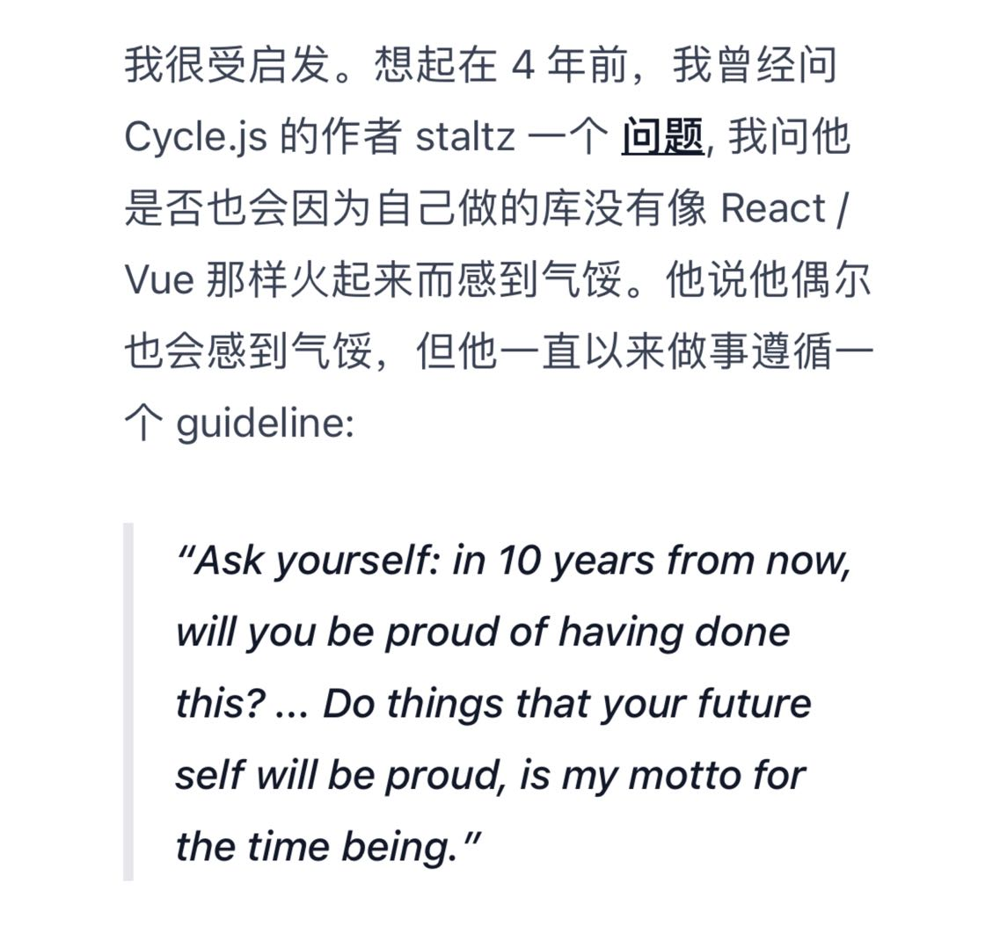

# Memory 𖧵

> Memory, out of memory

## 0x000D | 韦伯思想是时代的"黑暗之心"

沃格林和施特劳斯，卢卡奇与马尔库塞，他们对韦伯的科学学说最重要的社会批评在于，科学通过“价值自由”发展的“手段知识”，是现代社会物化现实的某种镜像。
而韦伯自身对科学使命的规定，并没能超出这一科学致力于研究的对象本身面临的根本困境，相反，韦伯恰恰是这一困境浓缩的反映。
当韦伯坚持，“局限于专业工作”，是我们这个科学时代“任何有价值的行动的前提”，这一“局限”（Beschränkung），就不仅是现代精神工作者在知识上的指导原则，也是其生活之道不可逾越的纪律，并最终成为现代思想的“绝对命令”。
在这个意义上，韦伯的伟大是与其错误息息相关的，**他的思想是这个时代的“黑暗之心”——他之所以伟大是因为我们可以透过他的思想以最鲜明、最尖锐的方式把握这个时代的错误或狭隘**。

-- 李猛

## 0x000C | 他说要他画遍弗洛伦萨的墙壁

据说**基兰达约**是位可爱慷慨的人，他的工作室开放给许多好学的晚辈。他的弟弟也是大画家，敬爱他，做他下手，有一次因为憎恨修士配给哥哥的饭菜太坏，差点杀了那位修士。

不论订件大小，报酬如何，基兰达约都接受。当美第奇银行总监图拉布尼由于一时手紧，付不了预先许诺的追加画款200杜卡特，他答道：赞助人的满意比金子更可贵。

他生前说，**他要画遍佛罗伦萨的墙壁，这才罢休**。他的素描草图精美绝伦，在20世纪一次柏林展出中被弄错，标明是达芬奇所画。

## 0x000B | 这个人了解他的时代

当我独处时，我没有勇气以艺术家这个古老、伟大的名词的意义来想象我自己是一名艺术家。乔托、提香、伦勃朗、戈雅才是伟大的艺术家。我只是一个公开卖艺的人，**这个人了解他的时代，并且竭尽所能扮演了与他同代人的种种愚蠢、贪婪和杂耍**。我这段痛苦的告白比它实际上的含义还要更痛苦。

--毕加索


## 0x000A | 嘿！炒股！

想起从前，在上海看到一大群人聚集在街道空处，分散成不同的团簇。

我钻进去问呀，怎么啦，这么多人

大爷回答说： 嘿！ 炒股！

## 0x0009 | 看什么看，画自己的画

局部 第二季 陈丹青

## 0x0008 | 不顾一切奔跑

生命的冒险，一直在进行。

## 0x0007 | Always call super first.

// Always call super first.

很有趣, 之前de了半个小时的bug, 发现是很久之前, 刚入职的年轻人, 忘了调用`[super highlighted];`, 线上用的就是没有调用父类`highlighted`的`UIButton`. 

当时想锤爆别人脑壳。现在只是觉得好玩🥳。

## 0x0006 | 对不确定的事情保持乐观

-- dingkun

## 0x0005 | 你所坚持的，才成为你自己

我所坚持的，才成为我自己。

## 0x0004 | 成长是一个很私人的事情

-- dingkun

## 0x0003 | 大处着眼， 小处着手

-- dingkun

## 0x0002 | 整体看起来，是不是还不错
> link: [https://www.bilibili.com/video/BV1Zr4y1J7PH/](https://www.bilibili.com/video/BV1Zr4y1J7PH/)

## 0x0001 | in 10 years from now, will you be proud of having done this?
<div style="width: 100%; overflow: hidden;">
<p style="width: 40%; float:left; margin-left: 15px; margin-top:15px; padding: 10px; box-shadow: 0px 0px 5px gray; border-radius: 15px;"> 
Ask yourself: in 10 years from now, will you be proud of having done this? 
... Do things that your future self will be proud, is my motto for the time being.
</p></img>
</div>

## 0x0000 | how-to-be-successful

> link: [https://blog.samaltman.com/how-to-be-successful](https://blog.samaltman.com/how-to-be-successful)
```text
1. Compound yourself // 让自己处于复利之中
2. Have almost too much self-belief // 无条件自信
3. Learn to think independently // 学会独立思考
4. Get good at “sales” // 善于“推销”
5. Make it easy to take risks // 让冒险变得容易
6. Focus // 保持专注
7. Work hard // 努力工作
8. Be bold // 大胆去做
9. Be willful // 拥有顽强的信念
10. Be hard to compete with // 让自己难以被取代
11. Build a network // 构建人际网络
12. You get rich by owning things // 通过拥有东西致富
13. Be internally driven // 成为内驱型的人
```

<Vssue :title="$title" />


