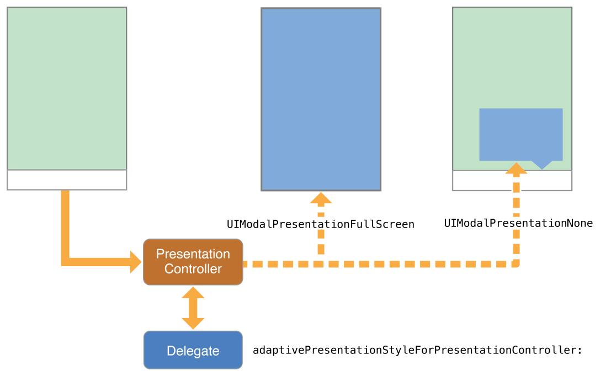

# 四. 自适应和`size`变化 🍟 Adaptivity And Size Changes

[[toc]]

## 1. 自适应模型 🍟 The Adaptive Model

自适应界面可以最大限度地利用可用空间。自适应意味着能够调整内容，使其适合任何iOS设备。iOS中的自适应模型支持简单但动态的方式来重新排列和调整内容以响应更改。当您利用此模型时，单个应用程序可以适应截然不同的屏幕尺寸（如图12-1所示），而只需很少的额外代码。

图12-1 适应不同的设备和方向


构建自适应界面的一个重要工具是自动布局。使用自动布局，您可以定义控制视图控制器视图布局的规则（称为约束）。您可以在`Interface Builder`中直观地创建这些规则，也可以在代码中以编程方式创建这些规则。当父视图的大小发生变化时，iOS根据您指定的约束自动调整视图的其余部分的大小并重新定位。

特征(`Traits`)是自适应模型的另一个重要组成部分。特征描述了视图控制器和视图所必需的运行环境。特征帮助您对界面做出高级决策。

### 特征的作用 🍟 The Role of Traits

当仅靠约束不足以管理布局时，您的视图控制器有几个时机可以进行调整。视图控制器、视图和其他一些对象管理一组当前环境的特征。表12-1描述了这些特征以及您如何使用它们来影响您的用户交互界面。

表12-1 特征

| 特征 | 例子 | 描述 |
| --- | --- | --- |
| [`horizontalSizeClass`](https://developer.apple.com/documentation/uikit/uitraitcollection/1623508-horizontalsizeclass) | [`UIUserInterfaceSizeClassCompact`](https://developer.apple.com/documentation/uikit/uiuserinterfacesizeclass/compact) | 此特征传达了界面的一般宽度。使用它来做出粗粒度级别的布局决策，例如视图是垂直堆叠、并排显示、完全隐藏还是以其他方式显示。 |
| [`verticalSizeClass`](https://developer.apple.com/documentation/uikit/uitraitcollection/1623513-verticalsizeclass) | [`UIUserInterfaceSizeClassRegular`](https://developer.apple.com/documentation/uikit/uiuserinterfacesizeclass/uiuserinterfacesizeclassregular) | 此特征传达了界面的一般高度。如果您的设计要求所有内容都适应屏幕而不滚动，请使用此特征来做出布局决策。 |
| [`displayScale`](https://developer.apple.com/documentation/uikit/uitraitcollection/1623519-displayscale) | `2.0` | 此特征传达了内容是显示在`Retina`显示器还是标准分辨率显示器上。使用它（根据需要）做出像素级布局决策或选择要显示的图像版本。 |
| [`userInterfaceIdiom`](https://developer.apple.com/documentation/uikit/uitraitcollection/1623521-userinterfaceidiom) | [`UIUserInterfaceIdiomPhone`](https://developer.apple.com/documentation/uikit/uiuserinterfaceidiom/phone) | 提供此特征是为了向后兼容，并传达运行应用程序的设备类型。尽可能避免使用此特征。对于布局决策，请改用水平和垂直`size class`。 |

使用特征来决定如何呈现您的用户交互界面。在`Interface Builder`中构建界面时，使用特征来更改您显示的视图和图像，或者使用它们来应用不同的约束集合。许多UIKit类，如`UIImageAsset`，使用您指定的特征来定制它们提供的信息。

以下是一些提示，可帮助您了解何时使用不同类型的特征：

* **使用`size class`对界面进行粗粒度更改**。`size class`更改是添加或删除视图、添加或删除子视图控制器或更改布局约束的适当时机。您也可以什么都不做，让您的界面使用其现有的布局约束自动适应。

* **切勿假设`size class`对应于视图的特定宽度或高度**。视图控制器的`size class`可能因多种原因而改变。例如，iPhone上的容器视图控制器可能会使其子视图控制器变成水平`regular`的，以强制它以不同的方式显示其内容。

* **使用`Interface Builder`为每个`size class`指定不同的布局约束**，视情况而定。使用`Interface Builder`指定约束比自己添加和删除约束要简单得多。视图控制器通过从其故事板应用适当的约束来自动处理`size class`更改。有关为不同`size class`配置布局约束的信息，请参阅*配置您的故事板以处理不同的`size class`* [|原文](https://developer.apple.com/library/archive/featuredarticles/ViewControllerPGforiPhoneOS/BuildinganAdaptiveInterface.html#//apple_ref/doc/uid/TP40007457-CH32-SW2)。

* **避免使用`idiom`信息来决定界面的布局或内容**。在iPad和iPhone上运行的应用程序通常应该显示相同的信息，并且应该使用`size class`来做出布局决定。

### Trait和Size变化何时发生？ 🍟 When Do Trait and Size Changes Happen?

特征变化很少变化，但确实会发生。UIKit根据底层环境的变化更新视图控制器的特征。大小特征比显示比例特征更有可能发生变化。`idiom`特征应该很少改变，如果有的话。`size class`变化的发生有以下原因：

* 视图控制器`window`的垂直或水平`size class`发生了变化，通常是因为设备旋转。

* 容器视图控制器的水平或垂直`size class`已更改。

* 当前视图控制器的水平或垂直`size class`由其容器显式更改。

视图控制器层次结构中的`size class`更改向下传播到任何子视图控制器。`window`对象充当该层次结构的根，为其根视图控制器提供基线`size class`特征。当设备方向在纵向和横向之间发生变化时，`window`更新其自己的`size class`信息，并将该信息向下传播到视图控制器层次结构。容器视图控制器可以将更改传递给子视图控制器，而无需修改，也可以覆盖每个子视图的特征。

在`iOS8`和更高版本中，`window`原点始终位于左上角，当设备在横向和纵向方向之间旋转时，`window`的边界会发生变化。`window`大小的变化以及任何相应的特征变化都会沿着视图控制器层次结构传播。对于层次结构中的每个视图控制器，UIKit调用以下方法来报告这些变化：

* `willTransitionToTraitCollection:withTransitionCoordinator:`方法告诉每个相关的视图控制器，它的**特征**即将改变。

* `viewWillTransitionToSize:withTransitionCoordinator:`方法告诉每个相关的视图控制器，它的**大小**即将改变。

* `traitCollectionDidChange:`方法告诉每个相关的视图控制器，它的**特征**已经改变。

当遍历视图控制器层次结构时，UIKit仅在有要报告的更改时才向视图控制器报告更改。如果容器视图控制器覆盖其子级的`size class`，则当容器的`size class`更改时，不会通知这些子级。同样，如果视图控制器的视图具有固定的宽度和高度，则不会收到大小更改通知。

图12-2 显示了当`iPhone6`上发生旋转时，视图控制器的特征和视图大小是如何更新的。从纵向到横向的旋转将屏幕的垂直`size class`从规则`regular`更改为紧凑`compact`。然后，`size class`更改和相应的视图大小更改将沿着视图控制器层次结构传播。将视图设置为新大小后，UIKit在调用视图控制器的`traitCollectionDidChange:`方法。

图12-2 更新视图控制器的特征和视图大小


### 不同设备的默认`size class` 🍟 Default Size Classes for Different Devices

每个iOS设备都有一组默认的尺寸类别，您可以在设计界面时将其用作指南。表12-2列出了纵向和横向设备的尺寸类别。表中未列出的设备与屏幕尺寸相同的设备具有相同的尺寸类别。

表12-2 具有不同屏幕尺寸的设备的尺寸类别。

| 设备 | 竖直放置 | 水平放置 |
| --- | --- | --- |
| iPad（all）<br> iPad Mini | 垂直`size class`：常规 <br> 水平`size class`：常规 | 垂直`size class`：常规 <br> 水平`size class`：常规 |
| iPhone6 Plus | 垂直`size class`：常规 <br> 水平`size class`：紧凑型 | 垂直`size class`：紧凑型 <br> 水平`size class`：常规 |
| iPhone6 | 垂直`size class`：常规 <br> 水平`size class`：紧凑型 | 垂直`size class`：紧凑型 <br> 水平`size class`：紧凑型 |
| iPhone5s <br> iPhone5c <br> iPhone5 | 垂直`size class`：常规 <br> 水平`size class`：紧凑型 | 垂直`size class`：紧凑型 <br> 水平`size class`：紧凑型 |
| iPhone4s | 垂直`size class`：常规 <br> 水平`size class`：紧凑型 | 垂直`size class`：紧凑型 <br> 水平`size class`：紧凑型 |

:::warning 重要
永远不要假设您的应用程序将在设备上以特定的`size class`显示。在决定如何配置该对象时，请始终检查在对象的特征集合中找到的`size class`。
:::

## 2. 构建自适应接口 🍟 Building an Adaptive Interface

自适应界面应该响应特征和尺寸的变化。在视图控制器级别，您可以使用特征对您显示的内容和该内容的布局进行粗粒度的确定。例如，在尺寸类之间更改时，您可以选择更改视图属性、显示或隐藏视图，或者显示一组完全不同的视图。做出这些大的决定后，您可以更改`size`来微调内容。

### 适应特征变化 🍟 Adapting to Trait Changes

特征为您提供了一种针对不同环境以不同方式配置应用程序的方法，您可以使用它们对界面进行粗粒度调整。您对特征所做的大部分更改可以直接在故事板文件中完成，但有些需要额外的代码。

### 配置故事板以处理不同尺寸类 🍟 Configuring Your Storyboard to Handle Different Size Classes

`Interface Builder`使您的界面可以轻松适应不同尺寸类。故事板编辑器包括支持以不同大小的类配置显示您的界面，支持删除特定配置中的视图，以及指定不同的布局约束。您还可以创建图像资源，为不同尺寸类交付不同的图像。使用这些工具意味着您不必在运行时以编程方式进行相同的更改。相反，UIKit会在当前尺寸类更改时自动更新您的界面。

图13-1显示了用于在`Interface Builder`中配置界面的工具。`size class`查看控件会更改界面的外观。使用该控件可以查看给定`size class`的界面外观。对于单个视图，使用`installation control`配置视图在对应的`size class`中是否展示。使用复选框左侧的`plus`（+）按钮添加新配置。

图13-1为不同尺寸类自定义界面


### 改变子视图控制器的特征 🍟 Changing the Traits of a Child View Controller

默认情况下，子视图控制器继承其父视图控制器的特征。对于尺寸类等特征，每个子视图控制器与其父视图控制器具有相同的特征可能没有意义。例如，常规`regular`环境中的视图控制器可能希望为其子视图控制器分配一个紧凑`compact`的尺寸类，以反映该子视图控制器空间的减少。实现容器视图控制器时，您可以通过调用容器视图控制器的`setOverrideTraitCollection:forChildViewController:`方法来修改子视图控制器的特征。

清单13-1 显示了如何创建一组新的特征并将它们与子视图控制器相关联。您从父视图控制器执行此代码，并且只需要执行一次。被覆盖的特征保留在子视图中，直到您再次更改它们或从视图控制器层次结构中删除子视图。

示例13-1 更改子视图控制器的特征
```objc
UITraitCollection* horizTrait = [UITraitCollection
                 traitCollectionWithHorizontalSizeClass:UIUserInterfaceSizeClassRegular];
UITraitCollection* vertTrait = [UITraitCollection
                 traitCollectionWithVerticalSizeClass:UIUserInterfaceSizeClassCompact];
UITraitCollection* childTraits = [UITraitCollection
                 traitCollectionWithTraitsFromCollections:@[horizTrait, vertTrait]];
 
[self setOverrideTraitCollection:childTraits forChildViewController:self.childViewControllers[0]];
```

当父视图控制器的特征发生变化时，子级会继承任何未被父级显式覆盖的特征。例如，当父级的水平尺寸类从常规更改为紧凑时，前面示例中的子级保留其常规水平尺寸类。但是，如果`displayScale`特征发生变化，则子级继承新值。

### 使`Presented`视图控制器适应新的风格 🍟 Adapting Presented View Controllers to a New Style

`Presented`现视图控制器在水平规则和紧凑环境之间自动适应。当从水平规则转换到水平紧凑环境时，UIKit默认将内置呈现样式更改为`UIModalPresentationFullScreen`。对于自定义呈现样式，您的呈现控制器可以确定适应行为并相应地调整呈现。

对于某些应用程序，适应全屏风格可能会出现问题。例如，弹出窗口通常会通过点击其边界来关闭，但在弹出窗口覆盖整个屏幕的紧凑环境中，这样做是不可能的，如图13-3所示。当默认适应样式不合适时，您可以告诉UIKit使用不同的样式或呈现更适合全屏样式的完全不同的视图控制器。

图13-3A在常规和紧凑环境中的弹出窗口


要更改呈现样式的默认自适应行为，请将`delegate`分配给关联的呈现控制器。您可以使用呈现视图控制器的`presentationController`属性访问呈现控制器。呈现控制器在进行任何与自适应相关的更改之前会咨询您的委托对象。委托可以返回与默认不同的呈现样式，并且可以为呈现控制器提供要显示的备用视图控制器。

使用委托的`adaptivePresentationStyleForPresentationController:`方法指定与默认不同的呈现样式。转换到紧凑环境时，唯一支持的样式是两种全屏样式或`UIModalPresentationNone`。返回`UIModalPresentationNone`告诉呈现文稿控制器忽略紧凑环境并继续使用以前的呈现文稿样式。在弹出窗口的情况下，忽略更改会在所有设备上为您提供相同的类似iPad的弹出窗口行为。图13-4并排显示了默认的全屏适配和无适配，以便您可以比较生成的呈现文稿。

图13-4 改变呈现视图控制器的自适应行为



要完全替换视图控制器，请实现委托的`presentationController:viewControllerForAdaptivePresentationStyle:`方法。适应紧凑环境时，您可以使用该方法将导航控制器插入视图层次结构或加载专为较小空间设计的视图控制器。

### 实现自适应Popovers的技巧 🍟 Tips for Implementing Adaptive Popovers

从水平规则切换到水平紧凑时，弹出窗口需要额外的修改。因为水平紧凑的默认行为将其弹出以更改为全屏呈现。由于弹出窗口通常通过点击弹出窗口的边界来关闭，因此更改为全屏呈现消除了关闭弹出窗口的主要技术。您可以通过执行以下操作之一来补偿这种行为：

* **将popover的视图控制器压入现有导航堆栈**。当有可用的父导航控制器时，关闭当前popover窗口并将其视图控制器压入导航堆栈。

* 添加控件以在弹出窗口全屏显示时关闭弹出窗口。您可以将控件添加到弹出窗口的视图控制器，但更好的选择是使用`presentationController:viewControllerForAdaptivePresentationStyle:`方法将poper替换为导航控制器。使用导航控制器可以为您提供模态界面和空间来添加完成按钮或其他控件来关闭内容。

* 使用呈现控制器委托来消除任何适应性更改。获取popover窗口呈现控制器并为其分配一个实现`adaptivePresentationStyleForPresentationController:`方法的委托。从该方法返回`UIModalPresentationNone`会导致弹出窗口继续显示为弹出窗口。有关详细信息，请参阅使*呈现视图控制器适应新样式* [|原文](https://developer.apple.com/library/archive/featuredarticles/ViewControllerPGforiPhoneOS/BuildinganAdaptiveInterface.html#//apple_ref/doc/uid/TP40007457-CH32-SW6)。

### 响应尺寸变化 🍟 Responding to Size Changes

尺寸更改可能出于多种原因，包括以下原因：

* 底层窗口的尺寸发生变化，通常是因为方向发生了变化。

* 父视图控制器调整其子视图之一的大小。

* 呈现控制器更改其`presented`视图控制器的大小。

当大小发生变化时，UIKit会通过正常布局过程自动更新可见视图控制器层次结构的大小和位置。如果您使用自动布局约束指定视图的大小和位置，您的应用程序会自动适应任何大小变化，并应在具有不同屏幕尺寸的设备上运行。

如果您的`Auto Layout`约束不足以实现您想要的外观，您可以使用`viewWillTransitionToSize:withTransitionCoordinator:`方法对布局进行更改。您还可以使用该方法创建附加动画以与大小更改动画一起运行。例如，在界面旋转期间，您可以使用过渡协调器的`targetTransform`属性为界面的某些部分创建反旋转矩阵。

<Vssue :title="$title" />