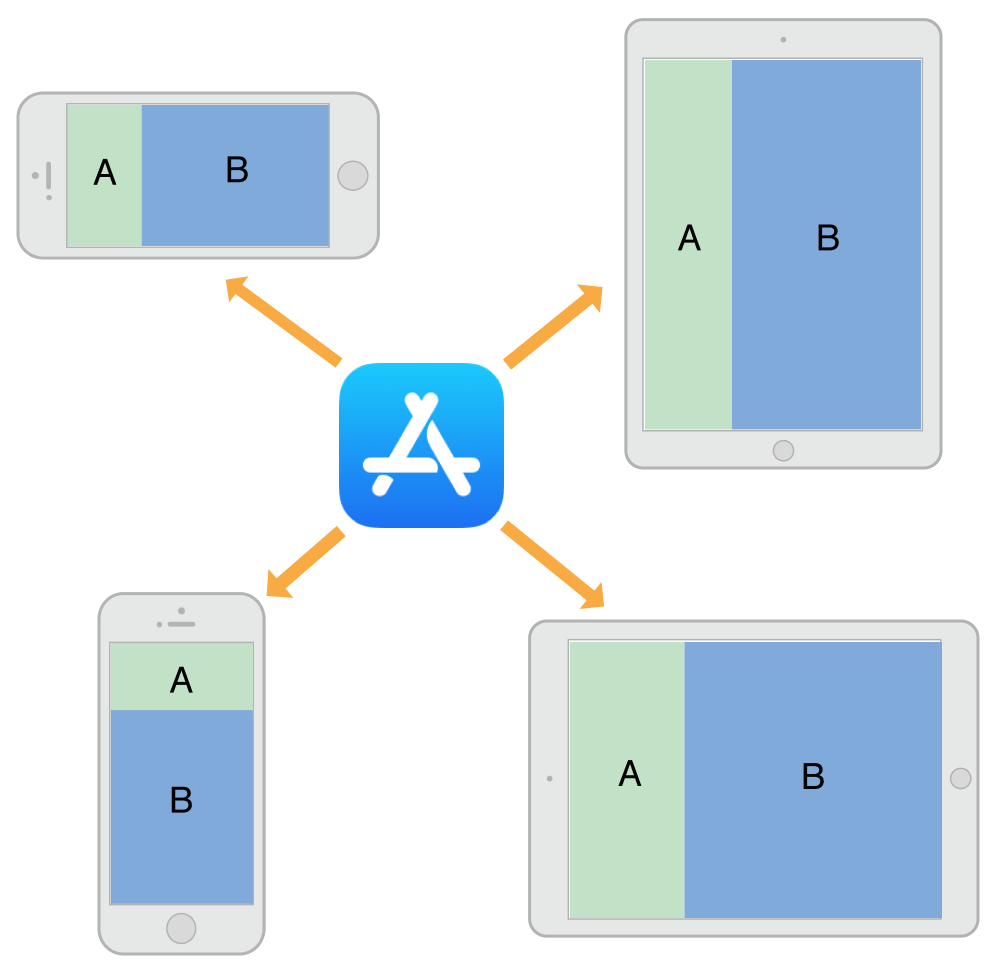
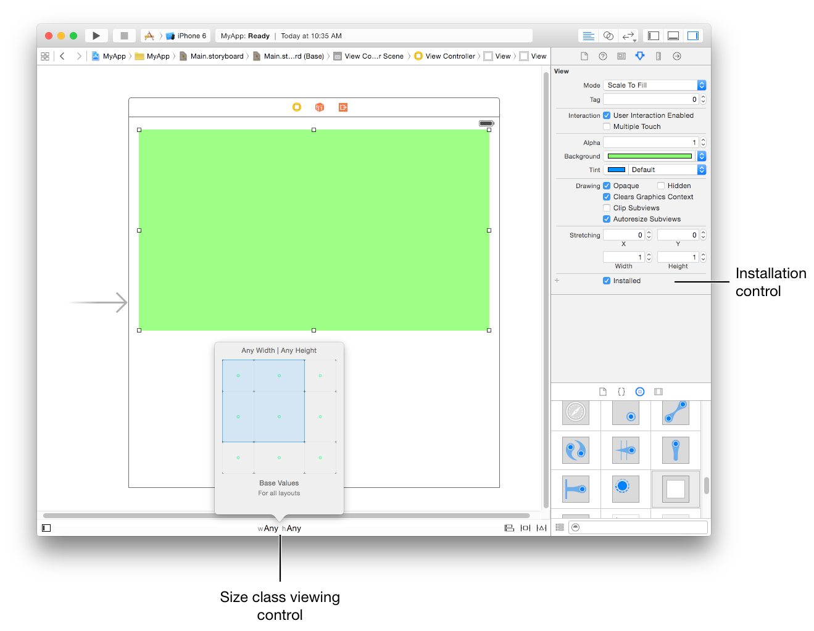
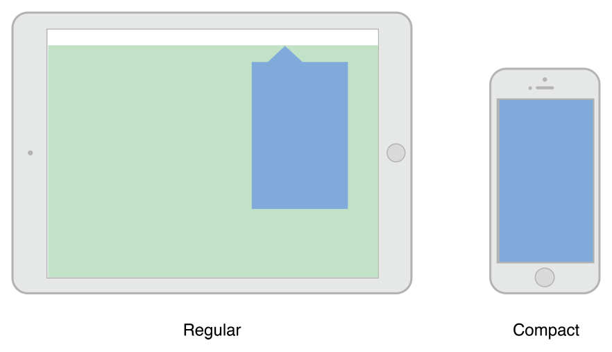
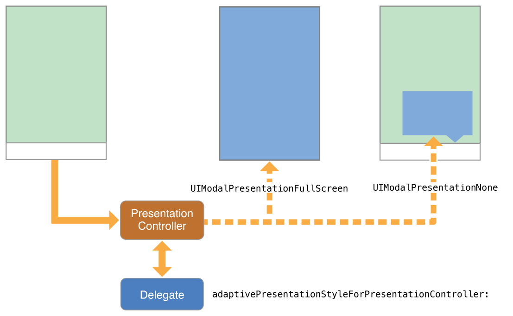

# 四. 自适应和`size`变化 🍟 Adaptivity And Size Changes 双语

[[toc]]

## 1. 自适应模型 🍟 The Adaptive Model

An adaptive interface is one that makes the best use of the available space. Being adaptive means being able to adjust your content so that it fits well on any iOS device. The adaptive model in iOS supports simple but dynamic ways to rearrange and resize your content in response to changes. When you take advantage of this model, a single app can adapt to dramatically different screen sizes (as illustrated in Figure 12-1) with very little extra code.

自适应界面可以最大限度地利用可用空间。自适应意味着能够调整内容，使其适合任何iOS设备。iOS中的自适应模型支持简单但动态的方式来重新排列和调整内容以响应更改。当您利用此模型时，单个应用程序可以适应截然不同的屏幕尺寸（如图12-1所示），而只需很少的额外代码。

Figure 12-1 Adapting to different devices and orientations

图12-1 适应不同的设备和方向



An important tool for building adaptive interfaces is Auto Layout. Using Auto Layout, you define rules (known as constraints) that govern the layout of your view controller’s views. You can create these rules visually in Interface Builder or programmatically in your code. When the size of a parent view changes, iOS automatically resizes and repositions the rest of your views according to the constraints you specified.

构建自适应界面的一个重要工具是自动布局。使用自动布局，您可以定义控制视图控制器视图布局的规则（称为约束）。您可以在`Interface Builder`中直观地创建这些规则，也可以在代码中以编程方式创建这些规则。当父视图的大小发生变化时，iOS根据您指定的约束自动调整视图的其余部分的大小并重新定位。

Traits are another important component of the adaptive model. Traits describe the environment in which your view controllers and views must operate. Traits help you make high-level decisions about your interface.

特征(`Traits`)是自适应模型的另一个重要组成部分。特征描述了视图控制器和视图所必需的运行环境。特征帮助您对界面做出高级决策。

### 特征的作用 🍟 The Role of Traits

When constraints alone are not enough to manage layout, your view controllers have several opportunities to make changes. View controllers, views, and a few other objects manage a collection of traits that specify the current environment associated with that object. Table 12-1 describes the traits and how you use them to affect your user interface.

当仅靠约束不足以管理布局时，您的视图控制器有几个时机可以进行调整。视图控制器、视图和其他一些对象管理一组当前环境的特征。表12-1描述了这些特征以及您如何使用它们来影响您的用户交互界面。

Table 12-1 Traits

表12-1 特征

| Trait | Examples | Description |
| --- | --- | --- |
| [`horizontalSizeClass`](https://developer.apple.com/documentation/uikit/uitraitcollection/1623508-horizontalsizeclass) | [`UIUserInterfaceSizeClassCompact`](https://developer.apple.com/documentation/uikit/uiuserinterfacesizeclass/compact) | This trait conveys the general width of your interface. Use it to make coarse-level layout decisions, such as whether views are stacked vertically, displayed side by side, hidden altogether, or displayed by another means. |
| [`verticalSizeClass`](https://developer.apple.com/documentation/uikit/uitraitcollection/1623513-verticalsizeclass) | [`UIUserInterfaceSizeClassRegular`](https://developer.apple.com/documentation/uikit/uiuserinterfacesizeclass/uiuserinterfacesizeclassregular) | This trait conveys the general height of your interface. If your design requires all of your content to fit on the screen without scrolling, use this trait to make layout decisions. |
| [`displayScale`](https://developer.apple.com/documentation/uikit/uitraitcollection/1623519-displayscale) | `2.0` | This trait conveys whether the content is displayed on a Retina display or a standard-resolution display. Use it (as needed) to make pixel-level layout decisions or to choose which version of an image to display. |
| [`userInterfaceIdiom`](https://developer.apple.com/documentation/uikit/uitraitcollection/1623521-userinterfaceidiom) | [`UIUserInterfaceIdiomPhone`](https://developer.apple.com/documentation/uikit/uiuserinterfaceidiom/phone) | This trait is provided for backward compatibility and conveys the type of device on which your app is running. Avoid using this trait as much as possible. For layout decisions, use the horizontal and vertical size classes instead. |


| 特征 | 例子 | 描述 |
| --- | --- | --- |
| [`horizontalSizeClass`](https://developer.apple.com/documentation/uikit/uitraitcollection/1623508-horizontalsizeclass) | [`UIUserInterfaceSizeClassCompact`](https://developer.apple.com/documentation/uikit/uiuserinterfacesizeclass/compact) | 此特征传达了界面的一般宽度。使用它来做出粗粒度级别的布局决策，例如视图是垂直堆叠、并排显示、完全隐藏还是以其他方式显示。 |
| [`verticalSizeClass`](https://developer.apple.com/documentation/uikit/uitraitcollection/1623513-verticalsizeclass) | [`UIUserInterfaceSizeClassRegular`](https://developer.apple.com/documentation/uikit/uiuserinterfacesizeclass/uiuserinterfacesizeclassregular) | 此特征传达了界面的一般高度。如果您的设计要求所有内容都适应屏幕而不滚动，请使用此特征来做出布局决策。 |
| [`displayScale`](https://developer.apple.com/documentation/uikit/uitraitcollection/1623519-displayscale) | `2.0` | 此特征传达了内容是显示在`Retina`显示器还是标准分辨率显示器上。使用它（根据需要）做出像素级布局决策或选择要显示的图像版本。 |
| [`userInterfaceIdiom`](https://developer.apple.com/documentation/uikit/uitraitcollection/1623521-userinterfaceidiom) | [`UIUserInterfaceIdiomPhone`](https://developer.apple.com/documentation/uikit/uiuserinterfaceidiom/phone) | 提供此特征是为了向后兼容，并传达运行应用程序的设备类型。尽可能避免使用此特征。对于布局决策，请改用水平和垂直`size class`。 |

Use traits to make decisions about how to present your user interface. When building your interface in Interface Builder, use traits to change the views and images that you display or use them to apply different sets of constraints. Many UIKit classes, like UIImageAsset, tailor the information they provide using the traits you specify.

使用特征来决定如何呈现您的用户交互界面。在`Interface Builder`中构建界面时，使用特征来更改您显示的视图和图像，或者使用它们来应用不同的约束集合。许多UIKit类，如`UIImageAsset`，使用您指定的特征来定制它们提供的信息。

Here are some tips to help you understand when to use different types of traits:

以下是一些提示，可帮助您了解何时使用不同类型的特征：

* Use size classes to make coarse changes to your interface. Size class changes are an appropriate time to add or remove views, add or remove child view controllers, or change your layout constraints. You can also do nothing and let your interface adapt automatically using its existing layout constraints.

* **使用`size class`对界面进行粗粒度更改**。`size class`更改是添加或删除视图、添加或删除子视图控制器或更改布局约束的适当时机。您也可以什么都不做，让您的界面使用其现有的布局约束自动适应。

* Never assume that a size class corresponds to the specific width or height of a view. Your view controllers’ size classes can change for many reasons. For example, a container view controller on iPhone might make one of its children horizontally regular to force it to display its contents differently.

* **切勿假设`size class`对应于视图的特定宽度或高度**。视图控制器的`size class`可能因多种原因而改变。例如，iPhone上的容器视图控制器可能会使其子视图控制器变成水平`regular`的，以强制它以不同的方式显示其内容。

* Use Interface Builder to specify different layout constraints for each size class, as appropriate. Using Interface Builder to specify constraints is much simpler than adding and removing constraints yourself. View controllers automatically handle size class changes by applying the appropriate constraints from their storyboard. For information about configuring layout constraints for different size classes, see Configuring Your Storyboard to Handle Different Size Classes.

* **使用`Interface Builder`为每个`size class`指定不同的布局约束**，视情况而定。使用`Interface Builder`指定约束比自己添加和删除约束要简单得多。视图控制器通过从其故事板应用适当的约束来自动处理`size class`更改。有关为不同`size class`配置布局约束的信息，请参阅*配置您的故事板以处理不同的`size class`* [|原文](https://developer.apple.com/library/archive/featuredarticles/ViewControllerPGforiPhoneOS/BuildinganAdaptiveInterface.html#//apple_ref/doc/uid/TP40007457-CH32-SW2)。

* Avoid using idiom information to make decisions about the layout or content of your interface. Apps running on iPad and iPhone should generally display the same information and should use size classes to make layout decisions.

* **避免使用`idiom`信息来决定界面的布局或内容**。在iPad和iPhone上运行的应用程序通常应该显示相同的信息，并且应该使用`size class`来做出布局决定。

### Trait和Size变化何时发生？ 🍟 When Do Trait and Size Changes Happen?

Trait changes occur infrequently but they do occur. UIKit updates a view controller’s traits based on changes to the underlying environment. Size class traits are much more likely to change than the display scale trait. The idiom trait should rarely, if ever, change. Size class changes occur for the following reasons:

特征变化很少变化，但确实会发生。UIKit根据底层环境的变化更新视图控制器的特征。大小特征比显示比例特征更有可能发生变化。`idiom`特征应该很少改变，如果有的话。`size class`变化的发生有以下原因：

* The vertical or horizontal size class of the view controller’s window changed, usually because of a device rotation.

* 视图控制器`window`的垂直或水平`size class`发生了变化，通常是因为设备旋转。

* The horizontal or vertical size class of a container view controller changed.

* 容器视图控制器的水平或垂直`size class`已更改。

* The horizontal or vertical size class of the current view controller was changed explicitly by its container.

* 当前视图控制器的水平或垂直`size class`由其容器显式更改。

Size class changes in the view controller hierarchy propagate down to any child view controllers. The window object serves as the root of that hierarchy, providing the baseline size class traits for its root view controller. When the device orientation changes between portrait and landscape, the window updates its own size class information and propagates that information down the view controller hierarchy. Container view controllers can pass the changes to child view controllers unmodified or they can override the traits of each child.

视图控制器层次结构中的`size class`更改向下传播到任何子视图控制器。`window`对象充当该层次结构的根，为其根视图控制器提供基线`size class`特征。当设备方向在纵向和横向之间发生变化时，`window`更新其自己的`size class`信息，并将该信息向下传播到视图控制器层次结构。容器视图控制器可以将更改传递给子视图控制器，而无需修改，也可以覆盖每个子视图的特征。

In iOS 8 and later, the window origin is always in the upper-left corner and the window’s bounds change when the device rotates between landscape and portrait orientations. The window size change is propagated down the view controller hierarchy along with any corresponding trait changes. For each view controller in the hierarchy, UIKit calls the following methods to report those changes:

在`iOS8`和更高版本中，`window`原点始终位于左上角，当设备在横向和纵向方向之间旋转时，`window`的边界会发生变化。`window`大小的变化以及任何相应的特征变化都会沿着视图控制器层次结构传播。对于层次结构中的每个视图控制器，UIKit调用以下方法来报告这些变化：

* The willTransitionToTraitCollection:withTransitionCoordinator: tells each relevant view controller that its traits are about to change.

* `willTransitionToTraitCollection:withTransitionCoordinator:`方法告诉每个相关的视图控制器，它的**特征**即将改变。

* The viewWillTransitionToSize:withTransitionCoordinator: tells each relevant view controller that its size is about to change.

* `viewWillTransitionToSize:withTransitionCoordinator:`方法告诉每个相关的视图控制器，它的**大小**即将改变。

* The traitCollectionDidChange: tells each relevant view controller that its traits have now changed.

* `traitCollectionDidChange:`方法告诉每个相关的视图控制器，它的**特征**已经改变。

When walking the view controller hierarchy, UIKit reports changes to a view controller only when there is a change to report. If a container view controller overrides the size classes of its children, those children are not notified when the container’s size class changes. Similarly, if a view controller’s view has a fixed width and height, it does not receive size change notifications.

当遍历视图控制器层次结构时，UIKit仅在有要报告的更改时才向视图控制器报告更改。如果容器视图控制器覆盖其子级的`size class`，则当容器的`size class`更改时，不会通知这些子级。同样，如果视图控制器的视图具有固定的宽度和高度，则不会收到大小更改通知。

Figure 12-2 shows how a view controller’s traits and view size are updated when a rotation occurs on an iPhone 6. A rotation from portrait to landscape changes the vertical size class of the screen from regular to compact. The size class change and a corresponding view size change are then propagated down the view controller hierarchy. After animating the view to its new size, UIKit applies the size class and view size changes before calling the view controller’s traitCollectionDidChange: method.

图12-2 显示了当`iPhone6`上发生旋转时，视图控制器的特征和视图大小是如何更新的。从纵向到横向的旋转将屏幕的垂直`size class`从规则`regular`更改为紧凑`compact`。然后，`size class`更改和相应的视图大小更改将沿着视图控制器层次结构传播。将视图设置为新大小后，UIKit在调用视图控制器的`traitCollectionDidChange:`方法。

Figure 12-2Updating a view controller’s traits and view size

图12-2 更新视图控制器的特征和视图大小


### 不同设备的默认`size class` 🍟 Default Size Classes for Different Devices

Each iOS device has a default set of size classes that you can use as a guide when designing your interface. Table 12-2 lists the size classes for devices in both portrait and landscape orientations. Devices not listed in the table have the same size classes as the device with the same screen dimensions.

每个iOS设备都有一组默认的尺寸类别，您可以在设计界面时将其用作指南。表12-2列出了纵向和横向设备的尺寸类别。表中未列出的设备与屏幕尺寸相同的设备具有相同的尺寸类别。

Table 12-2 Size classes for devices with different screen sizes.

表12-2 具有不同屏幕尺寸的设备的尺寸类别。

| Device | Portrait | Landscape |
| --- | --- | --- |
| iPad (all) iPad Mini | Vertical size class: Regular Horizontal size class: Regular | Vertical size class: Regular Horizontal size class: Regular |
| iPhone 6 Plus | Vertical size class: Regular Horizontal size class: Compact | Vertical size class: Compact Horizontal size class: Regular |
| iPhone 6 | Vertical size class: Regular Horizontal size class: Compact | Vertical size class: Compact Horizontal size class: Compact |
| iPhone 5s iPhone 5c iPhone 5 | Vertical size class: Regular Horizontal size class: Compact | Vertical size class: Compact Horizontal size class: Compact |
| iPhone 4s | Vertical size class: Regular Horizontal size class: Compact | Vertical size class: Compact Horizontal size class: Compact |

| 设备 | 竖直放置 | 水平放置 |
| --- | --- | --- |
| iPad（all）<br> iPad Mini | 垂直`size class`：常规 <br> 水平`size class`：常规 | 垂直`size class`：常规 <br> 水平`size class`：常规 |
| iPhone6 Plus | 垂直`size class`：常规 <br> 水平`size class`：紧凑型 | 垂直`size class`：紧凑型 <br> 水平`size class`：常规 |
| iPhone6 | 垂直`size class`：常规 <br> 水平`size class`：紧凑型 | 垂直`size class`：紧凑型 <br> 水平`size class`：紧凑型 |
| iPhone5s <br> iPhone5c <br> iPhone5 | 垂直`size class`：常规 <br> 水平`size class`：紧凑型 | 垂直`size class`：紧凑型 <br> 水平`size class`：紧凑型 |
| iPhone4s | 垂直`size class`：常规 <br> 水平`size class`：紧凑型 | 垂直`size class`：紧凑型 <br> 水平`size class`：紧凑型 |


:::warning IMPORTANT
Never assume that your app will be displayed with a specific size class on a device. Always check the size class found in an object’s trait collection when making decisions about how to configure that object.
:::

:::warning 重要
永远不要假设您的应用程序将在设备上以特定的`size class`显示。在决定如何配置该对象时，请始终检查在对象的特征集合中找到的`size class`。
:::

>>>

## 2. 构建自适应接口 🍟 Building an Adaptive Interface

An adaptive interface should respond to both trait and size changes. At the view controller level, you use traits to make coarse-level determinations about the content you display and the layout of that content. For example, when changing between size classes, you might choose to change view attributes, show or hide views, or display an entirely different set of views. After those big decisions are made, you use size changes to fine-tune your content.

自适应界面应该响应特征和尺寸的变化。在视图控制器级别，您可以使用特征对您显示的内容和该内容的布局进行粗粒度的确定。例如，在尺寸类之间更改时，您可以选择更改视图属性、显示或隐藏视图，或者显示一组完全不同的视图。做出这些大的决定后，您可以更改`size`来微调内容。

### 适应特征变化 🍟 Adapting to Trait Changes

Traits give you a way to configure your app differently for different environments, and you use them to make coarse adjustments to your interface. Most of the changes you make with traits can be done directly in your storyboard files, but some require additional code.

特征为您提供了一种针对不同环境以不同方式配置应用程序的方法，您可以使用它们对界面进行粗粒度调整。您对特征所做的大部分更改可以直接在故事板文件中完成，但有些需要额外的代码。

### 配置故事板以处理不同尺寸类 🍟 Configuring Your Storyboard to Handle Different Size Classes

Interface Builder makes it easy to adapt your interface to different size classes. The storyboard editor includes support for displaying your interface in different size class configurations, for removing views in specific configurations, and for specifying different layout constraints. You can also create image assets that deliver different images for different size classes. Using these tools means that you do not have to make the same changes programmatically at runtime. Instead, UIKit automatically updates your interface when the current size class changes.

`Interface Builder`使您的界面可以轻松适应不同尺寸类。故事板编辑器包括支持以不同大小的类配置显示您的界面，支持删除特定配置中的视图，以及指定不同的布局约束。您还可以创建图像资源，为不同尺寸类交付不同的图像。使用这些工具意味着您不必在运行时以编程方式进行相同的更改。相反，UIKit会在当前尺寸类更改时自动更新您的界面。

Figure 13-1 shows the tools you use to configure your interface in Interface Builder. The size class viewing control changes the appearance of your interface. Use that control to see how your interface will look for a given size class. For individual views, use the installation control to configure whether the view is present for a given size class configuration. Use the plus (+) button to the left of the checkbox to add new configurations.

图13-1显示了用于在`Interface Builder`中配置界面的工具。`size class`查看控件会更改界面的外观。使用该控件可以查看给定`size class`的界面外观。对于单个视图，使用`installation control`配置视图在对应的`size class`中是否展示。使用复选框左侧的`plus`（+）按钮添加新配置。

Figure 13-1 Customizing your interface for different size classes

图13-1为不同尺寸类自定义界面




### 改变子视图控制器的特征 🍟 Changing the Traits of a Child View Controller

Child view controllers inherit the traits of their parent view controller by default. For traits like size classes, it may not make sense for each child to have the same traits as its parent. For example, a view controller in a regular environment might want to assign a compact size class to one or more of its children to reflect a diminished amount of space for that child. When implementing a container view controller, you modify the traits of the child by calling the setOverrideTraitCollection:forChildViewController: method of the container view controller.

默认情况下，子视图控制器继承其父视图控制器的特征。对于尺寸类等特征，每个子视图控制器与其父视图控制器具有相同的特征可能没有意义。例如，常规`regular`环境中的视图控制器可能希望为其子视图控制器分配一个紧凑`compact`的尺寸类，以反映该子视图控制器空间的减少。实现容器视图控制器时，您可以通过调用容器视图控制器的`setOverrideTraitCollection:forChildViewController:`方法来修改子视图控制器的特征。

Listing 13-1 shows how you create a new set of traits and associate them with a child view controller. You execute this code from your parent view controller and only need to do so once. Overridden traits remain with the child until you change them again or until you remove the child from your view controller hierarchy.

清单13-1 显示了如何创建一组新的特征并将它们与子视图控制器相关联。您从父视图控制器执行此代码，并且只需要执行一次。被覆盖的特征保留在子视图中，直到您再次更改它们或从视图控制器层次结构中删除子视图。

Listing 13-1 Changing the traits of a child view controller
示例13-1 更改子视图控制器的特征
```objc
UITraitCollection* horizTrait = [UITraitCollection
                 traitCollectionWithHorizontalSizeClass:UIUserInterfaceSizeClassRegular];
UITraitCollection* vertTrait = [UITraitCollection
                 traitCollectionWithVerticalSizeClass:UIUserInterfaceSizeClassCompact];
UITraitCollection* childTraits = [UITraitCollection
                 traitCollectionWithTraitsFromCollections:@[horizTrait, vertTrait]];
 
[self setOverrideTraitCollection:childTraits forChildViewController:self.childViewControllers[0]];
```
When the traits of the parent view controller change, children inherit any traits that are not explicitly overridden by the parent. For example, when the parent’s horizontal size class changes from regular to compact, the child in the preceding example retains its regular horizontal size class. However, if the displayScale trait changes, the child inherits the new value.

当父视图控制器的特征发生变化时，子级会继承任何未被父级显式覆盖的特征。例如，当父级的水平尺寸类从常规更改为紧凑时，前面示例中的子级保留其常规水平尺寸类。但是，如果`displayScale`特征发生变化，则子级继承新值。

### 使`Presented`视图控制器适应新的风格 🍟 Adapting Presented View Controllers to a New Style

Presented view controllers adapt automatically between horizontally regular and compact environments. When transitioning from a horizontally regular to a horizontally compact environment, UIKit changes the built-in presentation styles to UIModalPresentationFullScreen by default. For custom presentation styles, your presentation controller can determine the adaptation behavior and adjust the presentation accordingly.

`Presented`现视图控制器在水平规则和紧凑环境之间自动适应。当从水平规则转换到水平紧凑环境时，UIKit默认将内置呈现样式更改为`UIModalPresentationFullScreen`。对于自定义呈现样式，您的呈现控制器可以确定适应行为并相应地调整呈现。

For some apps, adapting to a full-screen style may present problems. For example, a popover is normally dismissed by tapping outside its bounds, but doing so is not possible in a compact environment where the popover covers the entire screen, as shown in Figure 13-3. When the default adaptation style is not appropriate, you can tell UIKit to use a different style or present an entirely different view controller that is better suited to the full-screen style.

对于某些应用程序，适应全屏风格可能会出现问题。例如，弹出窗口通常会通过点击其边界来关闭，但在弹出窗口覆盖整个屏幕的紧凑环境中，这样做是不可能的，如图13-3所示。当默认适应样式不合适时，您可以告诉UIKit使用不同的样式或呈现更适合全屏样式的完全不同的视图控制器。

Figure 13-3A popover in regular and compact environments

图13-3A在常规和紧凑环境中的弹出窗口



To change the default adaptive behavior for a presentation style, assign a delegate to the associated presentation controller. You access the presentation controller using the presented view controller’s presentationController property. The presentation controller consults your delegate object before making any adaptivity-related changes. The delegate can return a different presentation style than the default and it can provide the presentation controller with an alternate view controller to display.

要更改呈现样式的默认自适应行为，请将`delegate`分配给关联的呈现控制器。您可以使用呈现视图控制器的`presentationController`属性访问呈现控制器。呈现控制器在进行任何与自适应相关的更改之前会咨询您的委托对象。委托可以返回与默认不同的呈现样式，并且可以为呈现控制器提供要显示的备用视图控制器。

Use the delegate’s adaptivePresentationStyleForPresentationController: method to specify a different presentation style than the default. When transitioning to a compact environment, the only supported styles are the two full-screen styles or UIModalPresentationNone. Returning UIModalPresentationNone tells the presentation controller to ignore the compact environment and continue using the previous presentation style. In the case of a popover, ignoring the change gives you the same iPad-like popover behavior on all devices. Figure 13-4 shows the default full-screen adaption and no adaptation side by side so that you can compare the resulting presentations.

使用委托的`adaptivePresentationStyleForPresentationController:`方法指定与默认不同的呈现样式。转换到紧凑环境时，唯一支持的样式是两种全屏样式或`UIModalPresentationNone`。返回`UIModalPresentationNone`告诉呈现文稿控制器忽略紧凑环境并继续使用以前的呈现文稿样式。在弹出窗口的情况下，忽略更改会在所有设备上为您提供相同的类似iPad的弹出窗口行为。图13-4并排显示了默认的全屏适配和无适配，以便您可以比较生成的呈现文稿。

Figure 13-4 Changing the adaptive behavior for a presented view controller

图13-4 改变呈现视图控制器的自适应行为



To replace the view controller altogether, implement the delegate’s presentationController:viewControllerForAdaptivePresentationStyle: method. When adapting to a compact environment, you might use that method to insert a navigation controller into your view hierarchy or load a view controller that was specifically designed for the smaller space.

要完全替换视图控制器，请实现委托的`presentationController:viewControllerForAdaptivePresentationStyle:`方法。适应紧凑环境时，您可以使用该方法将导航控制器插入视图层次结构或加载专为较小空间设计的视图控制器。

### 实现自适应Popovers的技巧 🍟 Tips for Implementing Adaptive Popovers

Popovers require additional modifications when changing from horizontally regular to horizontally compact. The default behavior for horizontally compact popovers it to change to a full-screen presentation. Because popovers are usually dismissed by tapping outside the bounds of the popover, changing to a full-screen presentation eliminates the main technique for dismissing the popover. You can compensate for that behavior by doing one of the following:

从水平规则切换到水平紧凑时，弹出窗口需要额外的修改。因为水平紧凑的默认行为将其弹出以更改为全屏呈现。由于弹出窗口通常通过点击弹出窗口的边界来关闭，因此更改为全屏呈现消除了关闭弹出窗口的主要技术。您可以通过执行以下操作之一来补偿这种行为：

* Push the popover’s view controller onto an existing navigation stack. When there is a parent navigation controller available, dismiss the popover and push its view controller onto the navigation stack.

* **将popover的视图控制器压入现有导航堆栈**。当有可用的父导航控制器时，关闭当前popover窗口并将其视图控制器压入导航堆栈。

* Add controls to dismiss the popover when it is presented full-screen. You can add controls to the popover’s view controller, but a better option is to swap out the popover for a navigation controller using the presentationController:viewControllerForAdaptivePresentationStyle: method. Using a navigation controller gives you a modal interface and space to add a Done button or other controls to dismiss the content.

* 添加控件以在弹出窗口全屏显示时关闭弹出窗口。您可以将控件添加到弹出窗口的视图控制器，但更好的选择是使用`presentationController:viewControllerForAdaptivePresentationStyle:`方法将poper替换为导航控制器。使用导航控制器可以为您提供模态界面和空间来添加完成按钮或其他控件来关闭内容。

* Use a presentation controller delegate to eliminate any adaptivity changes. Get the popover presentation controller and assign a delegate to it that implements the adaptivePresentationStyleForPresentationController: method. Returning UIModalPresentationNone from that method causes the popover to continue to be displayed as a popover. For more information, see Adapting Presented View Controllers to a New Style.

* 使用呈现控制器委托来消除任何适应性更改。获取popover窗口呈现控制器并为其分配一个实现`adaptivePresentationStyleForPresentationController:`方法的委托。从该方法返回`UIModalPresentationNone`会导致弹出窗口继续显示为弹出窗口。有关详细信息，请参阅使*呈现视图控制器适应新样式* [|原文](https://developer.apple.com/library/archive/featuredarticles/ViewControllerPGforiPhoneOS/BuildinganAdaptiveInterface.html#//apple_ref/doc/uid/TP40007457-CH32-SW6)。

### 响应尺寸变化 🍟 Responding to Size Changes

Size changes can occur for many reasons, including the following:

尺寸更改可能出于多种原因，包括以下原因：

* The dimensions of the underlying window change, usually because of an orientation change.

* 底层窗口的尺寸发生变化，通常是因为方向发生了变化。

* A parent view controller resizes one of its children.

* 父视图控制器调整其子视图之一的大小。

* A presentation controller changes the size of its presented view controller.

* 呈现控制器更改其`presented`视图控制器的大小。

When size changes happen, UIKit automatically updates the size and position of the visible view controller hierarchies through the normal layout process. If you specified the size and position of your views using Auto Layout constraints, your app adapts automatically to any size changes and should run on devices with different screen sizes.

当大小发生变化时，UIKit会通过正常布局过程自动更新可见视图控制器层次结构的大小和位置。如果您使用自动布局约束指定视图的大小和位置，您的应用程序会自动适应任何大小变化，并应在具有不同屏幕尺寸的设备上运行。

If your Auto Layout constraints are insufficient to achieve the look you want, you can use the viewWillTransitionToSize:withTransitionCoordinator: method to make changes to your layout. You can also use that method to create additional animations to run alongside the size-change animations. For example, during an interface rotation, you might use the transition coordinator’s targetTransform property to to create a counter-rotation matrix for parts of your interface.

如果您的`Auto Layout`约束不足以实现您想要的外观，您可以使用`viewWillTransitionToSize:withTransitionCoordinator:`方法对布局进行更改。您还可以使用该方法创建附加动画以与大小更改动画一起运行。例如，在界面旋转期间，您可以使用过渡协调器的`targetTransform`属性为界面的某些部分创建反旋转矩阵。
