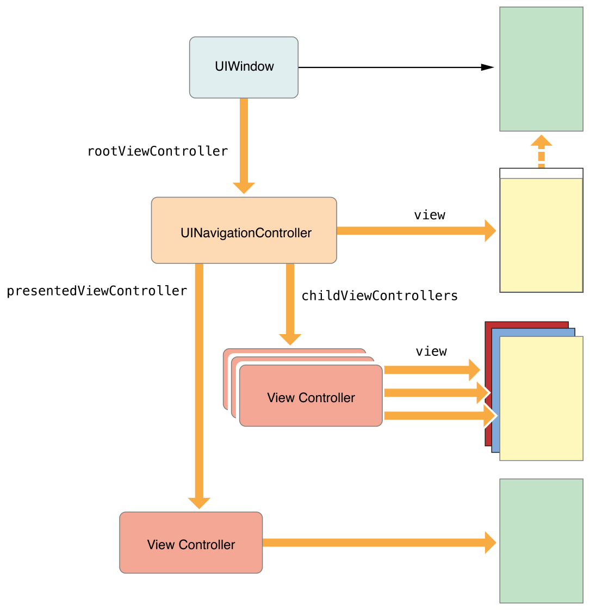

# 一. 概述 | Overview
## 1. VC的作用 | The Role of View Controllers

`View controllers`是应用内部结构的基础。每个应用至少有一个`view controller`，大多数应用都有几个。每个`view controller`管理应用的一部分用户交互界面以及该界面和底层数据之间的交互。`view controller`还有助于用户交互界面不同部分之间的跳转。

因为`view controller`在应用中扮演着如此重要的角色，所以`view controller`几乎是您所做的一切的中心。`UIViewController类`定义了很多方法和属性，用于: 管理视图、处理事件、从一个`view controller`转换到另一个`view controller`以及与应用的其他部分协调。您可以继承`UIViewController`（或着它子类之一）并添加实现您的app所需的自定义代码。

有两种类型的`view controller`：

* `Content view controller`管理应用的多个不同部分，是您创建的主要的`view controller`类型。

* `Container view controller`从其他`view controller`（称为`child view controller`）收集信息，以便于导航或以不同方式展示这些`view controller`的内容。

大多数app是两种类型的`view controller`的混合体。

### 视图管理 | View Management

`view controller`最重要的作用是管理视图的层次结构。每个`view controller`都有一个包含`view controller`所有内容的`root view`。在该`root view`中，您需要添加显示内容所需的`view`。图1-1说明了`view controller`及其`view`之间的内置关系。`view controller`总是对其`root view`有一个引用，每个`view`都对其`子view`有强引用。

图1-1 `view controller`与其视图之间的关系

> 注: \
> 通常的做法是使用`outlets`访问`view controller`视图层次结构中的其他视图。因为`view controller`管理其所有视图的内容，`outlets`允许您存储对所需视图的引用。当视图从故事板加载时，`outlets`本身会自动连接到实际的视图对象。

一个`content view controller`自行管理其所有视图。一个`container view controller`管理其自己的视图以及来自一个或多个子`view controller`的`root view`。这个容器不管理其`child view`的内容。它只管理`root view`，根据容器的设计调整大小和放置`root view`。图1-2说明了`split view controller`与其`child view`之间的关系。`split view controller`管理其`child views`的整体大小和位置，但`child view controller`管理这些`view`的实际内容。

图1-2: `view controller`可以管理来自其他`view controller`的内容

有关管理`view controller`的视图的信息，请参阅管理视图布局[|原文](https:|developer.apple.com/library/archive/featuredarticles/ViewControllerPGforiPhoneOS/DefiningYourSubclass.html#|apple_ref/doc/uid/TP40007457-CH7-SW6)。

### 数据 [Marshaling](https:|zh.wikipedia.org/wiki/Marshalling_(%E8%AE%A1%E7%AE%97%E6%9C%BA%E7%A7%91%E5%AD%A6)) | Data Marshaling

`view controller`充当它管理的视图和应用程序数据之间的中介。`UIViewController类`的方法和属性允许您管理应用程序的外观。当您继承`UIViewController`时，您可以添加任何变量来管理子类中的数据。添加自定义变量会创建一个类似于图1-3中的关系，其中`view controller`引用了您的数据和用于呈现该数据的视图。在两者之间来回移动数据是您的职责。

图1-3A `view controller`在数据对象和视图之间进行中介

您应该始终在`view controller`和数据对象中保持清晰的职责分离。确保数据结构完整性的大部分逻辑属于数据对象本身。`view controller`可能会验证来自视图的输入，然后将输入打包为数据对象所需的格式，但是您应该尽量减少`view controller`在管理实际数据中的作用。

一个`UIDocument`对象是一种与`view controller`分开管理数据的方法。`UIDocument`对象是一个控制器对象，它知道如何读取和写入数据到持久存储。当您子类化时，您可以添加提取数据所需的任何逻辑和方法，并将其传递给`view controller`或应用程序的其他部分。`view controller`可能会存储它接收到的任何数据的副本，以便更容易更新视图，但文档仍然拥有真实的数据。

### 用户交互 | User Interactions

`view controller`是[`responder`](https:|developer.apple.com/library/archive/documentation/General/Conceptual/Devpedia-CocoaApp/Responder.html#|apple_ref/doc/uid/TP40009071-CH1)对象，能够处理响应者链中的事件。尽管它们能够这样做，`view controller`很少直接处理触摸事件。相反，视图通常处理自己的触摸事件，并将结果报告给关联的`delegate`或`target object`的方法，这通常是`view controller`。因此，`view controller`中的大多数事件都是使用`delegate methods`或`action methods`来处理的。

有关在`view controller`中实现操作方法的详细信息，请参阅处理用户交互。有关处理其他类型事件的信息，请参阅iOS的事件处理指南[|原文](https:|developer.apple.com/library/archive/featuredarticles/ViewControllerPGforiPhoneOS/DefiningYourSubclass.html#|apple_ref/doc/uid/TP40007457-CH7-SW11)。

### 资源管理 | Resource Management

`view controller`对其视图及其创建的任何对象承担所有责任。`UIViewController`类自动处理视图管理的大多数方面。例如，`UIKit`自动释放不再需要的任何与视图相关的资源。在您的`UIViewController子类`中，您负责管理您显式创建的任何对象。

当可用内存不足时，`UIKit`会要求应用程序释放它们不再需要的任何资源。一种方法是调用`view controller`的`didReceiveMemoryWarning`方法。使用该方法删除对不再需要或以后可以轻松重新创建的对象的引用。例如，您可以使用该方法删除缓存数据。当内存不足的情况发生时，尽可能多地释放内存非常重要。消耗过多内存的应用程序可能会被系统直接终止以恢复内存。

### 设备适配 | Adaptivity

`view controller`负责其视图的呈现，并调整该呈现以匹配底层环境。每个iOS应用程序都应该能够在iPad和几种不同尺寸的iPhone上运行。与其为每个设备提供不同的`view controller`和视图层次结构，不如使用单个`view controller`来调整其视图以适应不断变化的空间要求。

在iOS中，`view controller`需要处理粗粒度的更改和细粒度的更改。当`view controller`的`traits(特征、表征/treɪt/)`发生变化时，就会发生粗粒度的更改。`traits`是描述整体环境的属性，例如显示比例。两个最重要的`traits`是`view controller`的水平和垂直的`size class`，它们指示了`view controller`在给定维度中有多少空间。您可以使用`size class`的更改来更改视图的布局方式，如图1-4所示。当水平`size class`是 *regular(规则)* 的时，`view controller`利用额外的水平空间来排列其内容。当水平`size class`是 *compact(紧凑)* 的时，`view controller`垂直排列其内容。

图1-4 使视图适应`size class`的变化

在给定的`size class`中，可以随时进行更细粒度的尺寸更改。当用户将iPhone从纵向旋转到横向时，`size class`可能不会改变，但屏幕尺寸通常会改变。当您使用自动布局时，UIKit会自动调整视图的大小和位置以匹配新的尺寸。`view controller`可以根据需要进行额外的调整。

有关适应性的更多信息，请参阅自适应模型[|原文](https:|developer.apple.com/library/archive/featuredarticles/ViewControllerPGforiPhoneOS/TheAdaptiveModel.html#|apple_ref/doc/uid/TP40007457-CH19-SW1)。

## 2. VC的层次结构 | [The View Controller Hierarchy](https:|developer.apple.com/library/archive/featuredarticles/ViewControllerPGforiPhoneOS/index.html#|apple_ref/doc/uid/TP40007457-CH2-SW1)

app 的 `view controller`之间的关系，定义了每个`view controller`所需的行为。`UIKit`预期是您以规范的方式来使用`view controller`。维护`view controller`的正确关系，可确保在需要时，将自动行为传递给正确的`view controller`。如果您破坏了规范的包含和表示关系，您的应用程序的某些部分将不会按预期运行。

### 根视图控制器 | `The Root View Controller`

`root view controller`是`view controller`层次结构的锚`anchor`。每个`window`都有一个`root view controller`，其内容填充该`wondow`。`root view controller`定义用户看到的初始内容。图2-1显示了`root view controller`和`wondow`之间的关系。因为`wondow`本身没有可见内容，`view controller`的视图提供了所有内容。

Figure 2-1 The root view controller

图2-1 `root view controller`

`root view controller`可从`UIWindow`对象的[`rootViewController`](https://developer.apple.com/documentation/uikit/uiwindow/1621581-rootviewcontroller)属性访问。当您使用故事板配置`view controller`时，`UIKit`会在启动时自动设置该属性的值。对于以编程方式创建的窗口，您必须自己设置`root view controller`。

### 容器视图控制器 | Container View Controllers

`container view controller`允许您使用更易于管理和可重用的部分来组装复杂的界面。`container view controller`将一个或多个子`view controller`的内容与可选的自定义视图混合在一起，以创建其最终界面。例如，`UINavigationController`对象显示`child view controller`的内容以及导航栏和可选工具栏，它们由`navigation controller`管理。`UIKit`包括几个`container view controller`，包括[`UINavigationController`](https://developer.apple.com/documentation/uikit/uinavigationcontroller)、[`UISplitViewController`](https://developer.apple.com/documentation/uikit/uisplitviewcontroller)和[`UIPageViewController`](https://developer.apple.com/documentation/uikit/uipageviewcontroller?language=objc)。

`container view controller`的视图总是填满给它的空间。`container view controller`常作为`root view controller`配置在`window`中（如图2-2所示），但它们也可以模块化地呈现或作为其他容器的子视图。容器负责适当地定位其子视图。在图中，容器将两个子视图并排放置。尽管它依赖于容器接口，但子视图控制器可能对容器和任何兄弟视图控制器的了解非常少。

图2-2A 容器充当根视图控制器

因为`container view controller`管理其子VC，`UIKit`定义了如何在自定义容器中设置这些子VC的规则。有关如何创建自定义`container view controller`的详细信息，请参阅实现`container view controller` | [原文](https://developer.apple.com/library/archive/featuredarticles/ViewControllerPGforiPhoneOS/ImplementingaContainerViewController.html#//apple_ref/doc/uid/TP40007457-CH11-SW1)。

### 呈现视图控制器 | Presented View Controllers

呈现`view controller`会将当前`view controller`的内容替换为新`view controller`的内容，通常隐藏以前的`view controller`的内容。这种呈现VC的方法最常用于模态显示新内容。例如，您可以呈现一个`view controller`来收集用户的输入。您还可以将它们用作应用程序界面的通用功能。

当您呈现`view controller`时，`UIKit`会在将呈现的`view controller`和已呈现`view controller`之间创建关系，如图2-3所示。（从已呈现的`view controller`到其将呈现`view controller`也有构件反向的关系。）这些关系构成了`view controller`层次结构的一部分，并且是在运行时定位其他`view controller`的一种方式。

图2-3 被呈现的`view controller`

当涉及`container view controller`时，`UIKit`可能会修改`presentation chain`以简化您必须编写的代码。不同的呈现样式对它们在屏幕上的呈现方式有不同的规则——例如，全屏呈现总是覆盖整个屏幕。当您呈现`view controller`时，UIKit会寻找为呈现提供合适上下文的`view controller`。在许多情况下，UIKit会选择最近的`container view controller`，但也可能会选择窗口的`root view controller`。在某些情况下，您还可以告诉UIKit哪个`view controller`定义了演示上下文并应该处理演示。

图2-4 说明了为何容器通常为呈现VC提供上下文。当执行全屏呈现时，新的`view controller`需要覆盖整个屏幕。容器决定是否处理呈现，而不是要求`child VC`知道其容器的边界。因为示例中的`navigation controller`覆盖了整个屏幕，所以它充当将要呈现的`view controller`并启动呈现。

图2-4A 容器和已经呈现的`view controller`

有关呈现VC的信息，请参阅呈现和转场处理[原文](https://developer.apple.com/library/archive/featuredarticles/ViewControllerPGforiPhoneOS/PresentingaViewController.html#//apple_ref/doc/uid/TP40007457-CH14-SW7)。

## 3. 设计技巧 | Design Tips

视图控制器是在iOS上运行的应用程序必不可少的工具，UIKit的视图控制器基础架构使得无需编写大量代码即可轻松创建复杂的界面。在实现您自己的视图控制器时，请使用以下提示和指南来确保您没有做可能干扰系统预期的自然行为的事情。

### 尽可能使用系统提供的视图控制器 | Use System-Supplied View Controllers Whenever Possible

iOS框架定义了许多在app中可以直接使用的视图控制器。使用这些系统提供的视图控制器可以为您节省时间并确保一致的用户体验。

大多数系统视图控制器是为特定任务设计的。一些视图控制器提供对用户数据（如联系人）的访问。其他可能提供对硬件的访问或提供用于管理媒体的特别调整的界面。例如，UIKit中的`UIImagePickerController`类显示了一个用于捕获图片和视频以及访问用户相机胶卷的标准界面。

在创建自己的自定义视图控制器之前，请查看现有框架, 看看是否已经存在用于您要执行的任务的视图控制器。

* UIKit框架提供了用于在iCloud上显示弹窗、拍摄图片和视频以及管理文件的视图控制器。UIKit还定义了许多标准容器视图控制器，您可以使用它们来组织您的内容。

* GameKit框架提供了用于匹配玩家和管理排行榜、成就和其他游戏功能的视图控制器。

* 通讯簿UI框架提供了用于显示和选择联系人信息的视图控制器。

* MediaPlayer框架提供了用于播放和管理视频以及从用户库中选择媒体资产的视图控制器。

* EventKit UI框架提供了用于显示和编辑用户日历数据的视图控制器。

* GLKit框架提供了一个用于管理OpenGL渲染表面的视图控制器。

* 多点连接框架提供了用于检测其他用户并邀请他们连接的视图控制器。

* Message UI框架提供了用于撰写电子邮件和SMS消息的视图控制器。

* PassKit框架提供了用于显示通行证并将其添加到Passbook的视图控制器。

* Social框架提供了用于为Twitter、Facebook和其他社交媒体网站撰写消息的视图控制器。

* AVFoundation框架提供了一个用于显示媒体资产的视图控制器。

::: danger 重要
切勿修改系统提供的视图控制器的视图层次结构。每个视图控制器都拥有其视图层次结构，并负责维护该层次结构的完整性。进行更改可能会在代码中引入错误或阻止拥有的视图控制器正常运行。对于系统视图控制器，始终依赖视图控制器的公开可用方法和属性进行所有修改。
:::

有关使用特定视图控制器的信息，请参阅相应框架的参考文档。

### 使每个视图控制器成为一个孤岛 ｜ Make Each View Controller an Island

视图控制器应该始终是自包含的对象。任何视图控制器都不应该了解另一个视图控制器的内部工作或视图层次结构。如果两个视图控制器需要来回通信或传递数据，它们应该始终使用明确定义的公共接口进行通信。

经常使用委托设计模式来管理视图控制器之间的通信。通过委托，一个对象定义了一个与关联委托对象通信的协议，委托对象是符合协议的任何对象。委托对象的确切类型并不重要。重要的是它实现了协议的方法。

### 仅将根视图用作其他视图的容器 ｜ Use the Root View Only as a Container for Other Views

仅将视图控制器的根视图用作其余内容的容器。将根视图用作容器为所有视图提供了一个通用的父视图，这使得许多布局操作更简单。许多自动布局约束需要一个通用的父视图来正确布局视图。

### 知道您的数据存储在哪里 ｜ Know Where Your Data Lives

在MVC设计模式中，视图控制器的作用是促进模型对象和视图对象之间的数据移动。视图控制器可能将一些数据存储在临时变量中并执行一些验证，但它的主要职责是确保其视图包含准确的信息。您的数据对象负责管理实际数据并确保该数据的整体完整性。

数据和接口分离的一个例子存在于`UIDocument`和`UIViewController`类之间的关系中。具体来说，两者之间不存在默认关系。`UIDocument`对象处理数据的加载和保存，而`UIViewController`对象处理视图在屏幕上的显示。如果您在两个对象之间创建关系，请记住视图控制器应该只缓存`UIDocument`中的信息以提高效率。实际数据仍然属于`UIDocument`对象。

### 设备适配 | Adapt to Changes

应用程序可以在各种iOS设备上运行，视图控制器旨在适应这些设备上不同大小的屏幕。与其使用单独的视图控制器来管理不同屏幕上的内容，不如使用内置的适应性支持来响应视图控制器中的`size`和`size class`更改。UIKit发送的通知使您有机会对用户交互界面进行大粒度和小粒度的更改，而无需更改视图控制器的其余代码。

有关处理适应性更改的更多信息，请参阅自适应模型[|原文](https://developer.apple.com/library/archive/featuredarticles/ViewControllerPGforiPhoneOS/TheAdaptiveModel.html#//apple_ref/doc/uid/TP40007457-CH19-SW1)。
