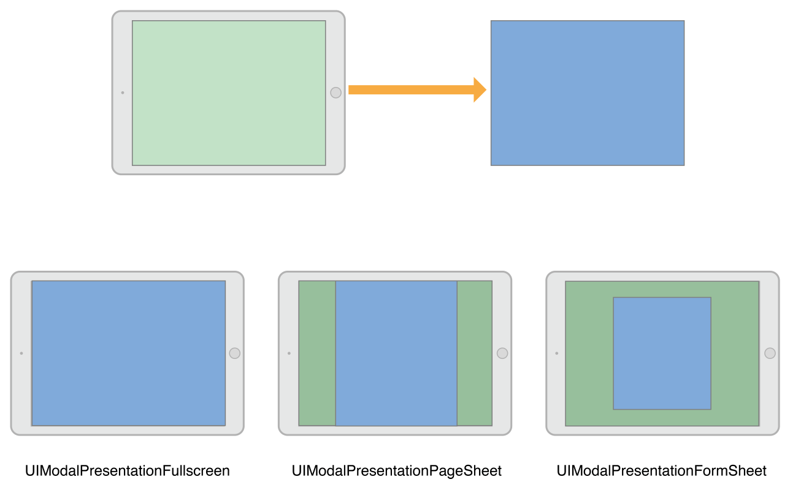
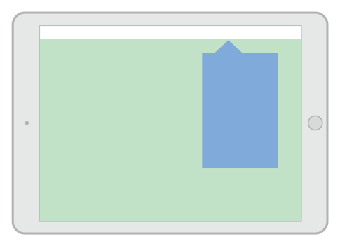
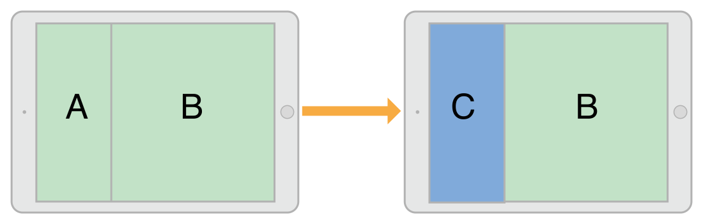
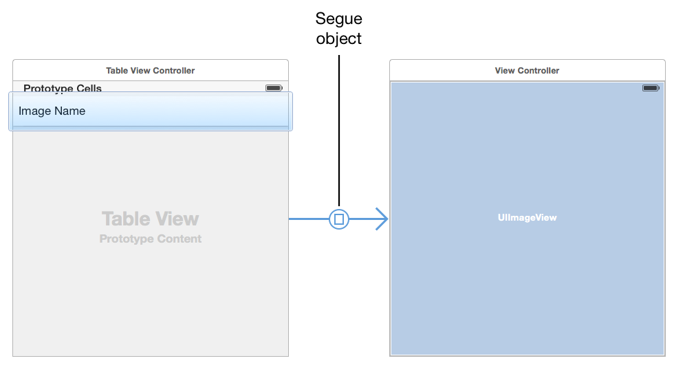
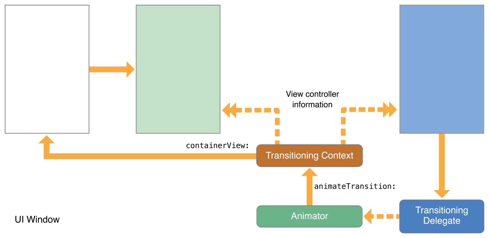

# 三. 呈现与转场 🍟 Presentations and Transitions

[[toc]]

## 1. 呈现视图控制器 🍟 PresentingaViewController

有两种方法可以在屏幕上显示视图控制器：将其嵌入容器视图控制器或呈现它。容器视图控制器提供应用程序的主要导航，但呈现视图控制器也是一个重要的导航工具。您可以直接使用呈现在当前视图控制器之上显示新的视图控制器。通常，当您想要实现模态界面时，您可以呈现视图控制器，但您也可以将它们用于其他目的。

`UIViewController`类内置对呈现视图控制器的支持，并且可用于所有视图控制器对象。您可以呈现来自任何其他视图控制器的任何视图控制器，尽管UIKit可能会将请求重新路由到不同的视图控制器。呈现视图控制器会在原始视图控制器（称为呈现视图控制器）和要显示的新视图控制器（称为呈现视图控制器）之间创建关系。这种关系构成视图控制器层次结构的一部分，并保持不变，直到呈现的视图控制器被关闭。

### 呈现和转场过程 🍟 The Presentation and Transition Process

呈现视图控制器是在屏幕上显示新内容的一种快速简便的方法。UIKit内置的呈现机制允许您使用内置或自定义动画显示新的视图控制器。内置呈现动画只需要很少的代码，因为UIKit处理所有工作。您还可以轻松创建自定义呈现和动画，并将它们与任何视图控制器一起使用。

您可以以编程方式或使用`segue`启动视图控制器的呈现。如果您在设计时知道应用程序的导航，使用`segue`会是启动呈现的最简单方法。对于更动态的界面，或者在没有专用控件来启动`segue`的情况下，使用`UIViewController`的方法来显示您的视图控制器。

### 呈现样式 🍟 Presentation Styles

视图控制器的"呈现样式"控制其在屏幕上的外观。UIKit定义了许多标准呈现样式，每种样式都有特定的外观和意图。您还可以定义自己的自定义呈现样式。设计应用程序时，选择最适合您尝试执行的操作的呈现样式，并将适当的常量分配给您想要呈现的视图控制器的`modalPresentationStyle`属性。

### 全屏呈现样式 🍟 Full-Screen Presentation Styles

全屏呈现样式覆盖整个屏幕，防止与底层内容交互。在水平`regular`的环境中，只有一种全屏样式完全覆盖底层内容。其余的包含渐变视图或改变透明度，以允许底层视图控制器的部分显示。在水平`compact`的环境中，全屏演示会自动适应`UIModalPresentationFullScreen`样式并覆盖所有底层内容。

图8-1说明了在水平规则环境中使用`UIModalPresentationFullScreen`、`UIModalPresentationPageSheet`和`UIModalPresentationFormSheet`样式的呈现外观。在图中，左上角的绿色视图控制器在右上角呈现蓝色视图控制器，每个呈现样式的结果如下所示。对于某些呈现样式，UIKit在两个视图控制器的内容之间插入一个渐变视图。

图8-1全屏呈现样式



:::tip 注
当使用`UIModalPresentationFullScreen`样式呈现视图控制器时，UIKit通常会在转换动画完成后删除底层视图控制器的视图。您可以通过指定`UIModalPresentationOverFullScreen`样式来防止删除这些视图。当呈现的视图控制器具有允许底层内容显示的透明区域时，您可以使用该样式。
:::

当使用一种全屏呈现样式时，启动呈现的视图控制器本身必须覆盖整个屏幕。如果演示视图控制器没有覆盖屏幕，UIKit会向上遍历视图控制器层次结构，直到找到一个覆盖屏幕的视图控制器。如果找不到填充屏幕的中间视图控制器，UIKit会使用窗口的根视图控制器。

### 弹出风格 🍟 The Popover Style

在弹出视图中，`UIModalPresentationPopover`样式显示视图控制器。弹出窗口对于显示附加信息或与焦点或选定对象相关的项目列表非常有用。在水平`regular`的环境中，弹出窗口仅覆盖屏幕的一部分，如图8-2所示。在水平`compact`的环境中，弹出窗口默认适应`UIModalPresentationOverFullScreen`呈现样式。在弹出窗口之外点击会自动关闭弹出窗口。

图8-2 popover风格




因为弹出窗口对于水平`compact`环境是全屏呈现，所以您通常需要修改弹出窗口代码来处理适应。在全屏模式下，您需要一种方法来关闭呈现的弹出窗口。您可以通过添加按钮、将弹出窗口嵌入到可关闭的容器视图控制器中或更改适配水平`compact`环境的行为本身来做到这一点。

有关如何配置弹出呈现的tips，请参阅在弹出窗口中呈现视图控制器[|原文](https://developer.apple.com/library/archive/featuredarticles/ViewControllerPGforiPhoneOS/PresentingaViewController.html#//apple_ref/doc/uid/TP40007457-CH14-SW13)。

### 当前上下文样式 🍟 The Current Context Styles

在`UIModalPresentationCurrentContext`样式覆盖特定的视图控制器。使用上下文样式时，可以通过将其`definesPresentationContext`属性设置为YES。图8-3说明了仅覆盖拆分视图控制器的一个子视图控制器的当前上下文表示。

图8-3当前上下文呈现样式



:::tip 注
当使用`UIModalPresentationFullScreen`样式呈现视图控制器时，UIKit通常会在转换动画完成后删除底层视图控制器的视图。您可以通过指定`UIModalPresentationOverCurrentContext`样式来防止删除这些视图。当呈现的视图控制器具有允许底层内容显示的透明区域时，您可以使用该样式。
:::

视图控制器不仅可以定义呈现的上下文，也可以定义呈现过程中使用的转场动画。通常，UIKit使用所呈现视图控制器的`modalTransitionStyle`属性中的值在屏幕上为视图控制器设置动画。如果呈现上下文视图控制器的`providesPresentationContextTransitionStyle`设置为YES，UIKit将使用该视图控制器的`modalTransitionStyle`属性中的值。

转换到水平`compact`环境时，当前上下文样式适应`UIModalPresentationFullScreen`样式。要更改该行为，请使用自适应呈现`delegate`来指定不同的呈现样式或视图控制器。

### 自定义呈现样式 🍟 Custom Presentation Styles

使用`UIModalPresentationCustom`样式可以使用定义的自定义样式来显示视图控制器。创建自定义样式需要子类化`UIPresentationController`并使用其方法在屏幕上为任何自定义视图设置动画，并设置所显示视图控制器的大小和位置。表示控制器还处理由于所显示视图控制器`traits`的更改而发生的任何调整。

有关如何定义自定义呈现控制器的信息，请参阅*创建自定义呈现*[|原文](https://developer.apple.com/library/archive/featuredarticles/ViewControllerPGforiPhoneOS/DefiningCustomPresentations.html#//apple_ref/doc/uid/TP40007457-CH25-SW1)。

### 转场样式 🍟 Transition Styles

转场样式决定了用于显示视图控制器的动画类型。对于内置的转场样式，您可以将标准转场样式之一分配给要呈现的视图控制器的`modalTransitionStyle`属性。当您呈现视图控制器时，UIKit会创建与该样式相对应的动画。例如，图8-4说明了标准的上滑转换（`UIModalTransitionStyleCoverVertical`）如何在屏幕上为视图控制器设置动画。视图控制器B从屏幕外开始，并在视图控制器A的顶部向上和向上设置动画。当视图控制器B被关闭时，动画会反转，以便B向下滑动以显示A。

图8-4A视图控制器的转场动画


您可以使用`animator`对象和转场委托创建自定义转换。`animator`对象创建用于将视图控制器放置在屏幕上的转换动画。转场委托在适当的时间将该`animator`对象提供给UIKit。有关如何实现自定义转换的信息，请参阅*自定义转换动画*[|原文](https://developer.apple.com/library/archive/featuredarticles/ViewControllerPGforiPhoneOS/CustomizingtheTransitionAnimations.html#//apple_ref/doc/uid/TP40007457-CH16-SW1)。

### 呈现与展现视图控制器 🍟 Presenting Versus Showing a View Controller

`UIViewController`类提供了两种显示视图控制器的方法：

* `showViewController:sender:`和`showDetailViewController:sender:`方法为显示视图控制器提供了最具适应性和灵活性的方法。这些方法让呈现视图控制器决定如何最好地处理呈现。例如，容器视图控制器可能将视图控制器合并为子视图控制器，而不是以模态方式呈现它。默认行为以模态方式呈现视图控制器。

* `presentViewController:animated:completion:`方法始终以模态方式显示视图控制器。调用此方法的视图控制器可能不会最终处理呈现过程，但呈现效果始终是模态的。此方法对适应水平`compact`的环境做呈现样式的适配。

`showViewController:sender:`和`showDetailViewController:sender:`方法是展示视图控制器的首选方式。视图控制器可以调用它们，而无需了解视图控制器层次结构的其余部分或当前视图控制器在该层次结构中的位置。这些方法还可以更轻松地在应用程序的不同部分重用视图控制器，而无需编写条件代码路径。

### 呈现视图控制器 🍟 Presenting a View Controller

有几种方法可以启动视图控制器的呈现：

* 使用`segue`自动显示视图控制器。`segue`使用您在`Interface Builder`中指定的信息实例化并显示视图控制器。有关如何配置`segue`的详细信息，请参阅*使用segue*。

* 调用`showViewController:sender:`或`showDetailViewController:sender:`方法显示视图控制器。在自定义视图控制器中，您可以将这些方法的行为更改为更适合您的视图控制器的行为。

* 调用`presentViewController:animated:completion:`方法以模态方式呈现视图控制器。

有关如何使用这些方法之一关闭呈现的视图控制器的信息，请参阅*关闭呈现的视图控制器*。

### 显示视图控制器 🍟 Showing View Controllers

当使用`showViewController:sender:`和`showDetailViewController:sender:`方法时，在屏幕上获取新视图控制器的过程很简单：

* 创建出要显示的视图控制器对象。创建视图控制器时，您有责任使用执行功能所需的任何数据对其进行初始化。

* 将新视图控制器的`modalPresentationStyle`属性设置为首选呈现样式。此样式可能不会在最终呈现中使用。

* 将视图控制器的`modalTransitionStyle`属性设置为所需的转场动画样式。此样式可能不会在最终动画中使用。

* 调用`showViewController:sender:`和当前视图控制器的`showDetailViewController:sender:`方法。

UIKit将对`showViewController:sender:`和`showDetailViewController:sender:`的调用转发到相应的呈现视图控制器。然后，该视图控制器可以决定如何最好地执行表示，并且可以根据需要更改表示和转换样式。例如，导航控制器可能会将视图控制器推送到其导航堆栈上

有关展现视图控制器和模态显示它们之间差异的信息，请参阅*呈现与展现视图控制器*。


### 模态化呈现视图控制器 🍟 Presenting View Controllers Modally

当直接呈现视图控制器时，您告诉UIKit您希望新视图控制器如何显示以及它应该如何在屏幕上显示动画。

* 创建出要呈现的视图控制器对象。

   创建视图控制器时，您有责任使用完成功能所需的任何数据对其进行初始化。

* 将新视图控制器的modalPresentationStyle属性设置为所需的表示样式。

* 将视图控制器的modalTransitionStyle属性设置为所需的动画样式。

* 调用`presentViewController:animated:completion:`方法。

调用`presentViewController:animated:completion:`方法的视图控制器可能不是实际执行模态表示的视图控制器。呈现样式决定了视图控制器的呈现方式，包括表示视图控制器所需的`characteristics`。例如，全屏表示必须由全屏视图控制器启动。如果当前正在呈现视图控制器那是不合适的，UIKit将遍历视图控制器层次结构，直到找到合适的视图控制器。完成模态表示后，UIKit会更新受影响视图控制器的`presentingViewController`和`presentedViewController`属性。

清单8-1演示了如何以编程方式呈现视图控制器。当用户添加新配方时，应用程序通过呈现导航控制器提示用户有关配方的基本信息。选择了导航控制器，以便在标准位置放置取消和完成按钮。使用导航控制器还可以更轻松地在未来扩展新配方界面。您所要做的就是在导航堆栈上推送新的视图控制器。

示例8-1以编程方式呈现视图控制器
```objc
- (void)add:(id)sender {
   // Create the root view controller for the navigation controller
   // The new view controller configures a Cancel and Done button for the
   // navigation bar.
   RecipeAddViewController *addController = [[RecipeAddViewController alloc] init];
 
   addController.modalPresentationStyle = UIModalPresentationFullScreen;
   addController.transitionStyle = UIModalTransitionStyleCoverVertical;
   [self presentViewController:addController animated:YES completion: nil];
}
```

### 在Popover中呈现视图控制器 🍟 Presenting a View Controller in a Popover

Popover需要额外配置才能呈现。将模态呈现样式设置为UIModalPresentationPopover后，配置以下popover相关属性：

* 将视图控制器的`preferredContentSize`属性设置为所需的大小。

* 使用关联的`UIPopoverPresentationController`对象设置popover锚点，该对象可从视图控制器的`popoverPresentationController`属性访问。仅设置以下一项：

   ** 将`barButtonItem`属性设置为`bar button item`。

   ** 将`sourceView`和`sourceRect`属性设置为某个视图中的特定区域。

您可以使用`UIPopoverPresentationController`对象根据需要对popover的外观进行其他调整。`popover presentation controller`还支持一个委托对象，您可以使用该对象来响应呈现过程中的更改。例如，您可以使用委托来响应popover在屏幕上出现、消失或重新定位时。有关此对象的更多信息，请参阅*UIPopoverPresentationController类参考*。

### 关闭呈现的视图控制器 🍟 Dismissing a Presented View Controller

要关闭呈现视图控制器，请调用`presented`的视图控制器的`dismissViewControllerAnimated:completion:`方法。您也可以在`presenting`视图控制器本身上调用此方法。当您在`presented`视图控制器上调用该方法时，UIKit会自动将请求转发给`presenting`视图控制器。

在关闭视图控制器之前，请务必从视图控制器中保存任何重要信息。关闭视图控制器会将其从视图控制器层次结构中删除，并从屏幕中删除其视图。如果您没有对存储在其他地方的视图控制器的强引用，则关闭它会释放与其关联的内存。

如果`presented`视图控制器必须将数据返回到`presenting`视图控制器，则使用委托设计模式来促进传输。委托使得在应用程序的不同部分重用视图控制器变得更加容易。通过委托，`presented`视图控制器存储对实现正式协议中方法的委托对象的引用。当它收集结果时，`presented`视图控制器在其委托上调用这些方法。在典型的实现中，`presenting`视图控制器使自己成为其`presented`视图控制器的委托。

### 呈现在不同故事板中定义的视图控制器 🍟 Presenting a View Controller Defined in a Different Storyboard

尽管您可以在同一故事板中的视图控制器之间创建`segue`，但您不能在故事板之间创建`segue`。当您想要显示存储在不同故事板中的视图控制器时，您必须在显示它之前显式地实例化该视图控制器，如清单8-2所示。该示例以模态方式显示视图控制器，但您可以将其推送到导航控制器或以其他方式显示它。

示例8-2从故事板加载视图控制器

```objc
UIStoryboard* sb = [UIStoryboard storyboardWithName:@"SecondStoryboard" bundle:nil];
MyViewController* myVC = [sb instantiateViewControllerWithIdentifier:@"MyViewController"];
 
// Configure the view controller.
 
// Display the view controller
[self presentViewController:myVC animated:YES completion:nil];
```

这里并不要求您在应用程序中创建多个故事板。不过，还是有一些多个故事板可能有用的情况：

* 比如您有一个大型编程团队，将用户交互界面的不同部分分配给团队的不同部分。每个团队在不同的故事板文件中拥有自己的用户交互界面部分，以最大限度地减少争用。

* 您购买或创建了一个预定义视图控制器类型集合的库；这些视图控制器的内容在库提供的故事板中定义。

您有需要在外部屏幕上显示的内容。在这种情况下，您可以将与备用屏幕关联的所有视图控制器保存在单独的故事板中。同一场景的另一种模式是编写自定义`segue`。


## 2. 使用Segue 🍟 Using Segues

使用`segue`定义应用界面的转换。`segue`定义应用故事板文件中两个视图控制器之间的转换。`segue`的起点是`button`、`table row`或`gesture recognizer`。`segue`的终点是您要显示的视图控制器。`segue`总是显示一个新的视图控制器，但您也可以`Unwind Segue`面板来关闭视图控制器。

图9-1A 两个视图控制器之间的切换



您不需要以编程方式触发`segue`。在运行时，UIKit加载与视图控制器关联的`segue`，并将它们连接到相应的元素。当用户与界面元素交互时，UIKit加载适当的视图控制器，通知您的应用程序`segue`即将发生，并执行转换。您可以使用UIKit发送的通知将数据传递给新的视图控制器或完全阻止`segue`发生。

### 在视图控制器之间创建Segue 🍟 Creating a Segue Between View Controllers

要在同一故事板文件中的视图控制器之间创建`segue`，请在第一个视图控制器中控制单击适当的元素并拖动到目标视图控制器。`segue`的起点必须是具有定义好`action`的视图或对象，例如控件、顶栏按钮项或手势识别器。您还可以从`cell-based`的视图（例如表格和集合视图）创建`segue`。图9-2显示了创建`segue`的过程，当点击表格行时，它会显示一个新的视图控制器。

图9-2 创建segue关系


:::tip 注
一些界面元素支持多个`segues`。例如，表格行允许您为行`accessory`按钮中的点击和该行其余部分的点击配置不同的`segues`。
:::

当您释放鼠标按钮时，`Interface Builder`会提示您选择要在两个视图控制器之间创建的关系类型，如图9-3所示。

图9-3选择要创建的segue类型


为`segue`选择关系类型时，尽可能选择一个自适应的`segue`。自适应`segue`会根据当前环境自动调整其行为。例如，一个`Show segue`的行为会根据呈现视图控制器发生变化。非自适应`segue`是为也必须在不支持自适应`segue`的iOS7上运行的应用程序提供的。图9-1列出了自适应`segue`以及它们在应用程序中的行为方式。

表9-1自适应segue类型

| `Segue`类型 | 行为 |
| --- | --- |
| Show (Push) | 此`segue`使用目标视图控制器的[`showViewController:sender:`](https://developer.apple.com/documentation/uikit/uiviewcontroller/1621377-showviewcontroller)方法显示新内容。对于大多数视图控制器，此segue在源视图控制器上以模态方式显示新内容。一些视图控制器专门覆盖该方法并使用它来实现不同的行为。例如，导航控制器将新视图控制器推送到其导航堆栈上。UIKit使用[`targetViewControllerForAction:sender:`](https://developer.apple.com/documentation/uikit/uiviewcontroller/1621415-targetviewcontroller)方法来定位源视图控制器。 |
| Show Detail (Replace) | 此`segue`使用目标视图控制器的[`showDetailViewController:sender:`]( https://developer.apple.com/documentation/uikit/uiviewcontroller/1621432-showdetailviewcontroller)方法显示新内容。此`segue`仅与嵌入在[`UISplitViewController`](https://developer.apple.com/documentation/uikit/uisplitviewcontroller)对象中的视图控制器相关。使用此`segue`，拆分视图控制器用新内容替换其第二个子视图控制器（`detail`控制器）。大多数其他视图控制器以模态方式显示新内容。UIKit使用[`targetViewControllerForAction:sender:`](https://developer.apple.com/documentation/uikit/uiviewcontroller/1621415-targetviewcontroller)方法来定位源视图控制器。 |
| Present Modally | 此`segue`使用指定的呈现和转场样式模态地显示视图控制器。定义正确呈现上下文的视图控制器处理实际呈现。 |
| Present as Popover| 在水平`regular`的环境中，视图控制器出现在弹出窗口中。在水平`compact`的环境中，视图控制器使用全屏模式呈现。 |

创建`segue`后，选择`segue`对象，并使用属性检查器为其分配一个标识符。在`segue`期间，您可以使用该标识符来确定触发了哪个`segue`，这在您的视图控制器支持多个`segue`时特别有用。该标识符包含在执行`segue`时传递给您的视图控制器的`UIStoryboardSegue`对象中。

### 在运行时修改Segue的行为 🍟 Modifying a Segue’s Behavior at Runtime

图9-4显示了当`segue`被触发时会发生什么。大部分工作发生在`presenting`视图控制器中，它管理到新视图控制器的转换。新视图控制器的配置遵循与您自己创建视图控制器并呈现它时基本相同的过程。因为`segue`是从故事板配置的，所以`segue`中涉及的两个视图控制器必须在同一个故事板中。

图9-4使用segue显示视图控制器


在`segue`期间，UIKit调用当前视图控制器的方法，让您有机会影响`segue`的结果。

该`shouldPerformSegueWithIdentifier:sender:`返回NO会导致`segue`无效，但不会阻止其他操作的发生。例如，在表行中点击仍然会导致表调用任何相关的委托方法。

源视图控制器的`prepareForSegue:sender:`方法允许您将数据从源视图控制器传递到目标视图控制器。传递给该方法的`UIStoryboardSegue`对象包含对目标视图控制器的引用以及其他与`segue`相关的信息。

### 创建一个 `Unwind Segue` 🍟 Creating an Unwind Segue

`Unwind Segue`允许您关闭已呈现的视图控制器。您可以通过将按钮或其他合适的对象链接到当前视图控制器的`Exit`对象来在`Interface Builder`中创建`Unwind Segue`。当用户点击按钮或与适当的对象交互时，UIKit会在视图控制器层次结构中搜索能够处理`Unwind Segue`的对象。然后它会关闭当前视图控制器和任何中间视图控制器以显示`Unwind Segue`的目标。

**To create an unwind segue**

**创造一个`unwind segue`**

* 选择应该出现在`unwind segue`结束时屏幕上的视图控制器。

* 在您选择的视图控制器上定义`unwind action`方法。

   此方法的Swift语法如下：
   ```swift
   @IBAction func myUnwindAction(unwindSegue: UIStoryboardSegue)
   ```
   此方法的Objective-C语法如下：
   ```objc
   - (IBAction)myUnwindAction:(UIStoryboardSegue*)unwindSegue
   ```

* 导航到启动`unwind action`的视图控制器。

* 控制单击应该启动`Unwind Segue`的按钮（或其他对象）。此界面元素应该在您要关闭的视图控制器中。

* 拖到视图控制器顶部的`Exit`对象。
   

* 从`relationship`面板中选择`unwind action`方法。

在尝试在`Interface Builder`中创建相应的`Unwind Segue`之前，您必须在其中一个视图控制器中定义一个`unwind action`方法。该方法的存在是必需的，并告诉`Interface Builder`有一个有效的`Unwind Segue`目标。

使用`unwind action`方法的实现来执行特定于您的应用程序的任何任务。您不需要自己关闭segue中涉及的任何视图控制器；UIKit会为您这样做。相反，使用segue对象获取正在关闭的视图控制器，以便您可以从中检索数据。您还可以使用`unwind action`在`Unwind Segue`完成之前更新当前视图控制器。

### 以编程方式启动`Segue` 🍟 Initiating a Segue Programmatically

`Segue`通常是因为您在故事板文件中创建的连接而被触发的。但是，有时您可能无法在故事板中创建`segue`，这可能是因为目标视图控制器尚不清楚。例如，游戏应用程序可能会根据游戏结果转换到不同的屏幕。在这种情况下，您可以使用当前视图控制器的`performSegueWithIdentifier:sender:`方法从代码中以编程方式触发`segue`。

清单9-1说明了一个`segue`，当从纵向到横向旋转时，它显示一个特定的视图控制器。因为在这种情况下，通知对象没有提供执行`segue`命令的有用信息，所以视图控制器将自己指定为`segue`的发送者。

示例9-1以编程方式触发segue

```objc
- (void)orientationChanged:(NSNotification *)notification {
    UIDeviceOrientation deviceOrientation = [UIDevice currentDevice].orientation;
    if (UIDeviceOrientationIsLandscape(deviceOrientation) &&
             !isShowingLandscapeView) {
        [self performSegueWithIdentifier:@"DisplayAlternateView" sender:self];
        isShowingLandscapeView = YES;
    }
// Remainder of example omitted.
}
```

### 创建自定义Segue 🍟 Creating a Custom Segue

`Interface Builder`为从一个视图控制器转换到另一个视图控制器的所有标准方法提供了`segue`——不论是呈现视图控制器，还是在弹出窗口中显示控制器。但是，如果其中一个`segue`不能满足您的要求，您可以创建一个自定义`segue`。

### Segue的生命周期 🍟 The Life Cycle of a Segue

要了解自定义`segue`的工作原理，您需要了解`segue`对象的生命周期。`segue`对象是`UIStoryboardSegue`类或其子类之一的实例。您的应用程序从不直接创建`segue`对象；UIKit在触发`segue`时创建它们。情况如下：

* 首先，创建并初始化要呈现的视图控制器。

* 创建segue对象并调用它的`initWithIdentifier:source:destination:方法。标识符是您在Interface Builder`中为`segue`提供的唯一字符串，另外两个参数表示转换中的两个控制器对象。

* `presenting`视图控制器的`prepareForSegue:sender:`方法被调用。请参阅*在运行时修改Segue的行为*[|原文](https://developer.apple.com/library/archive/featuredarticles/ViewControllerPGforiPhoneOS/UsingSegues.html#//apple_ref/doc/uid/TP40007457-CH15-SW11)。

* `segue`对象的`perform`方法被调用。此方法执行转换以将新的视图控制器显示在屏幕上。

* segue对象的引用被释放。

### 实现自定义Segue 🐶 Implementing a Custom Segue

要实现自定义`segue`，继承`UIStoryboardSegue`并实现以下方法：

* 重写`initWithIdentifier:source:destination:`方法并使用它来初始化您的自定义`segue`对象。始终先调用`super`方法。

* 实现`perform`方法并使用它来配置转场动画。

:::tip 注
如果您的实现添加了属性来配置`segue`，则无法在`Interface Builder`中配置这些属性。相反，请在触发`segue`的源视图控制器的`prepareForSegue:sender:`方法中配置自定义`segue`的附加属性。
:::

清单9-2 显示了一个非常简单的自定义`segue`。此示例仅显示目标视图控制器，没有任何类型的动画，但您可以根据需要使用自己的动画扩展此想法。

清单9-2A 自定义`segue`

```objc
- (void)perform {
    // Add your own animation code here.
 
    [[self sourceViewController] presentViewController:[self destinationViewController] animated:NO completion:nil];
}
```

## 3.自定义转场动画 🍟 Customizing the Transition Animations

转场动画提供有关应用界面切换的视觉反馈。UIKit提供了一组标准转场样式，用于呈现视图控制器，您可以用自己的自定义转场来补充标准转场。

### 转场动画序列 🍟 The Transition Animation Sequence

转换动画将一个视图控制器的内容交换为另一个视图控制器的内容。有两种类型的转换：呈现和关闭。呈现转换将新的视图控制器添加到应用程序的视图控制器层次结构中，而关闭转换将从层次结构中删除一个或多个视图控制器。

实现转场动画需要许多对象。UIKit提供了转场中涉及的所有对象的默认版本，您可以自定义所有对象或仅自定义子集。如果您选择了正确的对象集合，您应该能够仅用少量代码创建动画。如果您利用UIKit提供的现有代码，即使是包含交互的动画也可以轻松实现。

### 转场委托 🍟 The Transitioning Delegate

转场委托是转场动画和自定义呈现的起点。转场委托是您定义的一个对象，它符合`UIViewControllerTransitioningDelegate`协议。它的工作是为UIKit提供以下对象：

* `Animator`对象。`Animator`对象负责创建用于显示或隐藏视图控制器视图的动画。转场委托可以提供单独的`Animator`对象来呈现和关闭视图控制器。`Animator`对象符合`UIViewControllerAnimatedTransitioning`协议。

* 交互式`Animator`对象。交互式`Animator`对象使用触摸事件或手势识别器驱动自定义动画的时序。交互式`Animator`对象符合`UIViewControllerInteractiveTransitioning`协议。

   创建交互式`Animator`的最简单方法是子类化`UIPercentDrivenInteractiveTransition`类并将事件处理代码添加到子类中。该类控制使用现有`Animator`对象创建动画的时间。如果您创建自己的交互式`Animator`，则必须自己渲染动画的每一帧。

* 呈现控制器。当视图控制器在屏幕上时，呈现控制器管理演示样式。系统为内置呈现样式提供呈现控制器，您可以为自己的呈现样式提供自定义呈现控制器。有关创建自定义呈现控制器的更多信息，请参阅*创建自定义呈现*。

将转场委托分配给视图控制器的`transitioningDelegate`属性会告诉UIKit您要执行自定义转换或表示。您的委托可以选择它提供的对象。如果您不提供动画对象，UIKit将使用视图控制器的`modalTransitionStyle`属性中的标准转换动画。

图10-1显示了转场委托和`animator`与呈现视图控制器的关系。仅当视图控制器的`modalPresentationStyle`属性设置为`UIModalPresentationCustom`时，呈现控制器(presentation controller)才会被使用。

图10-1 自定义呈现和动画对象


有关如何实现转场委托的信息，请参阅*实现转场委托*。有关转场委托对象的方法的详细信息，请参阅*`UIViewControlllerTranstioningAgent ate`协议参考*[|原文](https://developer.apple.com/documentation/uikit/uiviewcontrollertransitioningdelegate)。

### 自定义动画序列 🍟 The Custom Animation Sequence

当呈现的视图控制器的`transitioningDelegate`属性包含有效对象时，UIKit使用您提供的自定义动画对象呈现该视图控制器。在准备呈现时，UIKit调用转场委托的`animationControllerForPresentedController:presentingController:sourceController:`方法来检索自定义动画对象。如果对象可用，UIKit执行以下步骤：

* UIKit调用转场委托的`interactionControllerForPresentation:`方法来查看交互式动画对象是否可用。如果该方法返回nil，UIKit将在没有用户交互的情况下执行动画。

* UIKit调用`Animator`对象的`transitionDuration:`方法来获取动画时长。

* UIKit调用适当的方法来启动动画：

   * 对于非交互式动画，UIKit调用`Animator`对象的`animateTransition:`方法。

   * 对于交互式动画，UIKit调用`interactive animator`对象的`startInteractiveTransition:`方法。

* UIKit等待`animator`对象调用`context transitioning object`的`completeTransition:`方法。

   您的自定义`Animator`在其动画完成后调用此方法，通常在动画的完成块中。调用此方法结束转换，并让UIKit知道它可以调用`presentViewController:animated:completion:`方法的完成处理程序并调用`Animator`对象自己的`animationEnded:`方法。

当关闭视图控制器时，UIKit调用转场委托的`animationControllerForDismissedController:`方法并执行以下步骤：

* UIKit调用转场委托的`interactionControllerForDismissal:`方法来查看交互式动画对象是否可用。如果该方法返回`nil`，UIKit将在没有用户交互的情况下执行动画。

* UIKit调用`Animator`对象的`transitionDuration:`方法来获取动画时长。
   
* UIKit调用适当的方法来启动动画：

   * 对于非交互式动画，UIKit调用`Animator`对象的`animateTransition:`方法。

   * 对于交互式动画，UIKit调用交互式动画对象的`startInteractiveTransition:`方法。

* UIKit等待动画对象调用上下文转换对象的`completeTransition:`方法。

   您的自定义`Animator`在其动画完成后调用此方法，通常是在动画的完成块中。调用此方法结束转换，并让UIKit知道它可以调用`presentViewController:animated:completion:`方法的完成处理程序并调用`Animator`对象自己的`animationEnded:`方法。

:::warning 重要
需要在动画末尾调用`completeTransition:`方法。UIKit不会结束转场过程，从而将控制权返回给您的应用程序，直到您调用该方法。
:::

### 转场上下文对象 🍟 The Transitioning Context Object

在转场动画开始之前，UIKit创建一个转场上下文对象，并用有关如何执行动画的信息填充它。转场上下文对象是您的代码的重要组成部分。它实现了`UIViewControllerContextTransitioning`协议，并存储了对转场中涉及的视图控制器和视图的引用。它还存储了有关您应该如何执行转场的信息，包括动画是否是交互式的。您的`Animator`对象需要所有这些信息来设置和执行实际的动画。

:::warning 重要
设置自定义动画时，始终使用转换上下文对象中的对象和数据，而不是您自己管理的任何缓存信息。转场可能发生在各种条件下，其中一些可能会更改动画参数。转换上下文对象保证具有执行动画所需的正确信息，而当您的`Animator`的方法被调用时，您的缓存信息可能已经过时了。
:::

图10-2 显示了转换上下文对象如何与其他对象交互。您的动画对象在其`animateTransition:`方法中接收对象。您创建的动画应该在提供的容器视图中进行。例如，当显示视图控制器时，将其视图添加为容器视图的子视图。容器视图可能是窗口或常规视图，但它始终配置为运行您的动画。

图10-2 转换上下文对象



有关转换上下文对象的详细信息，请参阅*`UIViewControlllerContextTranting`协议参考*[|原文](https://developer.apple.com/documentation/uikit/uiviewcontrollercontexttransitioning)。

### 转场协调器 🍟 The Transition Coordinator

对于内置转场和自定义转场，UIKit创建了一个转场协调器对象，以方便您可能需要执行的任何额外动画。除了视图控制器的呈现和关闭之外，当界面旋转发生或视图控制器的框架发生变化时，也会发生转场。所有这些转场都代表了视图层次结构的变化。转场协调器是一种跟踪这些变化并同时为您自己的内容设置动画的方法。要访问转场协调器，请在受影响的视图控制器的`transitionCoordinator`属性中获取对象。转场协调器仅在转场期间存在。

图10-3 显示了转场协调器与呈现中涉及的视图控制器的关系。使用转场协调器获取有关转场的信息，并注册您希望与转场动画同时执行的动画`block`。转场协调器对象符合`UIViewControllerTransitionCoordinatorContext`协议，该协议提供时序信息、有关动画当前状态的信息以及转场中涉及的视图和视图控制器。当您的动画`block`被执行时，它们类似地接收具有相同信息的上下文对象。

图10-3 转场协调器对象


有关转场协调器对象的详细信息，请参阅*`UIViewControlllerTrantion`协调器协议参考*[|原文](https://developer.apple.com/documentation/uikit/uiviewcontrollertransitioncoordinator?language=objc)。有关可用于配置动画的上下文信息的信息，请参阅*`UIViewControlllerContext`协议参考*[|原文](https://developer.apple.com/documentation/uikit/uiviewcontrollertransitioncoordinatorcontext)。

### 使用自定义动画呈现视图控制器 🍟 Presenting a View Controller Using Custom Animations

要使用自定义动画呈现视图控制器，请在现有视图控制器的操作方法中执行以下操作：

* 创建要显示的视图控制器。

* 创建自定义转场委托对象并将其分配给视图控制器的`transitioningDelegate`属性。转场委托的应当创建并返回自定义`animator`对象。

* 调用`presentViewController:animated:completion:`方法来展示视图控制器。

当您调用`presentViewController:animated:completion:`方法时，UIKit启动呈现过程。呈现在下一次运行循环迭代期间开始，并持续到您的自定义`Animator`调用`completeTransition:`方法。交互式转场允许您在转场进行时处理触摸事件，但非交互式转场在`Animator`对象指定的持续时间内运行。

### 实现转场委托 🍟 Implementing the Transitioning Delegate

转场委托的目的是创建和返回您的自定义对象。清单10-1显示了转换方法的实现是多么简单。此示例创建并返回一个自定义`animator`对象。大部分实际工作由`animator`对象本身处理。

示例10-1 创建动画对象

```objc
- (id<UIViewControllerAnimatedTransitioning>)
    animationControllerForPresentedController:(UIViewController *)presented
                         presentingController:(UIViewController *)presenting
                             sourceController:(UIViewController *)source {
    MyAnimator* animator = [[MyAnimator alloc] init];
    return animator;
}
```

转场委托的其他方法的实现可以像前面清单中的方法一样简单。您还可以合并自定义逻辑以根据应用程序的当前状态返回不同的`Animator`对象。有关转场委托方法的更多信息，请参阅*`UIViewControllerTransitioningDelegate Protocol`协议参考*。

### 实现你的`Animator`对象 🍟 Implementing Your Animator Objects

`Animator`对象是任何采用`UIViewControllerAnimatedTransitioning`协议的对象。`Animator`对象创建在固定时间段内执行的动画。`Animator`对象的关键是它的`animateTransition:`方法，您可以使用它来创建实际的动画。动画过程大致分为以下几个部分：

* 获取动画参数。

* 使用`Core Animation`或`UIView`动画方法创建动画。

* 清理并完成转场。

### 获取动画参数 🍟 Getting the Animation Parameters

传递给您的`animateTransition:`方法的上下文转换对象上，包含了执行动画时要使用的数据。当您可以从上下文转换对象中获取更多最新信息时，切勿使用您自己的缓存信息或从视图控制器中获取信息。呈现和关闭视图控制器有时会涉及视图控制器之外的对象。例如，自定义演示控制器可能会添加背景视图作为演示的一部分。上下文转换对象会考虑额外的视图和对象，并为您提供正确的动画视图。

* 调用`viewControllerForKey:`方法两次以获取转换中涉及的`“from”`和`“to”`视图控制器。永远不要假设您知道哪些视图控制器正在参与转换。UIKit可能会在适应新`trait`环境或响应应用程序的请求时更改视图控制器。

* 调用`containerView`方法来获取动画的`superview`视图。将所有关键子视图添加到此视图中。例如，在呈现过程中，将`presented`的视图控制器的视图添加到此视图中。

* 调用`viewForKey:`方法来获取要添加或删除的视图。视图控制器的视图可能不是转换期间唯一添加或删除的视图。`presentation controller`可能会将别的视图插入到添加或删除的层次结构中。`viewForKey:`方法返回包含您需要添加或删除的所有内容的根视图。

* 调用`finalFrameForViewController:`方法来获取正在添加或删除的视图的最终frame矩形。

上下文转换对象使用`“from”`和`“to”`命名法来标识转换中涉及的视图控制器、视图和`frame`矩形。`“from”`视图控制器总是在转换开始时其视图在屏幕上的那个，`“to”`视图控制器是其视图在转换结束时可见的那个。正如您在图10-4中看到的，`“from”`和`“to”`视图控制器在呈现和关闭之间交换位置。

图10-4 from和to对象


交换`values`可以更容易地编写一个处理呈现和关闭的`animator`。当你设计你的`animator`时，你所要做的就是包含一个属性来知道它是动画呈现还是关闭。两者之间唯一需要的区别如下：

* 对于呈现，将`“to”`视图添加到容器视图层次结构中。

* 对于关闭，请从容器视图层次结构中删除`“from”`视图。

### 创建转场动画 🍟 Creating the Transition Animations

在典型的呈现过程中，属于`presented`视图控制器的视图被动画展示到需要的位置。其他视图可能会作为呈现的一部分进行动画处理，但动画的主要目标始终是添加到视图层次结构中的那一个视图。

对主视图设置动画时，配置动画的基本操作是相同的。您从转场上下文对象中获取所需的对象和数据，并使用该信息来创建实际动画。

* **演示动画：Presentation animations:**

   * 使用`viewControllerForKey:`和`viewForKey:`方法检索转换中涉及的视图控制器和视图。

   * 设置`“to”`视图的起始位置。也将任何其他属性设置为它们的起始值。

   * 从转场上下文的`finalFrameForViewController：finalFrameForViewController:`获取`“to”`视图的结束位置。

   * 将`“to”`视图添加为容器视图的子视图。

   * 创建动画。

      * 在您的动画`block`中，将`“to”`视图通过动画移动到其在容器视图中的最终位置。也将任何其他属性设置为它们的最终值。

      * 在完成`block`中，调用`completeTransition:`方法，并执行任何其他清理。

* **解雇动画：Dismissal animations:**

   * 使用`viewControllerForKey:`和`viewForKey:`方法检索转场中涉及的视图控制器和视图。

   * 计算`“from”`视图的结束位置。该视图属于现在被关闭的呈现视图控制器。

   * 将“to”视图添加为容器视图的子视图。

      在呈现过程中，当转场完成时，属于`presenting`视图控制器的视图将被删除。因此，您必须在关闭操作期间将该视图添加回容器。

### 创建动画。🍟 Create the animations.

在您的动画`block`中，将`“from”`视图`animate`到其在容器视图中的最终位置。也将任何其他属性设置为它们的最终值。

在完成`block`中，从视图层次结构中删除`“from”`视图，并调用`completeTransition:`方法。根据需要执行任何其他清理。

图10-5显示了一个自定义的呈现和关闭转场，它使视图对角线移动。在呈现过程中，`presented`的视图从屏幕外开始，对角线向上和向左移动，直到它可见。在关闭过程中，视图反转方向，向下和向右移动，直到它再次离开屏幕。

图10-5A 自定义呈现和关闭


清单10-2显示了如何实现图10-5中所示的转换。检索动画所需的对象后，`animateTransition:`方法计算受影响视图的`frame`矩形。在呈现过程中，呈现的视图由`toView`变量表示。在关闭中，被关闭的视图由`fromView`变量表示。`presenting`属性是动画对象本身的自定义属性，转场委托在创建动画时将其设置为适当的值。

清单10-2 用于实现对角线表示和取消的动画

```objc
- (void)animateTransition:(id<UIViewControllerContextTransitioning>)transitionContext {
    // Get the set of relevant objects.
    UIView *containerView = [transitionContext containerView];
    UIViewController *fromVC = [transitionContext
            viewControllerForKey:UITransitionContextFromViewControllerKey];
    UIViewController *toVC   = [transitionContext
            viewControllerForKey:UITransitionContextToViewControllerKey];
 
    UIView *toView = [transitionContext viewForKey:UITransitionContextToViewKey];
    UIView *fromView = [transitionContext viewForKey:UITransitionContextFromViewKey];
 
    // Set up some variables for the animation.
    CGRect containerFrame = containerView.frame;
    CGRect toViewStartFrame = [transitionContext initialFrameForViewController:toVC];
    CGRect toViewFinalFrame = [transitionContext finalFrameForViewController:toVC];
    CGRect fromViewFinalFrame = [transitionContext finalFrameForViewController:fromVC];
 
    // Set up the animation parameters.
    if (self.presenting) {
        // Modify the frame of the presented view so that it starts
        // offscreen at the lower-right corner of the container.
        toViewStartFrame.origin.x = containerFrame.size.width;
        toViewStartFrame.origin.y = containerFrame.size.height;
    }
    else {
        // Modify the frame of the dismissed view so it ends in
        // the lower-right corner of the container view.
        fromViewFinalFrame = CGRectMake(containerFrame.size.width,
                                      containerFrame.size.height,
                                      toView.frame.size.width,
                                      toView.frame.size.height);
    }
 
    // Always add the "to" view to the container.
    // And it doesn't hurt to set its start frame.
    [containerView addSubview:toView];
    toView.frame = toViewStartFrame;
 
    // Animate using the animator's own duration value.
    [UIView animateWithDuration:[self transitionDuration:transitionContext]
                     animations:^{
                         if (self.presenting) {
                             // Move the presented view into position.
                             [toView setFrame:toViewFinalFrame];
                         }
                         else {
                             // Move the dismissed view offscreen.
                             [fromView setFrame:fromViewFinalFrame];
                         }
                     }
                     completion:^(BOOL finished){
                         BOOL success = ![transitionContext transitionWasCancelled];
 
                         // After a failed presentation or successful dismissal, remove the view.
                         if ((self.presenting && !success) || (!self.presenting && success)) {
                             [toView removeFromSuperview];
                         }
 
                         // Notify UIKit that the transition has finished
                         [transitionContext completeTransition:success];
                     }];
 
}
```

### 动画后的清理 🍟 Cleaning Up After the Animations

在转场动画结束时，调用`completeTransition:`方法至关重要。调用该方法会告诉`UIKit`转场已完成，用户可以开始使用呈现的视图控制器。调用该方法还会触发一系列其他完成处理程序，包括来自`presentViewController:animated:completion:`方法和动画对象自己的`animationEnded:`方法。调用`completeTransition:`方法的最佳位置是在动画`block`的完成处理程序中。

因为可以取消转场，所以您应该使用上下文对象的`transitionWasCancelled`方法的返回值来确定需要进行哪些清理。取消转场时，您的`Animator`必须撤消它对视图层次结构所做的任何修改。成功的关闭呈现也需要类似的操作。

### 为您的转场添加交互性 🍟 Adding Interactivity to Your Transitions

使您的动画具有交互性的最简单方法是使用`UIPercentDrivenInteractiveTransition`对象。`UIPercentDrivenInteractiveTransition`对象与您现有的`Animator`对象一起工作以控制其动画的时间。它使用您提供的完成百分比值来执行此操作。您所要做的就是设置计算完成百分比值所需的事件处理代码，并在每个新事件到达时更新它。

您可以直接使用或继承的UIPercentDrivenInteractiveTransition。如果是继承，则使用子类的`init`方法（或`startInteractiveTransition:`方法）对事件处理代码执行一次性设置。之后，使用自定义事件处理代码计算新的完成百分比值并调用`updateInteractiveTransition:`方法。当代码确定转换应该完成时，调用`finishInteractiveTransition`方法。

清单10-3显示了`UIPercentDrivenInteractiveTransition`子类的`startInteractiveTranption：startInteractiveTransition:`。此方法设置一个泛手势识别器来跟踪触摸事件，并将该手势识别器安装在动画的容器视图上。它还保存了对转换上下文的引用以供以后使用。

示例10-3 配置百分比驱动的交互式`Animator`

```objc
- (void)startInteractiveTransition:(id<UIViewControllerContextTransitioning>)transitionContext {
   // Always call super first.
   [super startInteractiveTransition:transitionContext];
 
   // Save the transition context for future reference.
   self.contextData = transitionContext;
 
   // Create a pan gesture recognizer to monitor events.
   self.panGesture = [[UIPanGestureRecognizer alloc]
                        initWithTarget:self action:@selector(handleSwipeUpdate:)];
   self.panGesture.maximumNumberOfTouches = 1;
 
   // Add the gesture recognizer to the container view.
   UIView* container = [transitionContext containerView];
   [container addGestureRecognizer:self.panGesture];
}
```

手势识别器为每个到达的新事件调用其动作方法。动作方法的实现可以使用手势识别器的状态信息来确定手势是成功、失败还是仍在进行中。同时，您可以使用最新的触摸事件信息来计算手势的新百分比值。

清单10-4显示了由清单10-3中配置的平移(`pan`)手势识别器调用的方法，随着新事件的到来，该方法使用垂直行程距离来计算动画的完成百分比，当手势结束时，该方法完成转换。

示例10-4使用事件更新动画进度
```objc
-(void)handleSwipeUpdate:(UIGestureRecognizer *)gestureRecognizer {
    UIView* container = [self.contextData containerView];
 
    if (gestureRecognizer.state == UIGestureRecognizerStateBegan) {
        // Reset the translation value at the beginning of the gesture.
        [self.panGesture setTranslation:CGPointMake(0, 0) inView:container];
    }
    else if (gestureRecognizer.state == UIGestureRecognizerStateChanged) {
        // Get the current translation value.
        CGPoint translation = [self.panGesture translationInView:container];
 
        // Compute how far the gesture has travelled vertically,
        //  relative to the height of the container view.
        CGFloat percentage = fabs(translation.y / CGRectGetHeight(container.bounds));
 
        // Use the translation value to update the interactive animator.
        [self updateInteractiveTransition:percentage];
    }
    else if (gestureRecognizer.state >= UIGestureRecognizerStateEnded) {
        // Finish the transition and remove the gesture recognizer.
        [self finishInteractiveTransition];
        [[self.contextData containerView] removeGestureRecognizer:self.panGesture];
    }
}
```

:::tip 注
您计算的值表示动画整个长度的完成百分比。对于交互式动画，您可能希望避免非线性效果，例如初始速度、阻尼值，和动画本身的非线性完成曲线。这种效果倾向于将事件的触摸位置与任何底层视图的移动分离。
:::

### 创建伴随转场运行的动画 🍟 Creating Animations that Run Alongside a Transition

转场中涉及的视图控制器可以在任何呈现或转场动画之上执行额外的动画。例如，呈现的视图控制器可以在转场期间为自己的视图层次结构设置动画，并在转场发生时添加运动效果或其他视觉反馈。任何对象都可以创建动画，只要它能够访问`presented` 或者 `presenting`视图控制器的`transitionCoordinator`属性。转场协调器仅在转场过程存在。

要创建动画，请调用转场协调器的`animateAlongsideTransition:completion:`方法或者`animateAlongsideTransitionInView:animation:completion:`方法。您提供的`block`将一直存储到转场动画开始，此时它们将与其余转场动画一起执行。

### 在动画中使用呈现控制器 🍟 Using a Presentation Controller with Your Animations

对于自定义呈现，您可以提供自己的演示控制器，为呈现的视图控制器提供自定义外观。呈现控制器管理与视图控制器及其内容分开的任何自定义`chrome` [todo:可能是官方typo,不应该是chrome吧] 。例如，放置在视图控制器视图后面的`dimming`视图将由呈现控制器管理。它不管理特定视图控制器的视图这一事实意味着您可以在应用程序中的任何视图控制器上使用相同的呈现控制器。

您可以从`presented`的视图控制器的转场委托提供自定义呈现控制器。（视图控制器的`modalTransitionStyle`属性必须是`UIModalPresentationCustom`。）呈现控制器与任何`animator`对象并行运行。当`animator`对象将视图控制器的视图通过动画移动到位时，呈现控制器将任何其他视图动画到位。在转场结束时，呈现控制器有机会对视图层次结构进行任何最终调整。

有关如何创建自定义呈现控制器的信息，请参阅*创建自定义呈现* [|原文](https://developer.apple.com/library/archive/featuredarticles/ViewControllerPGforiPhoneOS/DefiningCustomPresentations.html#//apple_ref/doc/uid/TP40007457-CH25-SW1)。


## 4. 创建自定义呈现 🍟 Creating Custom Presentations

UIKit将视图控制器的内容按照他们呈现展示出来的方式区分开。`Presented`视图控制器由底层呈现控制器对象管理，该对象管理用于显示视图控制器视图的视觉样式。呈现控制器可以执行以下操作：

* 设置呈现的视图控制器的大小。

* 添加自定义视图以更改呈现内容的视觉外观。

* 为其任何自定义视图提供转场动画。

* 当应用程序环境发生更改时，调整呈现的视觉外观。

UIKit为标准表示样式提供呈现控制器。当您将视图控制器的呈现样式设置为`UIModalPresentationCustom`并提供适当的转场委托时，UIKit将使用您的自定义呈现控制器。

### 自定义呈现过程 🍟 The Custom Presentation Process

当您呈现一个表示风格为`UIModalPresentationCustom`的视图控制器时，UIKit会寻找一个自定义呈现控制器来管理呈现过程。随着呈现的进行，UIKit会调用呈现控制器的方法，使其有机会设置任何自定义视图并将它们设置到适当的位置。

呈现控制器与任何`animator`对象一起工作以实现整体转场。`animator`对象将视图控制器的内容动画显示在屏幕上，呈现控制器处理其他所有内容。通常，呈现控制器为自己的视图制作动画，但您也可以覆盖呈现控制器的presentedView方法，让`animator`对象为所有或部分视图制作动画。

在演讲中，UIKit：

* 调用转换委托的`presentationControllerForPresentedViewController:presentingViewController:sourceViewController:`方法来检索自定义呈现控制器

* 询问`animator`和交互式`animator`对象（如果有）的转场委托

* 调用您的呈现控制器的`presentationTransitionWillBegin`方法

   此方法的实现应将任何自定义视图添加到视图层次结构并为这些视图配置动画。

* 从呈现控制器获取`presentedView`

   此方法返回的视图由`animator`对象通过动画移动到位。通常，此方法返回呈现视图控制器的根视图。您的呈现控制器可以根据需要将该视图替换为自定义背景视图。如果您确实指定了不同的视图，则必须将呈现视图控制器的根视图嵌入到视图层次结构中。

* 执行转场动画

   转场动画包括由`animator`对象创建的主要动画以及您配置为与主要动画一起运行的任何动画。有关转场动画的信息，请参阅*转场动画序列*[|原文](https://developer.apple.com/library/archive/featuredarticles/ViewControllerPGforiPhoneOS/CustomizingtheTransitionAnimations.html#//apple_ref/doc/uid/TP40007457-CH16-SW2)。

   在动画过程中，UIKit调用呈现控制器的`containerViewWillLayoutSubviews`和`containerViewDidLayoutSubviews`方法，以便您可以根据需要调整自定义视图的布局。

* 当转换动画完成时调用`presentationTransitionDidEnd:`方法

在关闭期间，UIKit：

* 从当前可见的视图控制器获取自定义呈现控制器

* 询问`animator`和交互式`animator`对象（如果有）的转换委托

* 调用您的呈现控制器的`dismissalTransitionWillBegin`方法

* 此方法的实现应将任何自定义视图添加到视图层次结构并为这些视图配置动画。

* 从呈现控制器获取已经使用的`presentedView`的视图

* 执行转场动画

   转场动画包括由`animator`对象创建的主要动画以及您配置为与主要动画一起运行的任何动画。有关转场动画的信息，请参阅*转场动画序列*[|原文](https://developer.apple.com/library/archive/featuredarticles/ViewControllerPGforiPhoneOS/CustomizingtheTransitionAnimations.html#//apple_ref/doc/uid/TP40007457-CH16-SW2)。

   在动画过程中，UIKit调用呈现控制器的`containerViewWillLayoutSubviews`和`containerViewDidLayoutSubviews`方法，以便您可以删除任何自定义约束。

* 当转场动画完成时调用`dismissalTransitionDidEnd:`方法

在呈现过程中，呈现控制器的`frameOfPresentedViewInContainerView`和`presentedView`方法可能会被多次调用，因此您的实现应该很快返回。此外，您的`presentedView`方法的实现不应尝试设置视图层次结构。调用方法时，视图层次结构应该已经配置好了。

### 创建自定义呈现控制器 🍟 Creating a Custom Presentation Controller

要实现自定义呈现样式，请继承`UIPresentationController`并添加代码以创建呈现的视图和动画。创建自定义呈现控制器时，请考虑以下问题：

* 您想添加哪些视图？

* 在屏幕上，您想如何为其他附属视图设置动画？

* 呈现的视图控制器应该是什么尺寸？

* 呈现应该如何适应水平`regular`和水平`compact`的尺寸？

* 呈现完成后，是否应该删除`presenting`视图控制器的视图？

所有这些决策都需要覆盖`UIPresentationController`类的不同方法。

### 设置`Presented`视图控制器的`frame` 🍟 Setting the Frame of the Presented View Controller

您可以修改`presented`视图控制器的`frame`矩形，使其仅填充部分可用空间。默认情况下，`presented`视图控制器的大小设置为完全填充容器视图的`frame`。要更改`frame`矩形，请覆盖呈现控制器的`frameOfPresentedViewInContainerView`方法。清单11-1显示了一个示例，其中`frame`被更改为仅覆盖容器视图的右半部分。在这种情况下，呈现控制器使用背景`dimming`视图来覆盖容器的另一半。

示例11-1 更改呈现的视图控制器的框架
```objc
- (CGRect)frameOfPresentedViewInContainerView {
    CGRect presentedViewFrame = CGRectZero;
    CGRect containerBounds = [[self containerView] bounds];
 
    presentedViewFrame.size = CGSizeMake(floorf(containerBounds.size.width / 2.0),
                                         containerBounds.size.height);
    presentedViewFrame.origin.x = containerBounds.size.width -
                                    presentedViewFrame.size.width;
    return presentedViewFrame;
}
```
### 管理和动画自定义视图 🍟 Managing and Animating Custom Views

自定义呈现通常涉及向呈现的内容添加自定义视图。使用自定义视图来实现纯粹的视觉装饰或使用它们来为呈现添加实际行为。例如，背景视图可能包含手势识别器，以跟踪呈现内容边界之外的特定操作。

呈现控制器负责创建和管理与其呈现相关联的所有自定义视图。通常，您在呈现控制器的初始化期间创建自定义视图。清单11-2 显示了自定义视图控制器的初始化方法，该方法创建自己的`dimming`视图。该方法创建视图并执行一些最小配置。

示例11-2 初始化呈现控制器
```objc
- (instancetype)initWithPresentedViewController:(UIViewController *)presentedViewController
                    presentingViewController:(UIViewController *)presentingViewController {
    self = [super initWithPresentedViewController:presentedViewController
                         presentingViewController:presentingViewController];
    if(self) {
        // Create the dimming view and set its initial appearance.
        self.dimmingView = [[UIView alloc] init];
        [self.dimmingView setBackgroundColor:[UIColor colorWithWhite:0.0 alpha:0.4]];
        [self.dimmingView setAlpha:0.0];
    }
    return self;
}
```

您可以使用`presentationTransitionWillBegin`方法将自定义视图通过动画移动到屏幕上。在此方法中，配置自定义视图并将它们添加到容器视图中，如清单11-3 所示。使用`presented`视图控制器或`presenting`视图控制器的转场协调器来创建任何动画。在此方法中不要修改`presented`视图控制器的视图。`animator`对象负责将`presented`视图控制器，通过动画移动到您从`frameOfPresentedViewInContainerView`方法返回的`frame`矩形中。

示例11-3将`dimming`视图动画化到屏幕上

```objc
- (void)presentationTransitionWillBegin {
    // Get critical information about the presentation.
    UIView* containerView = [self containerView];
    UIViewController* presentedViewController = [self presentedViewController];
 
    // Set the dimming view to the size of the container's
    // bounds, and make it transparent initially.
    [[self dimmingView] setFrame:[containerView bounds]];
    [[self dimmingView] setAlpha:0.0];
 
    // Insert the dimming view below everything else.
    [containerView insertSubview:[self dimmingView] atIndex:0];
 
    // Set up the animations for fading in the dimming view.
    if([presentedViewController transitionCoordinator]) {
        [[presentedViewController transitionCoordinator]
               animateAlongsideTransition:^(id<UIViewControllerTransitionCoordinatorContext>
                                            context) {
            // Fade in the dimming view.
            [[self dimmingView] setAlpha:1.0];
        } completion:nil];
    }
    else {
        [[self dimmingView] setAlpha:1.0];
    }
}
```

在呈现结束时，使用`presentationTransitionDidEnd:`。如果不满足阈值条件，交互式动画对象可能会取消转场。发生这种情况时，UIKit调用`presentationTransitionDidEnd:`方法，值为NO。当取消发生时，删除您在呈现开始时添加的任何自定义视图，并将任何其他视图返回到它们之前的配置，如清单11-4所示。

示例11-4 处理取消的呈现

```objc
- (void)presentationTransitionDidEnd:(BOOL)completed {
    // If the presentation was canceled, remove the dimming view.
    if (!completed)
        [self.dimmingView removeFromSuperview];
}
```

当视图控制器被关闭时，使用`dismissalTransitionDidEnd:`方法从视图层次结构中删除自定义视图。如果您想为视图的消失设置动画，请在`dismissalTransitionDidEnd:`方法中设置这些动画。清单11-5显示了前面示例中用于删除`dimming`视图的两种方法的实现。始终检查`dismissalTransitionDidEnd:`方法的参数，以查看关闭是成功还是被取消。

示例11-5关闭呈现的视图

```objc
- (void)dismissalTransitionWillBegin {
    // Fade the dimming view back out.
    if([[self presentedViewController] transitionCoordinator]) {
        [[[self presentedViewController] transitionCoordinator]
           animateAlongsideTransition:^(id<UIViewControllerTransitionCoordinatorContext>
                                        context) {
            [[self dimmingView] setAlpha:0.0];
        } completion:nil];
    }
    else {
        [[self dimmingView] setAlpha:0.0];
    }
}
 
- (void)dismissalTransitionDidEnd:(BOOL)completed {
    // If the dismissal was successful, remove the dimming view.
    if (completed)
        [self.dimmingView removeFromSuperview];
}

```

### 将您的呈现控制器提供给UIKit 🍟 Vending Your Presentation Controller to UIKit

显示视图控制器时，请执行以下操作以使用自定义呈现控制器显示它：

* 将呈现视图控制器的`modalPresentationStyle`属性设置为`UIModalPresentationCustom`。

* 将转场委托分配给呈现的视图控制器的`transitioningDelegate`属性。

* 实现转场委托的`presentationControllerForPresentedViewController:presentingViewController:sourceViewController:`方法。

UIKit在需要时调用您的呈现控制器的`presentationControllerForPresentedViewController:presentingViewController:sourceViewController:`。这个方法的实现应该和清单11-6中的一样简单。只需创建您的呈现控制器，配置它，然后返回它。如果您从这个方法返回`nil`，UIKit将使用全屏表示样式来表示视图控制器。

示例11-6创建自定义呈现控制器
```objc
- (UIPresentationController *)presentationControllerForPresentedViewController:
                                 (UIViewController *)presented
        presentingViewController:(UIViewController *)presenting
            sourceViewController:(UIViewController *)source {
 
    MyPresentationController* myPresentation = [[MyPresentationController]
       initWithPresentedViewController:presented presentingViewController:presenting];
 
    return myPresentation;
}
```
### 适应不同的尺寸类 🍟 Adapting to Different Size Classes

当呈现显示在屏幕上时，当基础`trait`或容器视图的`size`发生变化时，UIKit会通知您的呈现控制器。此类更改通常发生在设备旋转期间，但也可能发生在其他时间。您可以使用`trait`和`size``notification`来调整呈现的自定义视图并根据需要更新呈现样式。

有关如何适应新`trait`和`size`的信息，请参阅*构建自适应接口* [|原文](https://developer.apple.com/library/archive/featuredarticles/ViewControllerPGforiPhoneOS/BuildinganAdaptiveInterface.html#//apple_ref/doc/uid/TP40007457-CH32-SW1)。

<Vssue :title="$title" />