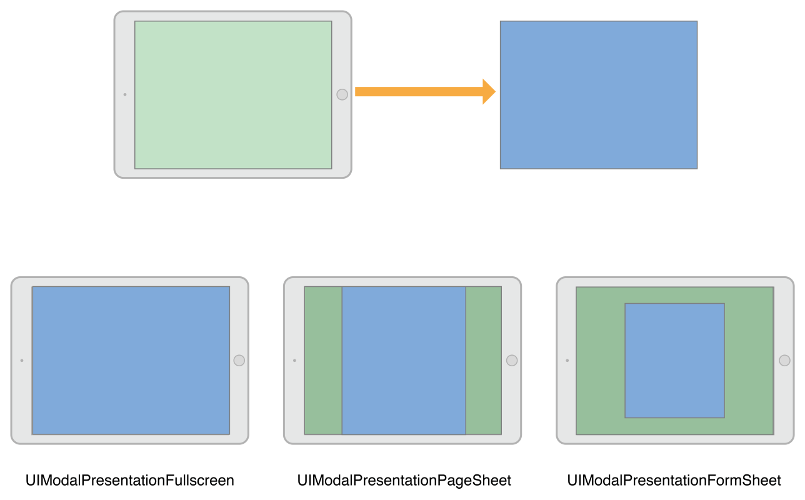
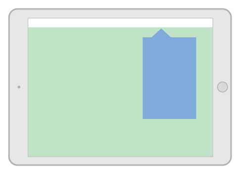
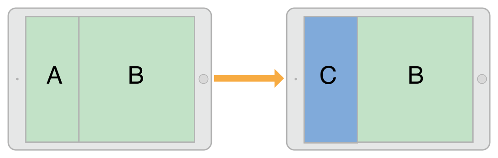
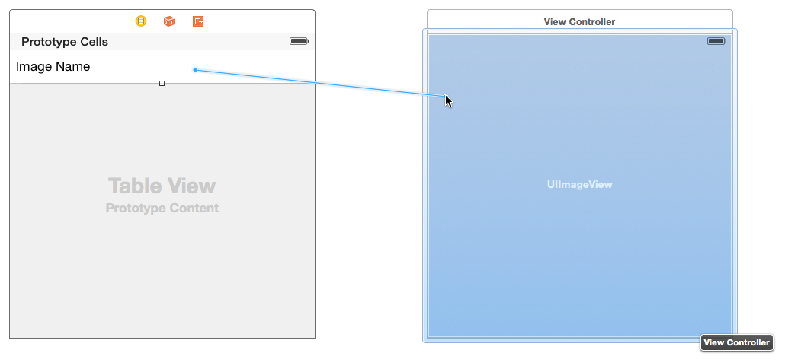
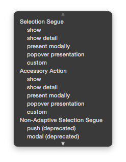
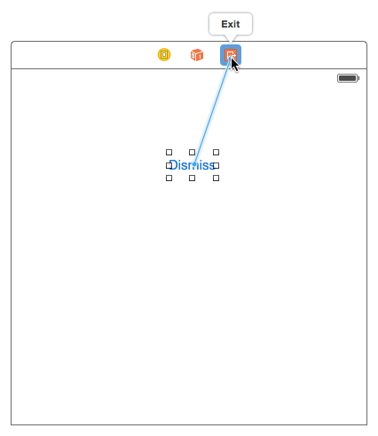
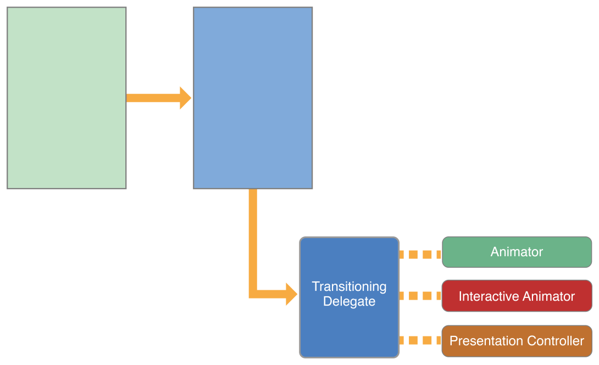
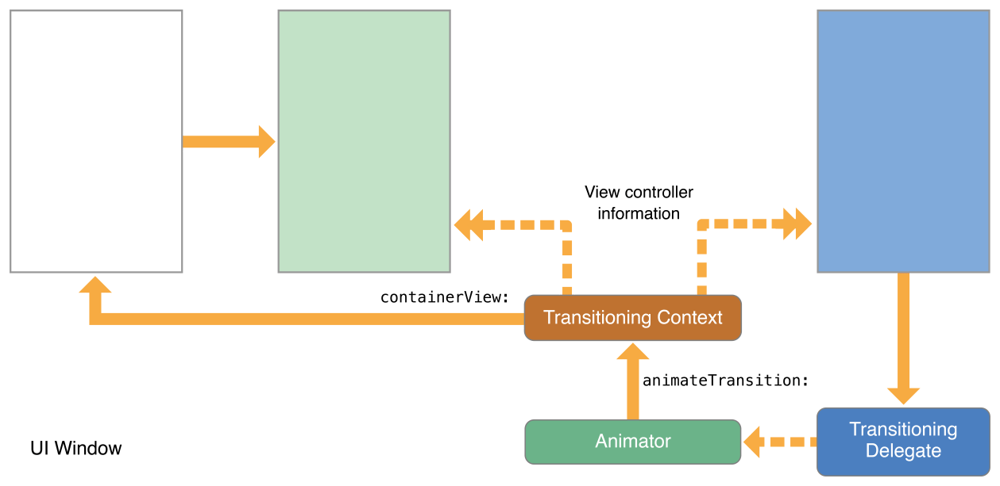
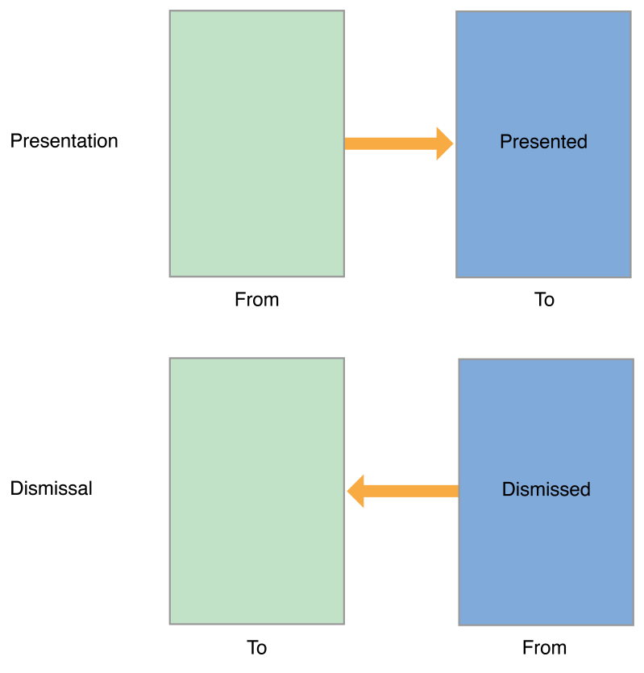

# Presentations and Transitions  双语

[[toc]]

## 1. 呈现视图控制器 🍟 PresentingaViewController

There are two ways to display a view controller onscreen: embed it in a container view controller or present it. Container view controllers provide an app’s primary navigation, but presenting view controllers is also an important navigation tool. You use direct presentation to display a new view controller on top of the current one. Typically, you present view controllers when you want to implement modal interfaces, but you can also use them for other purposes.

有两种方法可以在屏幕上显示视图控制器：将其嵌入容器视图控制器或呈现它。容器视图控制器提供应用程序的主要导航，但呈现视图控制器也是一个重要的导航工具。您可以直接使用呈现在当前视图控制器之上显示新的视图控制器。通常，当您想要实现模态界面时，您可以呈现视图控制器，但您也可以将它们用于其他目的。

Support for presenting view controllers is built in to the UIViewController class and is available to all view controller objects. You can present any view controller from any other view controller, although UIKit might reroute the request to a different view controller. Presenting a view controller creates a relationship between the original view controller, known as the presenting view controller, and the new view controller to be displayed, known as the presented view controller. This relationship forms part of the view controller hierarchy and remains in place until the presented view controller is dismissed.

`UIViewController`类内置对呈现视图控制器的支持，并且可用于所有视图控制器对象。您可以呈现来自任何其他视图控制器的任何视图控制器，尽管UIKit可能会将请求重新路由到不同的视图控制器。呈现视图控制器会在原始视图控制器（称为呈现视图控制器）和要显示的新视图控制器（称为呈现视图控制器）之间创建关系。这种关系构成视图控制器层次结构的一部分，并保持不变，直到呈现的视图控制器被关闭。

### 呈现和转场过程 🍟 The Presentation and Transition Process

Presenting a view controller is a quick and easy way to animate new content onto the screen. The presentation machinery built into UIKit lets you display a new view controller using built-in or custom animations. The built-in presentations and animations require very little code because UIKit handles all of the work. You can also create custom presentations and animations with little extra effort and use them with any of your view controllers.

呈现视图控制器是在屏幕上显示新内容的一种快速简便的方法。UIKit内置的呈现机制允许您使用内置或自定义动画显示新的视图控制器。内置呈现动画只需要很少的代码，因为UIKit处理所有工作。您还可以轻松创建自定义呈现和动画，并将它们与任何视图控制器一起使用。

You can initiate the presentation of a view controller programmatically or using segues. If you know your app’s navigation at design time, segues are the easiest way to initiate presentations. For more dynamic interfaces, or in cases where there is no dedicated control to initiate the segue, use the methods of UIViewController to present your view controllers.

您可以以编程方式或使用`segue`启动视图控制器的呈现。如果您在设计时知道应用程序的导航，使用`segue`会是启动呈现的最简单方法。对于更动态的界面，或者在没有专用控件来启动`segue`的情况下，使用`UIViewController`的方法来显示您的视图控制器。

### 呈现样式 🍟 Presentation Styles

The presentation style of a view controller governs its appearance onscreen. UIKit defines many standard presentation styles, each with a specific appearance and intent. You can also define your own custom presentation styles. When designing your app, choose the presentation style that makes the most sense for what you are trying to do and assign the appropriate constant to the modalPresentationStyle property of the view controller you want to present.

视图控制器的"呈现样式"控制其在屏幕上的外观。UIKit定义了许多标准呈现样式，每种样式都有特定的外观和意图。您还可以定义自己的自定义呈现样式。设计应用程序时，选择最适合您尝试执行的操作的呈现样式，并将适当的常量分配给您想要呈现的视图控制器的`modalPresentationStyle`属性。

### 全屏呈现样式 🍟 Full-Screen Presentation Styles

Full screen presentation styles cover the entire screen, preventing interactions with the underlying content. In a horizontally regular environment, only one of the full-screen styles covers the underlying content completely. The rest incorporate dimming views or transparency to allow portions of the underlying view controller to show through. In a horizontally compact environment, full-screen presentations automatically adapt to the UIModalPresentationFullScreen style and cover all of the underlying content.

全屏呈现样式覆盖整个屏幕，防止与底层内容交互。在水平`regular`的环境中，只有一种全屏样式完全覆盖底层内容。其余的包含渐变视图或改变透明度，以允许底层视图控制器的部分显示。在水平`compact`的环境中，全屏演示会自动适应`UIModalPresentationFullScreen`样式并覆盖所有底层内容。

Figure 8-1 illustrates the appearance of presentations using the UIModalPresentationFullScreen, UIModalPresentationPageSheet, and UIModalPresentationFormSheet styles in a horizontally regular environment. In the figure, the green view controller on the top-left presents the blue view controller on the top-right and the results of each presentation style are shown below. For some presentation styles, UIKit inserts a dimming view between the content of the two view controllers.

图8-1说明了在水平规则环境中使用`UIModalPresentationFullScreen`、`UIModalPresentationPageSheet`和`UIModalPresentationFormSheet`样式的呈现外观。在图中，左上角的绿色视图控制器在右上角呈现蓝色视图控制器，每个呈现样式的结果如下所示。对于某些呈现样式，UIKit在两个视图控制器的内容之间插入一个渐变视图。

Figure 8-1The full screen presentation styles

图8-1全屏呈现样式



:::tip NOTE
When presenting a view controller using the UIModalPresentationFullScreen style, UIKit normally removes the views of the underlying view controller after the transition animations finish. You can prevent the removal of those views by specifying the UIModalPresentationOverFullScreen style instead. You might use that style when the presented view controller has transparent areas that let underlying content show through.
:::

:::tip 注
当使用`UIModalPresentationFullScreen`样式呈现视图控制器时，UIKit通常会在转换动画完成后删除底层视图控制器的视图。您可以通过指定`UIModalPresentationOverFullScreen`样式来防止删除这些视图。当呈现的视图控制器具有允许底层内容显示的透明区域时，您可以使用该样式。
:::

When using one of the full-screen presentation styles, the view controller that initiates the presentation must itself cover the entire screen. If the presenting view controller does not cover the screen, UIKit walks up the view controller hierarchy until it finds one that does. If it can’t find an intermediate view controller that fills the screen, UIKit uses the root view controller of the window.

当使用一种全屏呈现样式时，启动呈现的视图控制器本身必须覆盖整个屏幕。如果演示视图控制器没有覆盖屏幕，UIKit会向上遍历视图控制器层次结构，直到找到一个覆盖屏幕的视图控制器。如果找不到填充屏幕的中间视图控制器，UIKit会使用窗口的根视图控制器。

### 弹出风格 薯条 The Popover Style

The UIModalPresentationPopover style displays the view controller in a popover view. Popovers are useful for displaying additional information or a list of items related to a focused or selected object. In a horizontally regular environment, the popover view covers only part of the screen, as shown in Figure 8-2. In a horizontally compact environment, popovers adapt to the UIModalPresentationOverFullScreen presentation style by default. A tap outside the popover view dismiss the popover automatically.

在弹出视图中，`UIModalPresentationPopover`样式显示视图控制器。弹出窗口对于显示附加信息或与焦点或选定对象相关的项目列表非常有用。在水平`regular`的环境中，弹出窗口仅覆盖屏幕的一部分，如图8-2所示。在水平`compact`的环境中，弹出窗口默认适应`UIModalPresentationOverFullScreen`呈现样式。在弹出窗口之外点击会自动关闭弹出窗口。

Figure 8-2The popover presentation style

图8-2 popover风格




Because popovers adapt to full-screen presentations in a horizontally compact environment, you usually need to modify your popover code to handle the adaptation. In full-screen mode, you need a way to dismiss a presented popover. You can do that by adding a button, embedding the popover in a dismissible container view controller, or changing the adaptation behavior itself.

因为弹出窗口对于水平`compact`环境是全屏呈现，所以您通常需要修改弹出窗口代码来处理适应。在全屏模式下，您需要一种方法来关闭呈现的弹出窗口。您可以通过添加按钮、将弹出窗口嵌入到可关闭的容器视图控制器中或更改适配水平`compact`环境的行为本身来做到这一点。


For tips on how to configure a popover presentation, see Presenting a View Controller in a Popover.

有关如何配置弹出呈现的tips，请参阅在弹出窗口中呈现视图控制器[|原文](https://developer.apple.com/library/archive/featuredarticles/ViewControllerPGforiPhoneOS/PresentingaViewController.html#//apple_ref/doc/uid/TP40007457-CH14-SW13)。

### 当前上下文样式 🍟 The Current Context Styles

The UIModalPresentationCurrentContext style covers a specific view controller in your interface. When using the contextual style, you designate which view controller you want to cover by setting its definesPresentationContext property to YES. Figure 8-3 illustrates a current context presentation that covers only one child view controller of a split view controller.

在`UIModalPresentationCurrentContext`样式覆盖特定的视图控制器。使用上下文样式时，可以通过将其`definesPresentationContext`属性设置为YES。图8-3说明了仅覆盖拆分视图控制器的一个子视图控制器的当前上下文表示。

Figure 8-3The current context presentation style

图8-3当前上下文呈现样式



:::tip NOTE
When presenting a view controller using the UIModalPresentationFullScreen style, UIKit normally removes the views of the underlying view controller after the transition animations finish. You can prevent the removal of those views by specifying the UIModalPresentationOverCurrentContext style instead. You might use that style when the presented view controller has transparent areas that let underlying content show through.
:::

:::tip 注
当使用`UIModalPresentationFullScreen`样式呈现视图控制器时，UIKit通常会在转换动画完成后删除底层视图控制器的视图。您可以通过指定`UIModalPresentationOverCurrentContext`样式来防止删除这些视图。当呈现的视图控制器具有允许底层内容显示的透明区域时，您可以使用该样式。
:::

The view controller that defines the presentation context can also define the transition animations to use during the presentation. Normally, UIKit animates view controllers onscreen using the value in the modalTransitionStyle property of the presented view controller. If the presentation context view controller has its providesPresentationContextTransitionStyle set to YES, UIKit uses the value in that view controller’s modalTransitionStyle property instead.

视图控制器不仅可以定义呈现的上下文，也可以定义呈现过程中使用的转场动画。通常，UIKit使用所呈现视图控制器的`modalTransitionStyle`属性中的值在屏幕上为视图控制器设置动画。如果呈现上下文视图控制器的`providesPresentationContextTransitionStyle`设置为YES，UIKit将使用该视图控制器的`modalTransitionStyle`属性中的值。

When transitioning to a horizontally compact environment, the current context styles adapt to the UIModalPresentationFullScreen style. To change that behavior, use an adaptive presentation delegate to specify a different presentation style or view controller.

转换到水平`compact`环境时，当前上下文样式适应`UIModalPresentationFullScreen`样式。要更改该行为，请使用自适应呈现`delegate`来指定不同的呈现样式或视图控制器。

### 自定义呈现样式 🍟 Custom Presentation Styles

The UIModalPresentationCustom style lets you present a view controller using a custom style that you define. Creating a custom style involves subclassing UIPresentationController and using its methods to animate any custom view onto the screen and to set the size and position of the presented view controller. The presentation controller also handles any adaptations that occur because of changes to the presented view controller’s traits.

使用`UIModalPresentationCustom`样式可以使用定义的自定义样式来显示视图控制器。创建自定义样式需要子类化`UIPresentationController`并使用其方法在屏幕上为任何自定义视图设置动画，并设置所显示视图控制器的大小和位置。呈现控制器还处理由于所显示视图控制器`traits`的更改而发生的任何调整。

For information on how to define a custom presentation controller, see Creating Custom Presentations.

有关如何定义自定义呈现控制器的信息，请参阅*创建自定义呈现*[|原文](https://developer.apple.com/library/archive/featuredarticles/ViewControllerPGforiPhoneOS/DefiningCustomPresentations.html#//apple_ref/doc/uid/TP40007457-CH25-SW1)。

### 转场样式 🍟 Transition Styles

Transition styles determine the type of animations used to display a presented view controller. For the built-in transition styles, you assign one of the standard transition styles to the modalTransitionStyle property of the view controller you want to present. When you present the view controller, UIKit creates the animations that correspond to that style. For example, Figure 8-4 illustrates how the standard slide-up transition (UIModalTransitionStyleCoverVertical) animates the view controller onscreen. View controller B starts offscreen and animates up and over the top of view controller A. When view controller B is dismissed, the animation reverses so that B slides down to reveal A.

转场样式决定了用于显示视图控制器的动画类型。对于内置的转场样式，您可以将标准转场样式之一分配给要呈现的视图控制器的`modalTransitionStyle`属性。当您呈现视图控制器时，UIKit会创建与该样式相对应的动画。例如，图8-4说明了标准的上滑转换（`UIModalTransitionStyleCoverVertical`）如何在屏幕上为视图控制器设置动画。视图控制器B从屏幕外开始，并在视图控制器A的顶部向上和向上设置动画。当视图控制器B被关闭时，动画会反转，以便B向下滑动以显示A。


Figure 8-4A transition animation for a view controller

图8-4A视图控制器的转场动画


You can create custom transitions using an animator object and transitioning delegate. The animator object creates the transition animations for placing the view controller onscreen. The transitioning delegate supplies that animator object to UIKit at the appropriate time. For information about how to implement custom transitions, see Customizing the Transition Animations.

您可以使用`animator`对象和转场委托创建自定义转换。`animator`对象创建用于将视图控制器放置在屏幕上的转换动画。转场委托在适当的时间将该`animator`对象提供给UIKit。有关如何实现自定义转换的信息，请参阅*自定义转换动画*[|原文](https://developer.apple.com/library/archive/featuredarticles/ViewControllerPGforiPhoneOS/CustomizingtheTransitionAnimations.html#//apple_ref/doc/uid/TP40007457-CH16-SW1)。

### 呈现与展现视图控制器 🍟 Presenting Versus Showing a View Controller

The UIViewController class offers two ways to display a view controller:

`UIViewController`类提供了两种显示视图控制器的方法：

* The `showViewController:sender:` and `showDetailViewController:sender:` methods offer the most adaptive and flexible way to display view controllers. These methods let the presenting view controller decide how best to handle the presentation. For example, a container view controller might incorporate the view controller as a child instead of presenting it modally. The default behavior presents the view controller modally.

* `showViewController:sender:`和`showDetailViewController:sender:`方法为显示视图控制器提供了最具适应性和灵活性的方法。这些方法让呈现视图控制器决定如何最好地处理呈现。例如，容器视图控制器可能将视图控制器合并为子视图控制器，而不是以模态方式呈现它。默认行为以模态方式呈现视图控制器。

* The `presentViewController:animated:completion:` method always displays the view controller modally. The view controller that calls this method might not ultimately handle the presentation but the presentation is always modal. This method adapts the presentation style for horizontally compact environments.

* `presentViewController:animated:completion:`方法始终以模态方式显示视图控制器。调用此方法的视图控制器可能不会最终处理呈现过程，但呈现效果始终是模态的。此方法对适应水平`compact`的环境做呈现样式的适配。

The showViewController:sender: and showDetailViewController:sender: methods are the preferred way to initiate presentations. A view controller can call them without knowing anything about the rest of the view controller hierarchy or the current view controller’s position in that hierarchy. These methods also make it easier to reuse view controllers in different parts of your app without writing conditional code paths.

`showViewController:sender:`和`showDetailViewController:sender:`方法是展示视图控制器的首选方式。视图控制器可以调用它们，而无需了解视图控制器层次结构的其余部分或当前视图控制器在该层次结构中的位置。这些方法还可以更轻松地在应用程序的不同部分重用视图控制器，而无需编写条件代码路径。

### 呈现视图控制器 🍟 Presenting a View Controller

There are several ways to initiate the presentation of a view controller:

有几种方法可以启动视图控制器的呈现：

* Use a segue to present the view controller automatically. The segue instantiates and presents the view controller using the information you specified in Interface Builder. For more information on how to configure segues, see Using Segues.

* 使用`segue`自动显示视图控制器。`segue`使用您在`Interface Builder`中指定的信息实例化并显示视图控制器。有关如何配置`segue`的详细信息，请参阅*使用segue*。

* Use the showViewController:sender: or showDetailViewController:sender: method to display the view controller. In custom view controllers, you can change the behavior of these methods to something more suitable for your view controller.

* 调用`showViewController:sender:`或`showDetailViewController:sender:`方法显示视图控制器。在自定义视图控制器中，您可以将这些方法的行为更改为更适合您的视图控制器的行为。

* Call the presentViewController:animated:completion: method to present the view controller modally.

* 调用`presentViewController:animated:completion:`方法以模态方式呈现视图控制器。

For information about how to dismiss a view controller that you presented using one of these techniques, see Dismissing a Presented View Controller.

有关如何使用这些方法之一关闭呈现的视图控制器的信息，请参阅*关闭呈现的视图控制器*。

### 显示视图控制器 🍟 Showing View Controllers

When using the showViewController:sender: and showDetailViewController:sender: methods, the process for getting a new view controller onscreen is straightforward:

当使用`showViewController:sender:`和`showDetailViewController:sender:`方法时，在屏幕上获取新视图控制器的过程很简单：

* Create the view controller object you want to present. When creating the view controller, it is your responsibility to initialize it with whatever data it needs to perform its task.

* 创建出要显示的视图控制器对象。创建视图控制器时，您有责任使用执行功能所需的任何数据对其进行初始化。

* Set the modalPresentationStyle property of the new view controller to the preferred presentation style. This style might not be used in the final presentation.

* 将新视图控制器的`modalPresentationStyle`属性设置为首选呈现样式。此样式可能不会在最终呈现中使用。

* Set the modalTransitionStyle property of the view controller to the desired transition animation style. This style might not be used in the final animations.

* 将视图控制器的`modalTransitionStyle`属性设置为所需的转场动画样式。此样式可能不会在最终动画中使用。

* Call the showViewController:sender: and showDetailViewController:sender: method of the current view controller.

* 调用`showViewController:sender:`和当前视图控制器的`showDetailViewController:sender:`方法。

UIKit forwards calls to the showViewController:sender: and showDetailViewController:sender: methods to the appropriate presenting view controller. That view controller can then decide how best to perform the presentation and can change the presentation and transition styles as needed. For example, a navigation controller might push the view controller onto its navigation stack.

UIKit将对`showViewController:sender:`和`showDetailViewController:sender:`的调用转发到相应的呈现视图控制器。然后，该视图控制器可以决定如何最好地执行表示，并且可以根据需要更改表示和转换样式。例如，导航控制器可能会将视图控制器推送到其导航堆栈上

For information about the differences between showing view controllers and presenting them modally, see Presenting Versus Showing a View Controller.

有关展现视图控制器和模态显示它们之间差异的信息，请参阅*呈现与展现视图控制器*。


### 模态化呈现视图控制器 🍟 Presenting View Controllers Modally

When presenting a view controller directly, you tell UIKit how you want the new view controller to be displayed and how it should be animated onscreen.

当直接呈现视图控制器时，您告诉UIKit您希望新视图控制器如何显示以及它应该如何在屏幕上显示动画。

* Create the view controller object you want to present.
   
   When creating the view controller, it is your responsibility to initialize it with whatever data it needs to perform its task.

* 创建出要呈现的视图控制器对象。

   创建视图控制器时，您有责任使用完成功能所需的任何数据对其进行初始化。

* Set the modalPresentationStyle property of the new view controller to the desired presentation style.

* 将新视图控制器的modalPresentationStyle属性设置为所需的表示样式。

* Set the modalTransitionStyle property of the view controller to the desired animation style.

* 将视图控制器的modalTransitionStyle属性设置为所需的动画样式。

* Call the presentViewController:animated:completion: method of the current view controller.

* 调用`presentViewController:animated:completion:`方法。

The view controller that calls the presentViewController:animated:completion: method may not be the one that actually performs the modal presentation. The presentation style determines how that view controller is to be presented, including the characteristics required of the presenting view controller. For example, a full-screen presentation must be initiated by a full-screen view controller. If the current presenting view controller is not suitable, UIKit walks the view controller hierarchy until it finds one that is. Upon completion of a modal presentation, UIKit updates the presentingViewController and presentedViewController properties of the affected view controllers.

调用`presentViewController:animated:completion:`方法的视图控制器可能不是实际执行模态表示的视图控制器。呈现样式决定了视图控制器的呈现方式，包括表示视图控制器所需的`characteristics`。例如，全屏表示必须由全屏视图控制器启动。如果当前正在呈现视图控制器那是不合适的，UIKit将遍历视图控制器层次结构，直到找到合适的视图控制器。完成模态表示后，UIKit会更新受影响视图控制器的`presentingViewController`和`presentedViewController`属性。

Listing 8-1 demonstrates how to present a view controller programmatically. When the user adds a new recipe, the app prompts the user for basic information about the recipe by presenting a navigation controller. A navigation controller was chosen so that there would be a standard place to put a Cancel and Done button. Using a navigation controller also makes it easier to expand the new recipe interface in the future. All you have to do is push new view controllers on the navigation stack.

清单8-1演示了如何以编程方式呈现视图控制器。当用户添加新配方时，应用程序通过呈现导航控制器提示用户有关配方的基本信息。选择了导航控制器，以便在标准位置放置取消和完成按钮。使用导航控制器还可以更轻松地在未来扩展新配方界面。您所要做的就是在导航堆栈上推送新的视图控制器。

Listing 8-1Presenting a view controller programmatically

示例8-1以编程方式呈现视图控制器
```objc
- (void)add:(id)sender {
   // Create the root view controller for the navigation controller
   // The new view controller configures a Cancel and Done button for the
   // navigation bar.
   RecipeAddViewController *addController = [[RecipeAddViewController alloc] init];
 
   addController.modalPresentationStyle = UIModalPresentationFullScreen;
   addController.transitionStyle = UIModalTransitionStyleCoverVertical;
   [self presentViewController:addController animated:YES completion: nil];
}
```

### 在Popover中呈现视图控制器 🍟 Presenting a View Controller in a Popover

Popovers require additional configuration before you can present them. After setting the modal presentation style to UIModalPresentationPopover, configure the following popover-related attributes:

Popover需要额外配置才能呈现。将模态呈现样式设置为UIModalPresentationPopover后，配置以下popover相关属性：

* Set the preferredContentSize property of your view controller to the desired size.

* 将视图控制器的`preferredContentSize`属性设置为所需的大小。

* Set the popover anchor point using the associated UIPopoverPresentationController object, which is accessible from the view controller’s popoverPresentationController property. Set only one of the following:

   * Set the barButtonItem property to a bar button item.

   * Set the sourceView and sourceRect properties to a specific region in one of your views.

* 使用关联的`UIPopoverPresentationController`对象设置popover锚点，该对象可从视图控制器的`popoverPresentationController`属性访问。仅设置以下一项：

   * 将`barButtonItem`属性设置为`bar button item`。

   * 将`sourceView`和`sourceRect`属性设置为某个视图中的特定区域。

You can use the UIPopoverPresentationController object to make other adjustments to the popover’s appearance as needed. The popover presentation controller also supports a delegate object that you can use to respond to changes during the presentation process. For example, you can use the delegate to respond when the popover appears, disappears, or is repositioned on the screen. Fore more information about this object, see UIPopoverPresentationController Class Reference.

您可以使用`UIPopoverPresentationController`对象根据需要对popover的外观进行其他调整。`popover presentation controller`还支持一个委托对象，您可以使用该对象来响应呈现过程中的更改。例如，您可以使用委托来响应popover在屏幕上出现、消失或重新定位时。有关此对象的更多信息，请参阅*UIPopoverPresentationController类参考*。

### 关闭呈现的视图控制器 🍟 Dismissing a Presented View Controller

To dismiss a presented view controller, call the dismissViewControllerAnimated:completion: method of the presenting view controller. You can also call this method on the presented view controller itself. When you call the method on the presented view controller, UIKit automatically forwards the request to the presenting view controller.

要关闭呈现视图控制器，请调用`presented`的视图控制器的`dismissViewControllerAnimated:completion:`方法。您也可以在`presenting`视图控制器本身上调用此方法。当您在`presented`视图控制器上调用该方法时，UIKit会自动将请求转发给`presenting`视图控制器。

Always save any important information from a view controller before dismissing it. Dismissing a view controller removes it from the view controller hierarchy and removes its view from the screen. If you do not have a strong reference to the view controller stored elsewhere, dismissing it releases the memory associated with it.

在关闭视图控制器之前，请务必从视图控制器中保存任何重要信息。关闭视图控制器会将其从视图控制器层次结构中删除，并从屏幕中删除其视图。如果您没有对存储在其他地方的视图控制器的强引用，则关闭它会释放与其关联的内存。

If the presented view controller must return data to the presenting view controller, use the delegation design pattern to facilitate the transfer. Delegation makes it easier to reuse view controllers in different parts of your app. With delegation, the presented view controller stores a reference to a delegate object that implements methods from a formal protocol. As it gathers results, the presented view controller calls those methods on its delegate. In a typical implementation, the presenting view controller makes itself the delegate of its presented view controller.

如果`presented`视图控制器必须将数据返回到`presenting`视图控制器，则使用委托设计模式来促进传输。委托使得在应用程序的不同部分重用视图控制器变得更加容易。通过委托，`presented`视图控制器存储对实现正式协议中方法的委托对象的引用。当它收集结果时，`presented`视图控制器在其委托上调用这些方法。在典型的实现中，`presenting`视图控制器使自己成为其`presented`视图控制器的委托。

### 呈现在不同故事板中定义的视图控制器 🍟 Presenting a View Controller Defined in a Different Storyboard

Although you can create segues between view controllers in the same storyboard, you cannot create segues between storyboards. When you want to display a view controller stored in a different storyboard, you must instantiate that view controller explicitly before presenting it, as shown in Listing 8-2. The example presents the view controller modally but you could push it onto a navigation controller or display it in other ways.

尽管您可以在同一故事板中的视图控制器之间创建`segue`，但您不能在故事板之间创建`segue`。当您想要显示存储在不同故事板中的视图控制器时，您必须在显示它之前显式地实例化该视图控制器，如清单8-2所示。该示例以模态方式显示视图控制器，但您可以将其推送到导航控制器或以其他方式显示它。

Listing 8-2Loading a view controller from a storyboard

示例8-2从故事板加载视图控制器

```objc
UIStoryboard* sb = [UIStoryboard storyboardWithName:@"SecondStoryboard" bundle:nil];
MyViewController* myVC = [sb instantiateViewControllerWithIdentifier:@"MyViewController"];
 
// Configure the view controller.
 
// Display the view controller
[self presentViewController:myVC animated:YES completion:nil];
```

There is no requirement that you create multiple storyboards in your app. Here, though, are a few cases where multiple storyboards might be useful:

这里并不要求您在应用程序中创建多个故事板。不过，还是有一些多个故事板可能有用的情况：

* You have a large programming team, with different portions of the user interface assigned to different parts of the team. Each team owns its portion of the user interface in a different storyboard file to minimize contention.

* 比如您有一个大型编程团队，将用户交互界面的不同部分分配给团队的不同部分。每个团队在不同的故事板文件中拥有自己的用户交互界面部分，以最大限度地减少争用。

* You purchased or created a library that predefines a collection of view controller types; the contents of those view controllers are defined in a storyboard provided by the library.

* 您购买或创建了一个预定义视图控制器类型集合的库；这些视图控制器的内容在库提供的故事板中定义。

You have content that needs to be displayed on an external screen. In this case, you might keep all of the view controllers associated with the alternate screen inside a separate storyboard. An alternative pattern for the same scenario is to write a custom segue.

您有需要在外部屏幕上显示的内容。在这种情况下，您可以将与备用屏幕关联的所有视图控制器保存在单独的故事板中。同一场景的另一种模式是编写自定义`segue`。

## 2. 使用Segue 🍟 Using Segues

Use segues to define the flow of your app’s interface. A segue defines a transition between two view controllers in your app’s storyboard file. The starting point of a segue is the button, table row, or gesture recognizer that initiates the segue. The end point of a segue is the view controller you want to display. A segue always presents a new view controller, but you can also use an unwind segue to dismiss a view controller.

使用`segue`定义应用界面的转换。`segue`定义应用故事板文件中两个视图控制器之间的转换。`segue`的起点是`button`、`table row`或`gesture recognizer`。`segue`的终点是您要显示的视图控制器。`segue`总是显示一个新的视图控制器，但您也可以`Unwind Segue`面板来关闭视图控制器。

Figure 9-1A segue between two view controllers

图9-1A两个视图控制器之间的切换


You do not need to trigger segues programmatically. At runtime, UIKit loads the segues associated with a view controller and connects them to the corresponding elements. When the user interacts with the element, UIKit loads the appropriate view controller, notifies your app that the segue is about to occur, and executes the transition. You can use the notifications sent by UIKit to pass data to the new view controller or prevent the segue from happening altogether.

您不需要以编程方式触发`segue`。在运行时，UIKit加载与视图控制器关联的`segue`，并将它们连接到相应的元素。当用户与界面元素交互时，UIKit加载适当的视图控制器，通知您的应用程序`segue`即将发生，并执行转换。您可以使用UIKit发送的通知将数据传递给新的视图控制器或完全阻止`segue`发生。

### 在视图控制器之间创建Segue 🍟 Creating a Segue Between View Controllers

To create a segue between view controllers in the same storyboard file, Control-click an appropriate element in the first view controller and drag to the target view controller. The starting point of a segue must be a view or object with a defined action, such as a control, bar button item, or gesture recognizer. You can also create segues from cell-based views such as tables and collection views. Figure 9-2 shows the creation of a segue that displays a new view controller when a table row is tapped.

要在同一故事板文件中的视图控制器之间创建`segue`，请在第一个视图控制器中控制单击适当的元素并拖动到目标视图控制器。`segue`的起点必须是具有定义好`action`的视图或对象，例如控件、顶栏按钮项或手势识别器。您还可以从`cell-based`的视图（例如表格和集合视图）创建`segue`。图9-2显示了创建`segue`的过程，当点击表格行时，它会显示一个新的视图控制器。

Figure 9-2Creating the segue relationship

图9-2创建segue关系



:::tip NOTE
Some elements support multiple segues. For example, a table row lets you configure different segues for taps in the row’s accessory button and taps in the rest of the row.
:::

:::tip 注
一些界面元素支持多个`segues`。例如，表格行允许您为行`accessory`按钮中的点击和该行其余部分的点击配置不同的`segues`。
:::

When you release the mouse button, Interface Builder prompts you to select the type of relationship you want to create between the two view controllers, as shown in Figure 9-3. Select the segue that corresponds to the transition you want.

当您释放鼠标按钮时，`Interface Builder`会提示您选择要在两个视图控制器之间创建的关系类型，如图9-3所示。

Figure 9-3Selecting the type of segue to create

图9-3选择要创建的segue类型



When selecting the relationship type for your segue, select an adaptive segue whenever possible. Adaptive segues adjust their behavior automatically based on the current environment. For example, the behavior of a Show segue changes based on the presenting view controller. Nonadaptive segues are provided for apps that must also run on iOS 7, which does not support adaptive segues. Figure 9-1 lists the adaptive segues and how they behave in your app.

为`segue`选择关系类型时，尽可能选择一个自适应的`segue`。自适应`segue`会根据当前环境自动调整其行为。例如，一个`Show segue`的行为会根据呈现视图控制器发生变化。非自适应`segue`是为也必须在不支持自适应`segue`的iOS7上运行的应用程序提供的。图9-1列出了自适应`segue`以及它们在应用程序中的行为方式。

Table 9-1Adaptive segue types

表9-1自适应segue类型

| Segue type | Behavior |
| --- | --- |
| Show (Push) | This segue displays the new content using the [`showViewController:sender:`](https://developer.apple.com/documentation/uikit/uiviewcontroller/1621377-showviewcontroller) method of the target view controller. For most view controllers, this segue presents the new content modally over the source view controller. Some view controllers specifically override the method and use it to implement different behaviors. For example, a navigation controller pushes the new view controller onto its navigation stack. UIKit uses the [`targetViewControllerForAction:sender:`](https://developer.apple.com/documentation/uikit/uiviewcontroller/1621415-targetviewcontroller) method to locate the source view controller. |
| Show Detail (Replace) | This segue displays the new content using the [`showDetailViewController:sender:`]( https://developer.apple.com/documentation/uikit/uiviewcontroller/1621432-showdetailviewcontroller) method of the target view controller. This segue is relevant only for view controllers embedded inside a [`UISplitViewController`](https://developer.apple.com/documentation/uikit/uisplitviewcontroller) object. With this segue, a split view controller replaces its second child view controller (the detail controller) with the new content. Most other view controllers present the new content modally. UIKit uses the [`targetViewControllerForAction:sender:`](https://developer.apple.com/documentation/uikit/uiviewcontroller/1621415-targetviewcontroller) method to locate the source view controller. |
| Present Modally | This segue displays the view controller modally using the specified presentation and transition styles. The view controller that defines the appropriate presentation context handles the actual presentation. |
| Present as Popover | In a horizontally regular environment, the view controller appears in a popover. In a horizontally compact environment, the view controller is displayed using a full-screen modal presentation. |

| `Segue`类型 | 行为 |
| --- | --- |
| Show (Push) | 此`segue`使用目标视图控制器的[`showViewController:sender:`](https://developer.apple.com/documentation/uikit/uiviewcontroller/1621377-showviewcontroller)方法显示新内容。对于大多数视图控制器，此segue在源视图控制器上以模态方式显示新内容。一些视图控制器专门覆盖该方法并使用它来实现不同的行为。例如，导航控制器将新视图控制器推送到其导航堆栈上。UIKit使用[`targetViewControllerForAction:sender:`](https://developer.apple.com/documentation/uikit/uiviewcontroller/1621415-targetviewcontroller)方法来定位源视图控制器。 |
| Show Detail (Replace) | 此`segue`使用目标视图控制器的[`showDetailViewController:sender:`]( https://developer.apple.com/documentation/uikit/uiviewcontroller/1621432-showdetailviewcontroller)方法显示新内容。此`segue`仅与嵌入在[`UISplitViewController`](https://developer.apple.com/documentation/uikit/uisplitviewcontroller)对象中的视图控制器相关。使用此`segue`，拆分视图控制器用新内容替换其第二个子视图控制器（`detail`控制器）。大多数其他视图控制器以模态方式显示新内容。UIKit使用[`targetViewControllerForAction:sender:`](https://developer.apple.com/documentation/uikit/uiviewcontroller/1621415-targetviewcontroller)方法来定位源视图控制器。 |
| Present Modally | 此`segue`使用指定的呈现和转场样式模态地显示视图控制器。定义正确呈现上下文的视图控制器处理实际呈现。 |
| Present as Popover| 在水平`regular`的环境中，视图控制器出现在弹出窗口中。在水平`compact`的环境中，视图控制器使用全屏模式呈现。 |


After creating a segue, select the segue object and assign an identifier to it using the attributes inspector. During a segue, you can use the identifier to determine which segue was triggered, which is especially useful if your view controller supports multiple segues. The identifier is included in the UIStoryboardSegue object delivered to your view controller when the segue is performed.

创建`segue`后，选择`segue`对象，并使用属性检查器为其分配一个标识符。在`segue`期间，您可以使用该标识符来确定触发了哪个`segue`，这在您的视图控制器支持多个`segue`时特别有用。该标识符包含在执行`segue`时传递给您的视图控制器的`UIStoryboardSegue`对象中。

### 在运行时修改Segue的行为 🍟 Modifying a Segue’s Behavior at Runtime

Figure 9-4 shows what happens when a segue is triggered. Most of the work happens in the presenting view controller, which manages the transition to the new view controller. The configuration of the new view controller follows essentially the same process as when you create the view controller yourself and present it. Because segues are configured from storyboards, both view controllers involved in the segue must be in the same storyboard.

图9-4显示了当`segue`被触发时会发生什么。大部分工作发生在`presenting`视图控制器中，它管理到新视图控制器的转换。新视图控制器的配置遵循与您自己创建视图控制器并呈现它时基本相同的过程。因为`segue`是从故事板配置的，所以`segue`中涉及的两个视图控制器必须在同一个故事板中。

Figure 9-4Displaying a view controller using a segue

图9-4使用segue显示视图控制器


During a segue, UIKit calls methods of the current view controller to give you opportunities to affect the outcome of the segue.

在`segue`期间，UIKit调用当前视图控制器的方法，让您有机会影响`segue`的结果。

The shouldPerformSegueWithIdentifier:sender: method gives you an opportunity to prevent a segue from happening. Returning NO from this method causes the segue to fail quietly but does not prevent other actions from happening. For example, a tap in a table row still causes the table to call any relevant delegate methods.

该`shouldPerformSegueWithIdentifier:sender:`返回NO会导致`segue`无效，但不会阻止其他操作的发生。例如，在表行中点击仍然会导致表调用任何相关的委托方法。

The prepareForSegue:sender: method of the source view controller lets you pass data from the source view controller to the destination view controller. The UIStoryboardSegue object passed to the method contains a reference to the destination view controller along with other segue-related information.

源视图控制器的`prepareForSegue:sender:`方法允许您将数据从源视图控制器传递到目标视图控制器。传递给该方法的`UIStoryboardSegue`对象包含对目标视图控制器的引用以及其他与`segue`相关的信息。

### 创建一个 `Unwind Segue` 🍟 Creating an Unwind Segue

Unwind segues let you dismiss view controllers that have been presented. You create unwind segues in Interface Builder by linking a button or other suitable object to the Exit object of the current view controller. When the user taps the button or interacts with the appropriate object, UIKit searches the view controller hierarchy for an object capable of handling the unwind segue. It then dismisses the current view controller and any intermediate view controllers to reveal the target of the unwind segue.

`Unwind Segue`允许您关闭已呈现的视图控制器。您可以通过将按钮或其他合适的对象链接到当前视图控制器的`Exit`对象来在`Interface Builder`中创建`Unwind Segue`。当用户点击按钮或与适当的对象交互时，UIKit会在视图控制器层次结构中搜索能够处理`Unwind Segue`的对象。然后它会关闭当前视图控制器和任何中间视图控制器以显示`Unwind Segue`的目标。

**To create an unwind segue**

**创造一个`unwind segue`**

Choose the view controller that should appear onscreen at the end of an unwind segue.

* 选择应该出现在`unwind segue`结束时屏幕上的视图控制器。

Define an unwind action method on the view controller you chose.

* 在您选择的视图控制器上定义`unwind action`方法。

   The Swift syntax for this method is as follows:

   此方法的Swift语法如下：
   ```swift
   @IBAction func myUnwindAction(unwindSegue: UIStoryboardSegue)
   ```
   The Objective-C syntax for this method is as follows:

   此方法的Objective-C语法如下：
   ```objc
   - (IBAction)myUnwindAction:(UIStoryboardSegue*)unwindSegue
   ```
* Navigate to the view controller that initiates the unwind action.

* 导航到启动`unwind action`的视图控制器。

* Control-click the button (or other object) that should initiate the unwind segue. This element should be in the view controller you want to dismiss.

* 控制单击应该启动`Unwind Segue`的按钮（或其他对象）。此界面元素应该在您要关闭的视图控制器中。

* Drag to the Exit object at the top of the view controller scene. 

* 拖到视图控制器顶部的`Exit`对象。
   

* Select your unwind action method from the relationship panel.

* 从`relationship`面板中选择`unwind action`方法。

You must define an unwind action method in one of your view controllers before trying to create the corresponding unwind segue in Interface Builder. The presence of that method is required and tells Interface Builder that there is a valid target for the unwind segue.

在尝试在`Interface Builder`中创建相应的`Unwind Segue`之前，您必须在其中一个视图控制器中定义一个`unwind action`方法。该方法的存在是必需的，并告诉`Interface Builder`有一个有效的`Unwind Segue`目标。

Use the implementation of your unwind action method to perform any tasks that are specific to your app. You do not need to dismiss any view controllers involved in the segue yourself; UIKit does that for you. Instead, use the segue object to fetch the view controller being dismissed so that you can retrieve data from it. You can also use the unwind action to update the current view controller before the unwind segue finishes.

使用`unwind action`方法的实现来执行特定于您的应用程序的任何任务。您不需要自己关闭segue中涉及的任何视图控制器；UIKit会为您这样做。相反，使用segue对象获取正在关闭的视图控制器，以便您可以从中检索数据。您还可以使用`unwind action`在`Unwind Segue`完成之前更新当前视图控制器。

### 以编程方式启动`Segue` 🍟 Initiating a Segue Programmatically

Segues are usually triggered because of the connections you create in your storyboard file. However, there may be times when you cannot create segues in your storyboard, perhaps because the destination view controller is not yet known. For example, a game app might transition to different screens depending on the outcome of the game. In those situations, you can trigger segues programmatically from your code using the performSegueWithIdentifier:sender: method of the current view controller.

`Segue`通常是因为您在故事板文件中创建的连接而被触发的。但是，有时您可能无法在故事板中创建`segue`，这可能是因为目标视图控制器尚不清楚。例如，游戏应用程序可能会根据游戏结果转换到不同的屏幕。在这种情况下，您可以使用当前视图控制器的`performSegueWithIdentifier:sender:`方法从代码中以编程方式触发`segue`。

Listing 9-1 illustrates a segue that presents a specific view controller when rotating from portrait to landscape. Because the notification object in this case provides no useful information for performing the segue command, the view controller designates itself as the sender of the segue.

清单9-1说明了一个`segue`，当从纵向到横向旋转时，它显示一个特定的视图控制器。因为在这种情况下，通知对象没有提供执行`segue`命令的有用信息，所以视图控制器将自己指定为`segue`的发送者。

Listing 9-1Triggering a segue programmatically

示例9-1以编程方式触发segue

```objc
- (void)orientationChanged:(NSNotification *)notification {
    UIDeviceOrientation deviceOrientation = [UIDevice currentDevice].orientation;
    if (UIDeviceOrientationIsLandscape(deviceOrientation) &&
             !isShowingLandscapeView) {
        [self performSegueWithIdentifier:@"DisplayAlternateView" sender:self];
        isShowingLandscapeView = YES;
    }
// Remainder of example omitted.
}
```

### 创建自定义Segue 🍟 Creating a Custom Segue

Interface Builder provides segues for all of the standard ways to transition from one view controller to another—from presenting a view controller to displaying a controller in a popover. However, if one of those segues doesn’t do what you want, you can create a custom segue.

`Interface Builder`为从一个视图控制器转换到另一个视图控制器的所有标准方法提供了`segue`——不论是呈现视图控制器，还是在弹出窗口中显示控制器。但是，如果其中一个`segue`不能满足您的要求，您可以创建一个自定义`segue`。

### Segue的生命周期 🍟 The Life Cycle of a Segue

要了解自定义`segue`的工作原理，您需要了解`segue`对象的生命周期。`segue`对象是`UIStoryboardSegue`类或其子类之一的实例。您的应用程序从不直接创建`segue`对象；UIKit在触发`segue`时创建它们。情况如下：

* The view controller to be presented is created and initialized.

* 首先，创建并初始化要呈现的视图控制器。

* The segue object is created and its initWithIdentifier:source:destination: method is called. The identifier is the unique string you provided for the segue in Interface Builder, and the two other parameters represent the two controller objects in the transition.

* 创建segue对象并调用它的`initWithIdentifier:source:destination:方法。标识符是您在Interface Builder`中为`segue`提供的唯一字符串，另外两个参数表示转换中的两个控制器对象。

* The presenting view controller’s prepareForSegue:sender: method is called. See Modifying a Segue’s Behavior at Runtime.

* `presenting`视图控制器的`prepareForSegue:sender:`方法被调用。请参阅*在运行时修改Segue的行为*[|原文](https://developer.apple.com/library/archive/featuredarticles/ViewControllerPGforiPhoneOS/UsingSegues.html#//apple_ref/doc/uid/TP40007457-CH15-SW11)。

* The segue object’s perform method is called. This method performs a transition to bring the new view controller onscreen.

* `segue`对象的`perform`方法被调用。此方法执行转换以将新的视图控制器显示在屏幕上。

* The reference to the segue object is released.

* segue对象的引用被释放。

### 实现自定义Segue 🐶 Implementing a Custom Segue

To implement a custom segue, subclass UIStoryboardSegue and implement the following methods:

要实现自定义`segue`，继承`UIStoryboardSegue`并实现以下方法：

* Override the initWithIdentifier:source:destination: method and use it to initialize your custom segue object. Always call super first.

* 重写`initWithIdentifier:source:destination:`方法并使用它来初始化您的自定义`segue`对象。始终先调用`super`方法。

* Implement the perform method and use it to configure your transition animations.

* 实现`perform`方法并使用它来配置转场动画。

:::tip NOTE
If your implementation adds properties to configure the segue, you cannot configure these attributes in Interface Builder. Instead, configure the custom segue’s additional properties in the prepareForSegue:sender: method of the source view controller that triggered the segue.
:::

:::tip 注
如果您的实现添加了属性来配置`segue`，则无法在`Interface Builder`中配置这些属性。相反，请在触发`segue`的源视图控制器的`prepareForSegue:sender:`方法中配置自定义`segue`的附加属性。
:::

Listing 9-2 shows a very simple custom segue. This example simply presents the destination view controller without any sort of animation, but you can extend this idea with your own animations as necessary.

清单9-2 显示了一个非常简单的自定义`segue`。此示例仅显示目标视图控制器，没有任何类型的动画，但您可以根据需要使用自己的动画扩展此想法。

Listing 9-2A custom segue

清单9-2A 自定义`segue`

```objc
- (void)perform {
    // Add your own animation code here.
 
    [[self sourceViewController] presentViewController:[self destinationViewController] animated:NO completion:nil];
}
```

## 3.自定义转场动画 🍟 Customizing the Transition Animations

Transition animations provide visual feedback about changes to your app’s interface. UIKit provides a set of standard transition styles to use when presenting view controllers, and you can supplement the standard transitions with custom transitions of your own.

转场动画提供有关应用界面切换的视觉反馈。UIKit提供了一组标准转场样式，用于呈现视图控制器，您可以用自己的自定义转场来补充标准转场。

### 转场动画序列 🍟 The Transition Animation Sequence

A transition animation swaps the contents of one view controller for the contents of another. There are two types of transitions: presentations and dismissals. A presentation transition adds a new view controller to your app’s view controller hierarchy, whereas a dismissal transition removes one or more view controllers from the hierarchy.

转换动画将一个视图控制器的内容交换为另一个视图控制器的内容。有两种类型的转换：呈现和关闭。呈现转换将新的视图控制器添加到应用程序的视图控制器层次结构中，而关闭转换将从层次结构中删除一个或多个视图控制器。

It takes many objects to implement a transition animation. UIKit provides default versions of all of the objects involved in transitions, and you can customize all of them or only a subset. If you choose the right set of objects, you should be able to create your animations with only a small amount of code. Even animations that include interactions can be implemented easily if you take advantage of the existing code that UIKit provides.

实现转场动画需要许多对象。UIKit提供了转场中涉及的所有对象的默认版本，您可以自定义所有对象或仅自定义子集。如果您选择了正确的对象集合，您应该能够仅用少量代码创建动画。如果您利用UIKit提供的现有代码，即使是包含交互的动画也可以轻松实现。

### 转场委托 🍟 The Transitioning Delegate

The transitioning delegate is the starting point for transition animations and custom presentations. The transitioning delegate is an object that you define and that conforms to the UIViewControllerTransitioningDelegate protocol. Its job is to provide UIKit with the following objects:

转场委托是转场动画和自定义呈现的起点。转场委托是您定义的一个对象，它符合`UIViewControllerTransitioningDelegate`协议。它的工作是为UIKit提供以下对象：

* Animator objects. An animator object is responsible for creating the animations used to reveal or hide a view controller’s view. The transitioning delegate can supply separate animator objects for presenting and dismissing the view controller. Animator objects conform to the UIViewControllerAnimatedTransitioning protocol.

* `Animator`对象。`Animator`对象负责创建用于显示或隐藏视图控制器视图的动画。转场委托可以提供单独的`Animator`对象来呈现和关闭视图控制器。`Animator`对象符合`UIViewControllerAnimatedTransitioning`协议。

* Interactive animator objects. An interactive animator object drives the timing of custom animations using touch events or gesture recognizers. Interactive animator objects conform to the UIViewControllerInteractiveTransitioning protocol.

* 交互式`Animator`对象。交互式`Animator`对象使用触摸事件或手势识别器驱动自定义动画的时序。交互式`Animator`对象符合`UIViewControllerInteractiveTransitioning`协议。

   The easiest way to create an interactive animator is to subclass UIPercentDrivenInteractiveTransition class and add event-handling code to your subclass. That class controls the timing of animations created using your existing animator objects. If you create your own interactive animator, you must render each frame of the animation yourself.

   创建交互式`Animator`的最简单方法是子类化`UIPercentDrivenInteractiveTransition`类并将事件处理代码添加到子类中。该类控制使用现有`Animator`对象创建动画的时间。如果您创建自己的交互式`Animator`，则必须自己渲染动画的每一帧。

* Presentation controller. A presentation controller manages the presentation style while the view controller is onscreen. The system provides presentation controllers for the built-in presentation styles and you can provide custom presentation controllers for your own presentation styles. For more information about creating a custom presentation controller, see Creating Custom Presentations.

* 呈现控制器。当视图控制器在屏幕上时，呈现控制器管理演示样式。系统为内置呈现样式提供呈现控制器，您可以为自己的呈现样式提供自定义呈现控制器。有关创建自定义呈现控制器的更多信息，请参阅*创建自定义呈现*。

Assigning a transitioning delegate to the transitioningDelegate property of a view controller tells UIKit that you want to perform a custom transition or presentation. Your delegate can be selective about which objects it provides. If you do not provide animator objects, UIKit uses the standard transition animation in the view controller’s modalTransitionStyle property.

将转场委托分配给视图控制器的`transitioningDelegate`属性会告诉UIKit您要执行自定义转换或表示。您的委托可以选择它提供的对象。如果您不提供动画对象，UIKit将使用视图控制器的`modalTransitionStyle`属性中的标准转换动画。

Figure 10-1 shows the relationship of the transitioning delegate and animator objects to the presented view controller. The presentation controller is used only when the view controller’s modalPresentationStyle property is set to UIModalPresentationCustom

图10-1显示了转场委托和`animator`与呈现视图控制器的关系。仅当视图控制器的`modalPresentationStyle`属性设置为`UIModalPresentationCustom`时，呈现控制器(presentation controller)才会被使用。

Figure 10-1The custom presentation and animator objects

图10-1 自定义呈现和动画对象



For information about how to implement your transitioning delegate, see Implementing the Transitioning Delegate. For more information about the methods of the transitioning delegate object, see UIViewControllerTransitioningDelegate Protocol Reference.

有关如何实现转场委托的信息，请参阅*实现转场委托*。有关转场委托对象的方法的详细信息，请参阅*`UIViewControlllerTranstioningAgent ate`协议参考*[|原文](https://developer.apple.com/documentation/uikit/uiviewcontrollertransitioningdelegate)。

### 自定义动画序列 🍟 The Custom Animation Sequence

When the transitioningDelegate property of a presented view controller contains a valid object, UIKit presents that view controller using the custom animator objects you provide. As it prepares a presentation, UIKit calls the animationControllerForPresentedController:presentingController:sourceController: method of your transitioning delegate to retrieve the custom animator object. If an object is available, UIKit performs the following steps:

当呈现的视图控制器的`transitioningDelegate`属性包含有效对象时，UIKit使用您提供的自定义动画对象呈现该视图控制器。在准备呈现时，UIKit调用转场委托的`animationControllerForPresentedController:presentingController:sourceController:`方法来检索自定义动画对象。如果对象可用，UIKit执行以下步骤：

* UIKit calls the transitioning delegate’s interactionControllerForPresentation: method to see if an interactive animator object is available. If that method returns nil, UIKit performs the animations without user interactions.

* UIKit调用转场委托的`interactionControllerForPresentation:`方法来查看交互式动画对象是否可用。如果该方法返回nil，UIKit将在没有用户交互的情况下执行动画。

* UIKit calls the transitionDuration: method of the animator object to get the animation duration.

* UIKit调用`Animator`对象的`transitionDuration:`方法来获取动画时长。

* UIKit calls the appropriate method to start the animations:

* UIKit调用适当的方法来启动动画：

   * For non-interactive animations, UIKit calls the animateTransition: method of the animator object.

   * 对于非交互式动画，UIKit调用`Animator`对象的`animateTransition:`方法。

   * For interactive animations, UIKit calls the startInteractiveTransition: method of the interactive animator object.

   * 对于交互式动画，UIKit调用`interactive animator`对象的`startInteractiveTransition:`方法。

* UIKit waits for an animator object to call the completeTransition: method of the context transitioning object.

* UIKit等待`animator`对象调用`context transitioning object`的`completeTransition:`方法。

   Your custom animator calls this method after its animations finish, typically in the animation’s completion block. Calling this method ends the transition and lets UIKit know that it can call the completion handler of the presentViewController:animated:completion: method and call the animator object’s own animationEnded: method.

   您的自定义`Animator`在其动画完成后调用此方法，通常在动画的完成块中。调用此方法结束转换，并让UIKit知道它可以调用presentViewController:animated:completion:方法的完成处理程序并调用`Animator`对象自己的animationEnded:方法。

When dismissing a view controller, UIKit calls the animationControllerForDismissedController: method of your transitioning delegate and performs the following steps:

当关闭视图控制器时，UIKit调用转场委托的`animationControllerForDismissedController:`方法并执行以下步骤：

* UIKit calls the transitioning delegate’s interactionControllerForDismissal: method to see if an interactive animator object is available. If that method returns nil, UIKit performs the animations without user interactions.

* UIKit调用转场委托的`interactionControllerForDismissal:`方法来查看交互式动画对象是否可用。如果该方法返回`nil`，UIKit将在没有用户交互的情况下执行动画。

* UIKit calls the transitionDuration: method of the animator object to get the animation duration.

* UIKit调用`Animator`对象的`transitionDuration:`方法来获取动画时长。

* UIKit calls the appropriate method to start the animations:

   UIKit调用适当的方法来启动动画：

   * For non-interactive animations, UIKit calls the animateTransition: method of the animator object.

   * 对于非交互式动画，UIKit调用`Animator`对象的`animateTransition:`方法。

   * For interactive animations, UIKit calls the startInteractiveTransition: method of the interactive animator object.

   * 对于交互式动画，UIKit调用交互式动画对象的`startInteractiveTransition:`方法。

* UIKit waits for an animator object to call the completeTransition: method of the context transitioning object.

* UIKit等待动画对象调用上下文转换对象的`completeTransition:`方法。

   Your custom animator calls this method after its animation finishes, typically in the animation’s completion block. Calling this method ends the transition and lets UIKit know that it can call the completion handler of the presentViewController:animated:completion: method and call the animator object’s own animationEnded: method.

   您的自定义`Animator`在其动画完成后调用此方法，通常是在动画的完成块中。调用此方法结束转换，并让UIKit知道它可以调用`presentViewController:animated:completion:`方法的完成处理程序并调用`Animator`对象自己的`animationEnded:`方法。

:::warning IMPORTANT
Calling the completeTransition: method at the end of your animations is required. UIKit does not end the transition process, and thereby return control to your app, until you call that method.
:::

:::warning 重要
需要在动画末尾调用completeTransition:方法。UIKit不会结束转场过程，从而将控制权返回给您的应用程序，直到您调用该方法。
:::

### 转场上下文对象 🍟 The Transitioning Context Object

Before a transition animation begins, UIKit creates a transitioning context object and fills it with information about how to perform the animations. The transitioning context object is an important part for your code. It implements the UIViewControllerContextTransitioning protocol and stores references to the view controllers and views involved in the transition. It also stores information about how you should perform the transition, including whether the animation is interactive. Your animator objects need all of this information to set up and execute the actual animations.

在转场动画开始之前，UIKit创建一个转场上下文对象，并用有关如何执行动画的信息填充它。转场上下文对象是您的代码的重要组成部分。它实现了`UIViewControllerContextTransitioning`协议，并存储了对转场中涉及的视图控制器和视图的引用。它还存储了有关您应该如何执行转场的信息，包括动画是否是交互式的。您的`Animator`对象需要所有这些信息来设置和执行实际的动画。

:::warning IMPORTANT
When setting up custom animations, always use the objects and data in the transitioning context object rather than any cached information you manage yourself. Transitions can happen in a variety of conditions, some of which might change the animation parameters. The transitioning context object is guaranteed to have the correct information you need to perform the animations, whereas your cached information might be stale by the time your animator’s methods are called.
:::

:::warning 重要
设置自定义动画时，始终使用转换上下文对象中的对象和数据，而不是您自己管理的任何缓存信息。转场可能发生在各种条件下，其中一些可能会更改动画参数。转换上下文对象保证具有执行动画所需的正确信息，而当您的`Animator`的方法被调用时，您的缓存信息可能已经过时了。
:::

Figure 10-2 shows how the transition context object interacts with other objects. Your animator object receives the object in its animateTransition: method. The animations you create should take place inside the provided container view. For example, when presenting a view controller, add its view as a subview of the container view. The container view might be the window or a regular view but it is always configured to run your animations.

图10-2 显示了转换上下文对象如何与其他对象交互。您的动画对象在其`animateTransition:`方法中接收对象。您创建的动画应该在提供的容器视图中进行。例如，当显示视图控制器时，将其视图添加为容器视图的子视图。容器视图可能是窗口或常规视图，但它始终配置为运行您的动画。

Figure 10-2The transitioning context object

图10-2 转换上下文对象



For more information about the transitioning context object, see UIViewControllerContextTransitioning Protocol Reference.

有关转换上下文对象的详细信息，请参阅*`UIViewControlllerContextTranting`协议参考*[|原文](https://developer.apple.com/documentation/uikit/uiviewcontrollercontexttransitioning)。

### 转场协调器 🍟 The Transition Coordinator

For both the built-in transitions and your custom transitions, UIKit creates a transition coordinator object to facilitate any extra animations that you might need to perform. Aside from the presentation and dismissal of a view controller, transitions can occur when an interface rotation occurs or when the frame of a view controller changes. All of these transitions represent changes to the view hierarchy. The transition coordinator is a way to track those changes and animate your own content at the same time. To access the transition coordinator, get the object in the transitionCoordinator property of the affected view controller. A transition coordinator exists only for the duration of the transition.

对于内置转场和自定义转场，UIKit创建了一个转场协调器对象，以方便您可能需要执行的任何额外动画。除了视图控制器的呈现和关闭之外，当界面旋转发生或视图控制器的框架发生变化时，也会发生转场。所有这些转场都代表了视图层次结构的变化。转场协调器是一种跟踪这些变化并同时为您自己的内容设置动画的方法。要访问转场协调器，请在受影响的视图控制器的`transitionCoordinator`属性中获取对象。转场协调器仅在转场期间存在。

Figure 10-3 shows the relationship of the transition coordinator to the view controllers involved in a presentation. Use the transition coordinator to get information about the transition and to register animation blocks that you want performed at the same time as the transition animations. Transition coordinator objects conform to the UIViewControllerTransitionCoordinatorContext protocol, which provides timing information, information about the animation’s current state, and the views and view controllers involved in the transition. When your animation blocks are executed, they similarly receive a context object with the same information.

图10-3 显示了转场协调器与呈现中涉及的视图控制器的关系。使用转场协调器获取有关转场的信息，并注册您希望与转场动画同时执行的动画`block`。转场协调器对象符合`UIViewControllerTransitionCoordinatorContext`协议，该协议提供时序信息、有关动画当前状态的信息以及转场中涉及的视图和视图控制器。当您的动画`block`被执行时，它们类似地接收具有相同信息的上下文对象。

Figure 10-3 The transition coordinator objects

图10-3 转场协调器对象


For more information about the transition coordinator object, see UIViewControllerTransitionCoordinator Protocol Reference. For information about the contextual information that you can use to configure your animations, see UIViewControllerTransitionCoordinatorContext Protocol Reference.

有关转场协调器对象的详细信息，请参阅*`UIViewControlllerTrantion`协调器协议参考*[|原文](https://developer.apple.com/documentation/uikit/uiviewcontrollertransitioncoordinator?language=objc)。有关可用于配置动画的上下文信息的信息，请参阅*`UIViewControlllerContext`协议参考*[|原文](https://developer.apple.com/documentation/uikit/uiviewcontrollertransitioncoordinatorcontext)。

### 使用自定义动画呈现视图控制器 🍟 Presenting a View Controller Using Custom Animations

To present a view controller using custom animations, do the following in an action method of your existing view controllers:

要使用自定义动画呈现视图控制器，请在现有视图控制器的操作方法中执行以下操作：

* Create the view controller that you want to present.

* 创建要显示的视图控制器。

* Create your custom transitioning delegate object and assign it to the view controller’s transitioningDelegate property. The methods of your transitioning delegate should create and return your custom animator objects when asked.

* 创建自定义转场委托对象并将其分配给视图控制器的`transitioningDelegate`属性。转场委托的应当创建并返回自定义`animator`对象。

* Call the presentViewController:animated:completion: method to present the view controller.

* 调用`presentViewController:animated:completion:`方法来展示视图控制器。

When you call the presentViewController:animated:completion: method, UIKit initiates the presentation process. Presentations start during the next run loop iteration and continue until your custom animator calls the completeTransition: method. Interactive transitions allow you to process touch events while the transition is ongoing, but noninteractive transitions run for the duration specified by the animator object.

当您调用`presentViewController:animated:completion:`方法时，UIKit启动呈现过程。呈现在下一次运行循环迭代期间开始，并持续到您的自定义`Animator`调用`completeTransition:`方法。交互式转场允许您在转场进行时处理触摸事件，但非交互式转场在`Animator`对象指定的持续时间内运行。

### 实现转场委托 🍟 Implementing the Transitioning Delegate

The purpose of the transitioning delegate is to create and return your custom objects. Listing 10-1 shows how simple the implementation of your transitioning methods can be. This example creates and returns a custom animator object. Most of the actual work is handled by the animator object itself.

转场委托的目的是创建和返回您的自定义对象。清单10-1显示了转换方法的实现是多么简单。此示例创建并返回一个自定义`animator`对象。大部分实际工作由`animator`对象本身处理。

Listing 10-1Creating an animator object

示例10-1 创建动画对象

```objc
- (id<UIViewControllerAnimatedTransitioning>)
    animationControllerForPresentedController:(UIViewController *)presented
                         presentingController:(UIViewController *)presenting
                             sourceController:(UIViewController *)source {
    MyAnimator* animator = [[MyAnimator alloc] init];
    return animator;
}
```

The other methods of your transitioning delegate can be as simple as the one in the preceding listing. You can also incorporate custom logic to return different animator objects based on the current state of your app. For more information about the methods of the transitioning delegate, see UIViewControllerTransitioningDelegate Protocol Reference.

转场委托的其他方法的实现可以像前面清单中的方法一样简单。您还可以合并自定义逻辑以根据应用程序的当前状态返回不同的`Animator`对象。有关转场委托方法的更多信息，请参阅*`UIViewControllerTransitioningDelegate Protocol`协议参考*。

### 实现你的`Animator`对象 🍟 Implementing Your Animator Objects

An animator object is any object that adopts the UIViewControllerAnimatedTransitioning protocol. An animator object creates animations that execute over a fixed period of time. The key to an animator object is its animateTransition: method, which you use to create the actual animations. The animation process is roughly divided into the following segments:

`Animator`对象是任何采用`UIViewControllerAnimatedTransitioning`协议的对象。`Animator`对象创建在固定时间段内执行的动画。`Animator`对象的关键是它的`animateTransition:`方法，您可以使用它来创建实际的动画。动画过程大致分为以下几个部分：

* Getting the animation parameters.

* 获取动画参数。

* Creating the animations using Core Animation or UIView animation methods.

* 使用`Core Animation`或`UIView`动画方法创建动画。

* Cleaning up and completing the transition.

* 清理并完成转场。

### 获取动画参数 🍟 Getting the Animation Parameters

The context transitioning object passed to your animateTransition: method contains the data to use when performing your animations. Never use your own cached information or fetch information from your view controllers when you can get more up-to-date information from the context transitioning object. Presenting and dismissing view controllers sometimes involves objects outside of your view controllers. For example, a custom presentation controller might add a background view as part of a presentation. The context transitioning object takes extra views and objects into account and provides you with the correct views to animate.

传递给您的`animateTransition:`方法的上下文转换对象上，包含了执行动画时要使用的数据。当您可以从上下文转换对象中获取更多最新信息时，切勿使用您自己的缓存信息或从视图控制器中获取信息。呈现和关闭视图控制器有时会涉及视图控制器之外的对象。例如，自定义呈现控制器可能会添加背景视图作为演示的一部分。上下文转换对象会考虑额外的视图和对象，并为您提供正确的动画视图。

* Call the viewControllerForKey: method twice to get the "from” and “to” view controller’s involved in the transition. Never assume that you know which view controllers are taking part in a transition. UIKit might change the view controllers while adapting to a new trait environment or in response to a request from your app.

* 调用`viewControllerForKey:`方法两次以获取转换中涉及的`“from”`和`“to”`视图控制器。永远不要假设您知道哪些视图控制器正在参与转换。UIKit可能会在适应新`trait`环境或响应应用程序的请求时更改视图控制器。

* Call the containerView method to get the superview for the animations. Add all key subviews to this view. For example, during a presentation, add the presented view controller’s view to this view.

* 调用`containerView`方法来获取动画的`superview`视图。将所有关键子视图添加到此视图中。例如，在呈现过程中，将`presented`的视图控制器的视图添加到此视图中。

* Call the viewForKey: method to get the view to be added or removed. A view controller’s view might not be the only one added or removed during a transition. A presentation controller might insert views into the hierarchy that must also be added or removed. The viewForKey: method returns the root view that contains everything you need to add or remove.

* 调用`viewForKey:`方法来获取要添加或删除的视图。视图控制器的视图可能不是转换期间唯一添加或删除的视图。`presentation controller`可能会将别的视图插入到添加或删除的层次结构中。`viewForKey:`方法返回包含您需要添加或删除的所有内容的根视图。

* Call the finalFrameForViewController: method to get the final frame rectangle for the view being added or removed.

* 调用`finalFrameForViewController:`方法来获取正在添加或删除的视图的最终frame矩形。

The context transitioning object uses “from” and “to” nomenclature to identify the view controllers, views, and frame rectangles involved in a transition. The “from” view controller is always the one whose view is onscreen at the beginning of the transition, and the “to” view controller is the one whose view will be visible at the end of the transition. As you can see in Figure 10-4 , the “from” and “to” view controllers swap positions between a presentation and a dismissal.

上下文转换对象使用`“from”`和`“to”`命名法来标识转换中涉及的视图控制器、视图和`frame`矩形。`“from”`视图控制器总是在转换开始时其视图在屏幕上的那个，`“to”`视图控制器是其视图在转换结束时可见的那个。正如您在图10-4中看到的，`“from”`和`“to”`视图控制器在呈现和关闭之间交换位置。

Figure 10-4 The from and to objects

图10-4 from和to对象



Swapping the values makes it easier to write a single animator that handles both presentations and dismissals. When you design your animator, all you have to do is include a property to know whether it is animating a presentation or dismissal. The only required difference between the two is the following:

交换`values`可以更容易地编写一个处理呈现和关闭的`animator`。当你设计你的`animator`时，你所要做的就是包含一个属性来知道它是动画呈现还是关闭。两者之间唯一需要的区别如下：

* For a presentation, add the “to” view to the container view hierarchy.

* 对于呈现，将`“to”`视图添加到容器视图层次结构中。

* For a dismissal, remove the “from” view from the container view hierarchy.

* 对于关闭，请从容器视图层次结构中删除`“from”`视图。

### 创建转场动画 🍟 Creating the Transition Animations

During a typical presentation, the view belonging to the presented view controller is animated into place. Other views may be animated as part of your presentation, but the main target of your animations is always the view being added to the view hierarchy.

在典型的呈现过程中，属于`presented`视图控制器的视图被动画展示到需要的位置。其他视图可能会作为呈现的一部分进行动画处理，但动画的主要目标始终是添加到视图层次结构中的那一个视图。

When animating the main view, the basic actions you take to configure your animations are the same. You fetch the objects and data you need from the transitioning context object and use that information to create your actual animations.

对主视图设置动画时，配置动画的基本操作是相同的。您从转场上下文对象中获取所需的对象和数据，并使用该信息来创建实际动画。

* **演示动画：Presentation animations:**

   * Use the viewControllerForKey: and viewForKey: methods to retrieve the view controllers and views involved in the transition.

   * 使用`viewControllerForKey:`和`viewForKey:`方法检索转换中涉及的视图控制器和视图。

   * Set the starting position of the “to” view. Set any other properties to their starting values as well.

   * 设置`“to”`视图的起始位置。也将任何其他属性设置为它们的起始值。

   * Get the end position of the “to” view from the finalFrameForViewController: method of the context transitioning context.

   * 从转场上下文的`finalFrameForViewController：finalFrameForViewController:`获取`“to”`视图的结束位置。

   * Add the “to” view as a subview of the container view.

   * 将`“to”`视图添加为容器视图的子视图。

   * Create the animations.

   * 创建动画。

      * In your animation block, animate the “to” view to its final location in the container view. Set any other properties to their final values as well.

      * 在您的动画`block`中，将`“to”`视图通过动画移动到其在容器视图中的最终位置。也将任何其他属性设置为它们的最终值。

      * In the completion block, call the completeTransition: method, and perform any other cleanup.

      * 在完成`block`中，调用`completeTransition:`方法，并执行任何其他清理。

* **解雇动画：Dismissal animations:**

   * Use the viewControllerForKey: and viewForKey: methods to retrieve the view controllers and views involved in the transition.

   * 使用`viewControllerForKey:`和`viewForKey:`方法检索转场中涉及的视图控制器和视图。

   * Compute the end position of the “from” view. This view belongs to the presented view controller that is now being dismissed.

   * 计算`“from”`视图的结束位置。该视图属于现在被关闭的呈现视图控制器。

   * Add the “to” view as a subview of the container view.

   * 将“to”视图添加为容器视图的子视图。

      During a presentation, the view belonging to the presenting view controller is removed when the transition completes. As a result, you must add that view back to the container during a dismissal operation.

      在呈现过程中，当转场完成时，属于`presenting`视图控制器的视图将被删除。因此，您必须在关闭操作期间将该视图添加回容器。

### 创建动画。🍟 Create the animations.

In your animation block, animate the “from” view to its final location in the container view. Set any other properties to their final values as well.

在您的动画`block`中，将`“from”`视图`animate`到其在容器视图中的最终位置。也将任何其他属性设置为它们的最终值。

In the completion block, remove the “from” view from your view hierarchy and call the completeTransition: method. Perform any other cleanup as needed.

在完成`block`中，从视图层次结构中删除`“from”`视图，并调用`completeTransition:`方法。根据需要执行任何其他清理。

Figure 10-5 shows a custom presentation and dismissal transition that animates its view diagonally. During a presentation, the presented view starts offscreen and animates diagonally up and to the left until it is visible. During a dismissal, the view reverses its direction and animates down and to the right until it is offscreen once again.

图10-5显示了一个自定义的呈现和关闭转场，它使视图对角线移动。在呈现过程中，`presented`的视图从屏幕外开始，对角线向上和向左移动，直到它可见。在关闭过程中，视图反转方向，向下和向右移动，直到它再次离开屏幕。

Figure 10-5A custom presentation and dismissal

图10-5A 自定义呈现和关闭


Listing 10-2 shows how you would implement the transitions shown in Figure 10-5. After retrieving the objects needed for the animation, the animateTransition: method computes the frame rectangle of the affected view. During a presentation, the presented view is represented by the toView variable. In a dismissal, the dismissed view is represented by the fromView variable. The presenting property is a custom property on the animator object itself that the transitioning delegate sets to an appropriate value when it creates the animator.

清单10-2显示了如何实现图10-5中所示的转换。检索动画所需的对象后，`animateTransition:`方法计算受影响视图的`frame`矩形。在呈现过程中，呈现的视图由`toView`变量表示。在关闭中，被关闭的视图由`fromView`变量表示。`presenting`属性是动画对象本身的自定义属性，转场委托在创建动画时将其设置为适当的值。

Listing 10-2Animations for implementing a diagonal presentation and dismissal

清单10-2 用于实现对角线表示和取消的动画

```objc
- (void)animateTransition:(id<UIViewControllerContextTransitioning>)transitionContext {
    // Get the set of relevant objects.
    UIView *containerView = [transitionContext containerView];
    UIViewController *fromVC = [transitionContext
            viewControllerForKey:UITransitionContextFromViewControllerKey];
    UIViewController *toVC   = [transitionContext
            viewControllerForKey:UITransitionContextToViewControllerKey];
 
    UIView *toView = [transitionContext viewForKey:UITransitionContextToViewKey];
    UIView *fromView = [transitionContext viewForKey:UITransitionContextFromViewKey];
 
    // Set up some variables for the animation.
    CGRect containerFrame = containerView.frame;
    CGRect toViewStartFrame = [transitionContext initialFrameForViewController:toVC];
    CGRect toViewFinalFrame = [transitionContext finalFrameForViewController:toVC];
    CGRect fromViewFinalFrame = [transitionContext finalFrameForViewController:fromVC];
 
    // Set up the animation parameters.
    if (self.presenting) {
        // Modify the frame of the presented view so that it starts
        // offscreen at the lower-right corner of the container.
        toViewStartFrame.origin.x = containerFrame.size.width;
        toViewStartFrame.origin.y = containerFrame.size.height;
    }
    else {
        // Modify the frame of the dismissed view so it ends in
        // the lower-right corner of the container view.
        fromViewFinalFrame = CGRectMake(containerFrame.size.width,
                                      containerFrame.size.height,
                                      toView.frame.size.width,
                                      toView.frame.size.height);
    }
 
    // Always add the "to" view to the container.
    // And it doesn't hurt to set its start frame.
    [containerView addSubview:toView];
    toView.frame = toViewStartFrame;
 
    // Animate using the animator's own duration value.
    [UIView animateWithDuration:[self transitionDuration:transitionContext]
                     animations:^{
                         if (self.presenting) {
                             // Move the presented view into position.
                             [toView setFrame:toViewFinalFrame];
                         }
                         else {
                             // Move the dismissed view offscreen.
                             [fromView setFrame:fromViewFinalFrame];
                         }
                     }
                     completion:^(BOOL finished){
                         BOOL success = ![transitionContext transitionWasCancelled];
 
                         // After a failed presentation or successful dismissal, remove the view.
                         if ((self.presenting && !success) || (!self.presenting && success)) {
                             [toView removeFromSuperview];
                         }
 
                         // Notify UIKit that the transition has finished
                         [transitionContext completeTransition:success];
                     }];
 
}
```

### 动画后的清理 🍟 Cleaning Up After the Animations

At the end of a transition animation, it is critical that you call the completeTransition: method. Calling that method tells UIKit that the transition is complete and that the user may begin to use the presented view controller. Calling that method also triggers a cascade of other completion handlers, including the one from the presentViewController:animated:completion: method and the animator object’s own animationEnded: method. The best place to call the completeTransition: method is in the completion handler of your animation block.

在转场动画结束时，调用`completeTransition:`方法至关重要。调用该方法会告诉`UIKit`转场已完成，用户可以开始使用呈现的视图控制器。调用该方法还会触发一系列其他完成处理程序，包括来自`presentViewController:animated:completion:`方法和动画对象自己的`animationEnded:`方法。调用`completeTransition:`方法的最佳位置是在动画`block`的完成处理程序中。

Because transitions can be canceled, you should use the return value of the transitionWasCancelled method of the context object to determine what cleanup is required. When a presentation is canceled, your animator must undo any modifications it made to the view hierarchy. A successful dismissal requires similar actions.

因为可以取消转场，所以您应该使用上下文对象的`transitionWasCancelled`方法的返回值来确定需要进行哪些清理。取消转场时，您的`Animator`必须撤消它对视图层次结构所做的任何修改。成功的关闭呈现也需要类似的操作。

### 为您的转场添加交互性 🍟 Adding Interactivity to Your Transitions

The easiest way to make your animations interactive is to use a UIPercentDrivenInteractiveTransition object. A UIPercentDrivenInteractiveTransition object works with your existing animator objects to control the timing of their animations. It does this using a completion percentage value that you provide. All you have to do is set up the event-handling code needed to compute that completion percentage value and update it as each new event arrives.

使您的动画具有交互性的最简单方法是使用`UIPercentDrivenInteractiveTransition`对象。`UIPercentDrivenInteractiveTransition`对象与您现有的`Animator`对象一起工作以控制其动画的时间。它使用您提供的完成百分比值来执行此操作。您所要做的就是设置计算完成百分比值所需的事件处理代码，并在每个新事件到达时更新它。

You can use a UIPercentDrivenInteractiveTransition class with or without subclassing. If you subclass, use the init method of your subclass (or the startInteractiveTransition: method) to perform a one-time setup of your event-handling code. After that, use your custom event-handling code to compute a new completion percentage value and call the updateInteractiveTransition: method. When your code determines that the transition should complete, call the finishInteractiveTransition method.

您可以直接使用或继承的UIPercentDrivenInteractiveTransition。如果是继承，则使用子类的`init`方法（或`startInteractiveTransition:`方法）对事件处理代码执行一次性设置。之后，使用自定义事件处理代码计算新的完成百分比值并调用`updateInteractiveTransition:`方法。当代码确定转换应该完成时，调用`finishInteractiveTransition`方法。

Listing 10-3 shows a custom implementation of the startInteractiveTransition: method of a UIPercentDrivenInteractiveTransition subclass. This method sets up a pan-gesture recognizer to track touch events and installs that gesture recognizer on the container view for the animations. It also saves a reference to the transition context for later use.

清单10-3显示了`UIPercentDrivenInteractiveTransition`子类的`startInteractiveTranption：startInteractiveTransition:`。此方法设置一个泛手势识别器来跟踪触摸事件，并将该手势识别器安装在动画的容器视图上。它还保存了对转换上下文的引用以供以后使用。

Listing 10-3 Configuring a percent-driven interactive animator

示例10-3 配置百分比驱动的交互式`Animator`

```objc
- (void)startInteractiveTransition:(id<UIViewControllerContextTransitioning>)transitionContext {
   // Always call super first.
   [super startInteractiveTransition:transitionContext];
 
   // Save the transition context for future reference.
   self.contextData = transitionContext;
 
   // Create a pan gesture recognizer to monitor events.
   self.panGesture = [[UIPanGestureRecognizer alloc]
                        initWithTarget:self action:@selector(handleSwipeUpdate:)];
   self.panGesture.maximumNumberOfTouches = 1;
 
   // Add the gesture recognizer to the container view.
   UIView* container = [transitionContext containerView];
   [container addGestureRecognizer:self.panGesture];
}
```

A gesture recognizer calls its action method for each new event that arrives. Your implementation of the action method can use the gesture recognizer’s state information to determine whether the gesture succeeded, failed, or is still in progress. At the same time, you can use the latest touch event information to compute a new percentage value for the gesture.

手势识别器为每个到达的新事件调用其动作方法。动作方法的实现可以使用手势识别器的状态信息来确定手势是成功、失败还是仍在进行中。同时，您可以使用最新的触摸事件信息来计算手势的新百分比值。

Listing 10-4 shows the method called by the pan gesture recognizer configured in Listing 10-3. As new events arrive, this method uses the vertical travel distance to compute the completion percentage of the animation. When the gesture ends, the method finishes the transition.

清单10-4显示了由清单10-3中配置的平移(`pan`)手势识别器调用的方法，随着新事件的到来，该方法使用垂直行程距离来计算动画的完成百分比，当手势结束时，该方法完成转换。

Listing 10-4Using events to update the animation progress

示例10-4使用事件更新动画进度
```objc
-(void)handleSwipeUpdate:(UIGestureRecognizer *)gestureRecognizer {
    UIView* container = [self.contextData containerView];
 
    if (gestureRecognizer.state == UIGestureRecognizerStateBegan) {
        // Reset the translation value at the beginning of the gesture.
        [self.panGesture setTranslation:CGPointMake(0, 0) inView:container];
    }
    else if (gestureRecognizer.state == UIGestureRecognizerStateChanged) {
        // Get the current translation value.
        CGPoint translation = [self.panGesture translationInView:container];
 
        // Compute how far the gesture has travelled vertically,
        //  relative to the height of the container view.
        CGFloat percentage = fabs(translation.y / CGRectGetHeight(container.bounds));
 
        // Use the translation value to update the interactive animator.
        [self updateInteractiveTransition:percentage];
    }
    else if (gestureRecognizer.state >= UIGestureRecognizerStateEnded) {
        // Finish the transition and remove the gesture recognizer.
        [self finishInteractiveTransition];
        [[self.contextData containerView] removeGestureRecognizer:self.panGesture];
    }
}
```

:::tip NOTE
The value you compute represents the completion percentage for the entire length of the animation. For interactive animations, you might want to avoid nonlinear effects such as initial velocities, damping values, and nonlinear completion curves in the animations themselves. Such effects tend to decouple the touch location of events from the movement of any underlying views.
:::

:::tip 注
您计算的值表示动画整个长度的完成百分比。对于交互式动画，您可能希望避免非线性效果，例如初始速度、阻尼值，和动画本身的非线性完成曲线。这种效果倾向于将事件的触摸位置与任何底层视图的移动分离。
:::

### 创建伴随转场运行的动画 🍟 Creating Animations that Run Alongside a Transition

View controllers involved in a transition can perform additional animations on top of any presentation or transition animations. For example, a presented view controller might animate its own view hierarchy during the transition and add motion effects or other visual feedback while the transition occurs. Any object can create animations, as long as it is able to access the transitionCoordinator property of the presented or presenting view controller. The transition coordinator exists only while a transition is in progress.

转场中涉及的视图控制器可以在任何呈现或转场动画之上执行额外的动画。例如，呈现的视图控制器可以在转场期间为自己的视图层次结构设置动画，并在转场发生时添加运动效果或其他视觉反馈。任何对象都可以创建动画，只要它能够访问`presented` 或者 `presenting`视图控制器的`transitionCoordinator`属性。转场协调器仅在转场过程存在。

To create animations, call the animateAlongsideTransition:completion: or animateAlongsideTransitionInView:animation:completion: method of the transition coordinator. The blocks you provide are stored until the transition animations begin, at which point they are executed along with the rest of the transition animations.

要创建动画，请调用转场协调器的`animateAlongsideTransition:completion:`方法或者`animateAlongsideTransitionInView:animation:completion:`方法。您提供的`block`将一直存储到转场动画开始，此时它们将与其余转场动画一起执行。

### 在动画中使用呈现控制器 🍟 Using a Presentation Controller with Your Animations

For custom presentations, you can provide your own presentation controller to give the presented view controller a custom appearance. Presentation controllers manage any custom chrome that is separate from the view controller and its contents. For example, a dimming view placed behind the view controller’s view would be managed by a presentation controller. The fact that it does not manage a specific view controller’s view means that you can use the same presentation controller with any view controller in your app.

对于自定义呈现，您可以提供自己的呈现控制器，为呈现的视图控制器提供自定义外观。呈现控制器管理与视图控制器及其内容分开的任何自定义`chrome` [todo:可能是官方typo,不应该是chrome吧] 。例如，放置在视图控制器视图后面的`dimming`视图将由呈现控制器管理。它不管理特定视图控制器的视图这一事实意味着您可以在应用程序中的任何视图控制器上使用相同的呈现控制器。

You provide a custom presentation controller from the transitioning delegate of the presented view controller. (The modalTransitionStyle property of the view controller must be UIModalPresentationCustom.) The presentation controller operates in parallel with any animator objects. As the animator objects animate the view controller’s view into place, the presentation controller animates any additional views into place. At the end of a transition, the presentation controller has an opportunity to perform any final adjustments to the view hierarchy.

您可以从`presented`的视图控制器的转场委托提供自定义呈现控制器。（视图控制器的`modalTransitionStyle`属性必须是`UIModalPresentationCustom`。）呈现控制器与任何`animator`对象并行运行。当`animator`对象将视图控制器的视图通过动画移动到位时，呈现控制器将任何其他视图动画到位。在转场结束时，呈现控制器有机会对视图层次结构进行任何最终调整。

For information about how to create a custom presentation controller, see Creating Custom Presentations.

有关如何创建自定义呈现控制器的信息，请参阅*创建自定义呈现* [|原文](https://developer.apple.com/library/archive/featuredarticles/ViewControllerPGforiPhoneOS/DefiningCustomPresentations.html#//apple_ref/doc/uid/TP40007457-CH25-SW1)。


>>>

## 创建自定义呈现 🍟 Creating Custom Presentations

UIKit separates the content of your view controllers from the way that content is presented and displayed onscreen. Presented view controllers are managed by an underlying presentation controller object, which manages the visual style used to display the view controller’s view. A presentation controller may do the following:

UIKit将视图控制器的内容按照他们呈现展示出来的方式区分开。`Presented`视图控制器由底层呈现控制器对象管理，该对象管理用于显示视图控制器视图的视觉样式。呈现控制器可以执行以下操作：

* Set the size of the presented view controller.

* 设置呈现的视图控制器的大小。

* Add custom views to change the visual appearance of the presented content.

* 添加自定义视图以更改呈现内容的视觉外观。

* Supply transition animations for any of its custom views.

* 为其任何自定义视图提供转场动画。

* Adapt the visual appearance of the presentation when changes occur in the app’s environment.

* 当应用程序环境发生更改时，调整呈现的视觉外观。

UIKit provides presentation controllers for the standard presentation styles. When you set the presentation style of a view controller to UIModalPresentationCustom and provide an appropriate transitioning delegate, UIKit uses your custom presentation controller instead.

UIKit为标准表示样式提供呈现控制器。当您将视图控制器的呈现样式设置为`UIModalPresentationCustom`并提供适当的转场委托时，UIKit将使用您的自定义呈现控制器。

### 自定义呈现过程 🍟 The Custom Presentation Process

When you present a view controller whose presentation style is UIModalPresentationCustom, UIKit looks for a custom presentation controller to manage the presentation process. As the presentation progresses, UIKit calls methods of the presentation controller, giving it opportunities to set up any custom views and animate them into position.

当您呈现一个表示风格为`UIModalPresentationCustom`的视图控制器时，UIKit会寻找一个自定义呈现控制器来管理呈现过程。随着呈现的进行，UIKit会调用呈现控制器的方法，使其有机会设置任何自定义视图并将它们设置到适当的位置。

A presentation controller works alongside any animator objects to implement the overall transition. The animator objects animate the view controller’s contents onto the screen and the presentation controller handles everything else. Normally, your presentation controller animates its own views, but you can also override the presentation controller’s presentedView method and let the animator objects animate all or some of those views.

呈现控制器与任何`animator`对象一起工作以实现整体转场。`animator`对象将视图控制器的内容动画显示在屏幕上，呈现控制器处理其他所有内容。通常，呈现控制器为自己的视图制作动画，但您也可以覆盖呈现控制器的presentedView方法，让`animator`对象为所有或部分视图制作动画。

During a presentation, UIKit:

在演讲中，UIKit：

* Calls the presentationControllerForPresentedViewController:presentingViewController:sourceViewController: method of the transitioning delegate to retrieve your custom presentation controller

* 调用转换委托的`presentationControllerForPresentedViewController:presentingViewController:sourceViewController:`方法来检索自定义呈现控制器

* Asks the transitioning delegate for the animator and interactive animator objects, if any

* 询问`animator`和交互式`animator`对象（如果有）的转场委托

* Calls your presentation controller’s presentationTransitionWillBegin method

* 调用您的呈现控制器的`presentationTransitionWillBegin`方法

   Your implementation of this method should add any custom views to the view hierarchy and configure the animations for those views.

   此方法的实现应将任何自定义视图添加到视图层次结构并为这些视图配置动画。

* Gets the presentedView from your presentation controller

* 从呈现控制器获取`presentedView`

   The view returned by this method is animated into position by the animator objects. Normally, this method returns the root view of the presented view controller. Your presentation controller can replace that view with a custom background view, as needed. If you do specify a different view, you must embed the root view of the presented view controller into your view hierarchy.

   此方法返回的视图由`animator`对象通过动画移动到位。通常，此方法返回呈现视图控制器的根视图。您的呈现控制器可以根据需要将该视图替换为自定义背景视图。如果您确实指定了不同的视图，则必须将呈现视图控制器的根视图嵌入到视图层次结构中。

* Performs the transition animations

* 执行转场动画

   The transition animations include the main ones created by the animator objects and any animations you configured to run alongside the main animations. For information on the transition animations, see The Transition Animation Sequence.

   转场动画包括由`animator`对象创建的主要动画以及您配置为与主要动画一起运行的任何动画。有关转场动画的信息，请参阅*转场动画序列*[|原文](https://developer.apple.com/library/archive/featuredarticles/ViewControllerPGforiPhoneOS/CustomizingtheTransitionAnimations.html#//apple_ref/doc/uid/TP40007457-CH16-SW2)。

   During the animation process, UIKit calls the containerViewWillLayoutSubviews and containerViewDidLayoutSubviews methods of your presentation controller so that you can adjust the layout of your custom views as needed.

   在动画过程中，UIKit调用呈现控制器的`containerViewWillLayoutSubviews`和`containerViewDidLayoutSubviews`方法，以便您可以根据需要调整自定义视图的布局。

* Calls the presentationTransitionDidEnd: method when the transition animations finish

* 当转换动画完成时调用`presentationTransitionDidEnd:`方法

During a dismissal, UIKit:

在关闭期间，UIKit：

* Gets your custom presentation controller from the currently visible view controller

* 从当前可见的视图控制器获取自定义呈现控制器

* Asks the transitioning delegate for the animator and interactive animator objects, if any

* 询问`animator`和交互式`animator`对象（如果有）的转换委托

* Calls your presentation controller’s dismissalTransitionWillBegin method

* 调用您的呈现控制器的`dismissalTransitionWillBegin`方法

* Your implementation of this method should add any custom views to the view hierarchy and configure the animations for those views .

* 此方法的实现应将任何自定义视图添加到视图层次结构并为这些视图配置动画。

* Gets the already presentedView from your presentation controller

* 从呈现控制器获取已经使用的`presentedView`的视图

* Performs the transition animations

* 执行转场动画

   The transition animations include the main ones created by the animator objects and any animations you configured to run alongside the main animations. For information on the transition animations, see The Transition Animation Sequence.

   转场动画包括由`animator`对象创建的主要动画以及您配置为与主要动画一起运行的任何动画。有关转场动画的信息，请参阅*转场动画序列*[|原文](https://developer.apple.com/library/archive/featuredarticles/ViewControllerPGforiPhoneOS/CustomizingtheTransitionAnimations.html#//apple_ref/doc/uid/TP40007457-CH16-SW2)。

   During the animation process, UIKit calls the containerViewWillLayoutSubviews and containerViewDidLayoutSubviews methods of your presentation controller so that you can remove any custom constraints.

   在动画过程中，UIKit调用呈现控制器的`containerViewWillLayoutSubviews`和`containerViewDidLayoutSubviews`方法，以便您可以删除任何自定义约束。

* Calls the `dismissalTransitionDidEnd:` method when the transition animations finish

* 当转场动画完成时调用`dismissalTransitionDidEnd:`方法

During the presentation process, The frameOfPresentedViewInContainerView and presentedView methods of your presentation controller may be called several times, so your implementations should return quickly. Also, your implementation of your presentedView method should not try to set up the view hierarchy. The view hierarchy should already be configured by the time the method is called.

在呈现过程中，呈现控制器的`frameOfPresentedViewInContainerView`和`presentedView`方法可能会被多次调用，因此您的实现应该很快返回。此外，您的`presentedView`方法的实现不应尝试设置视图层次结构。调用方法时，视图层次结构应该已经配置好了。

### 创建自定义呈现控制器 🍟 Creating a Custom Presentation Controller

To implement a custom presentation style, subclass UIPresentationController and add code to create the views and animations for your presentation. When creating a custom presentation controller, consider the following questions:

要实现自定义呈现样式，请继承`UIPresentationController`并添加代码以创建呈现的视图和动画。创建自定义呈现控制器时，请考虑以下问题：

* What views do you want to add?

* 您想添加哪些视图？

* How do you want to animate any additional views onscreen?

* 在屏幕上，您想如何为其他附属视图设置动画？

* What size should the presented view controller be?

* 呈现的视图控制器应该是什么尺寸？

* How should the presentation adapt between a horizontally regular and horizontally compact size class?

* 呈现应该如何适应水平`regular`和水平`compact`的尺寸？

* Should the presenting view controller’s view be removed when the presentation finishes?

* 呈现完成后，是否应该删除`presenting`视图控制器的视图？

All of these decisions require overriding different methods of the UIPresentationController class.

所有这些决策都需要覆盖`UIPresentationController`类的不同方法。

### 设置`Presented`视图控制器的`frame` 🍟 Setting the Frame of the Presented View Controller

You can modify the frame rectangle of the presented view controller so that it fills only part of the available space. By default, a presented view controller is sized to completely fill the container view’s frame. To change the frame rectangle, override your presentation controller’s frameOfPresentedViewInContainerView method. Listing 11-1 shows an example where the frame is changed to cover only the right half of the container view. In this case, the presentation controller uses a background dimming view to cover the other half of the container.

您可以修改`presented`视图控制器的`frame`矩形，使其仅填充部分可用空间。默认情况下，`presented`视图控制器的大小设置为完全填充容器视图的`frame`。要更改`frame`矩形，请覆盖呈现控制器的`frameOfPresentedViewInContainerView`方法。清单11-1显示了一个示例，其中`frame`被更改为仅覆盖容器视图的右半部分。在这种情况下，呈现控制器使用背景`dimming`视图来覆盖容器的另一半。

Listing 11-1 Changing the frame of a presented view controller

示例11-1 更改呈现的视图控制器的框架
```objc
- (CGRect)frameOfPresentedViewInContainerView {
    CGRect presentedViewFrame = CGRectZero;
    CGRect containerBounds = [[self containerView] bounds];
 
    presentedViewFrame.size = CGSizeMake(floorf(containerBounds.size.width / 2.0),
                                         containerBounds.size.height);
    presentedViewFrame.origin.x = containerBounds.size.width -
                                    presentedViewFrame.size.width;
    return presentedViewFrame;
}
```
### 管理和动画自定义视图 🍟 Managing and Animating Custom Views

Custom presentations often involve adding custom views to the presented content. Use custom views to implement purely visual adornments or use them to add practical behaviors to the presentation. For example, a background view might incorporate gesture recognizers to track specific actions outside the bounds of the presented content.

自定义呈现通常涉及向呈现的内容添加自定义视图。使用自定义视图来实现纯粹的视觉装饰或使用它们来为呈现添加实际行为。例如，背景视图可能包含手势识别器，以跟踪呈现内容边界之外的特定操作。

The presentation controller is responsible for creating and managing all custom views associated with its presentation. Usually, you create custom views during the initialization of your presentation controller. Listing 11-2 shows the initialization method of a custom view controller that creates its own dimming view. This method creates the view and performs some minimal configuration.

呈现控制器负责创建和管理与其呈现相关联的所有自定义视图。通常，您在呈现控制器的初始化期间创建自定义视图。清单11-2 显示了自定义视图控制器的初始化方法，该方法创建自己的`dimming`视图。该方法创建视图并执行一些最小配置。

Listing 11-2 Initializing the presentation controller

示例11-2 初始化呈现控制器
```objc
- (instancetype)initWithPresentedViewController:(UIViewController *)presentedViewController
                    presentingViewController:(UIViewController *)presentingViewController {
    self = [super initWithPresentedViewController:presentedViewController
                         presentingViewController:presentingViewController];
    if(self) {
        // Create the dimming view and set its initial appearance.
        self.dimmingView = [[UIView alloc] init];
        [self.dimmingView setBackgroundColor:[UIColor colorWithWhite:0.0 alpha:0.4]];
        [self.dimmingView setAlpha:0.0];
    }
    return self;
}
```

You animate your custom views onto the screen using the presentationTransitionWillBegin method. In this method, configure your custom views and add them to the container view, as shown in Listing 11-3. Use the transition coordinator of either the presented or presenting view controller to create any animations. Do not modify the presented view controller’s view in this method. The animator objects are responsible for animating the presented view controller into the frame rectangle you return from your frameOfPresentedViewInContainerView method.

您可以使用`presentationTransitionWillBegin`方法将自定义视图通过动画移动到屏幕上。在此方法中，配置自定义视图并将它们添加到容器视图中，如清单11-3 所示。使用`presented`视图控制器或`presenting`视图控制器的转场协调器来创建任何动画。在此方法中不要修改`presented`视图控制器的视图。`animator`对象负责将`presented`视图控制器，通过动画移动到您从`frameOfPresentedViewInContainerView`方法返回的`frame`矩形中。

Listing 11-3 Animating the dimming view onto the screen

示例11-3将`dimming`视图动画化到屏幕上

```objc
- (void)presentationTransitionWillBegin {
    // Get critical information about the presentation.
    UIView* containerView = [self containerView];
    UIViewController* presentedViewController = [self presentedViewController];
 
    // Set the dimming view to the size of the container's
    // bounds, and make it transparent initially.
    [[self dimmingView] setFrame:[containerView bounds]];
    [[self dimmingView] setAlpha:0.0];
 
    // Insert the dimming view below everything else.
    [containerView insertSubview:[self dimmingView] atIndex:0];
 
    // Set up the animations for fading in the dimming view.
    if([presentedViewController transitionCoordinator]) {
        [[presentedViewController transitionCoordinator]
               animateAlongsideTransition:^(id<UIViewControllerTransitionCoordinatorContext>
                                            context) {
            // Fade in the dimming view.
            [[self dimmingView] setAlpha:1.0];
        } completion:nil];
    }
    else {
        [[self dimmingView] setAlpha:1.0];
    }
}
```

At the end of a presentation, use the presentationTransitionDidEnd: method to handle any cleanup caused by the cancelation of the presentation. An interactive animator object might cancel a transition if its threshold conditions are not met. When that happens, UIKit calls the presentationTransitionDidEnd: method with a value of NO. When a cancelation occurs, remove any custom views you added at the beginning of the presentation and return any other views to their previous configurations, as shown in Listing 11-4.

在呈现结束时，使用`presentationTransitionDidEnd:`。如果不满足阈值条件，交互式动画对象可能会取消转场。发生这种情况时，UIKit调用`presentationTransitionDidEnd:`方法，值为NO。当取消发生时，删除您在呈现开始时添加的任何自定义视图，并将任何其他视图返回到它们之前的配置，如清单11-4所示。

Listing 11-4Handling a cancelled presentation

示例11-4处理取消的呈现

```objc
- (void)presentationTransitionDidEnd:(BOOL)completed {
    // If the presentation was canceled, remove the dimming view.
    if (!completed)
        [self.dimmingView removeFromSuperview];
}
```
When the view controller is dismissed, use the dismissalTransitionDidEnd: methods to remove your custom views from the view hierarchy. If you want to animate the disappearance of your views, set up those animations in the dismissalTransitionDidEnd: method. Listing 11-5 shows implementations of both methods for removing the dimming view in the previous examples. Always check the parameter of the dismissalTransitionDidEnd: method to see if the dismissal was successful or was canceled.

当视图控制器被关闭时，使用`dismissalTransitionDidEnd:`方法从视图层次结构中删除自定义视图。如果您想为视图的消失设置动画，请在`dismissalTransitionDidEnd:`方法中设置这些动画。清单11-5显示了前面示例中用于删除`dimming`视图的两种方法的实现。始终检查`dismissalTransitionDidEnd:`方法的参数，以查看关闭是成功还是被取消。

Listing 11-5Dismissing the presentation’s views

示例11-5关闭呈现的视图

```objc
- (void)dismissalTransitionWillBegin {
    // Fade the dimming view back out.
    if([[self presentedViewController] transitionCoordinator]) {
        [[[self presentedViewController] transitionCoordinator]
           animateAlongsideTransition:^(id<UIViewControllerTransitionCoordinatorContext>
                                        context) {
            [[self dimmingView] setAlpha:0.0];
        } completion:nil];
    }
    else {
        [[self dimmingView] setAlpha:0.0];
    }
}
 
- (void)dismissalTransitionDidEnd:(BOOL)completed {
    // If the dismissal was successful, remove the dimming view.
    if (completed)
        [self.dimmingView removeFromSuperview];
}

```

### 将您的呈现控制器提供给UIKit 🍟 Vending Your Presentation Controller to UIKit

When presenting a view controller, do the following to display it using your custom presentation controller:

显示视图控制器时，请执行以下操作以使用自定义呈现控制器显示它：

* Set the modalPresentationStyle property of the presented view controller to UIModalPresentationCustom.

* 将呈现视图控制器的`modalPresentationStyle`属性设置为`UIModalPresentationCustom`。

* Assign a transitioning delegate to the transitioningDelegate property of the presented view controller.

* 将转场委托分配给呈现的视图控制器的`transitioningDelegate`属性。

* Implement the presentationControllerForPresentedViewController:presentingViewController:sourceViewController: method of the transitioning delegate.

* 实现转场委托的`presentationControllerForPresentedViewController:presentingViewController:sourceViewController:`方法。

UIKit calls the presentationControllerForPresentedViewController:presentingViewController:sourceViewController: method of your transitioning delegate when it needs your presentation controller. Your implementation of this method should be as simple as the one in Listing 11-6. Simply create your presentation controller, configure it, and return it. If you return nil from this method, UIKit presents the view controller using a full-screen presentation style.

UIKit在需要时调用您的呈现控制器的`presentationControllerForPresentedViewController:presentingViewController:sourceViewController:`。这个方法的实现应该和清单11-6中的一样简单。只需创建您的呈现控制器，配置它，然后返回它。如果您从这个方法返回`nil`，UIKit将使用全屏表示样式来表示视图控制器。

Listing 11-6Creating a custom presentation controller

示例11-6创建自定义呈现控制器
```objc
- (UIPresentationController *)presentationControllerForPresentedViewController:
                                 (UIViewController *)presented
        presentingViewController:(UIViewController *)presenting
            sourceViewController:(UIViewController *)source {
 
    MyPresentationController* myPresentation = [[MyPresentationController]
       initWithPresentedViewController:presented presentingViewController:presenting];
 
    return myPresentation;
}
```
### 适应不同的尺寸类 🍟 Adapting to Different Size Classes

While a presentation is onscreen, UIKit notifies your presentation controller when changes occur to the underlying traits or to the size of the container view. Such changes typically occur during a device rotation but may occur at other times. You can use trait and size notifications to adjust your presentation’s custom views and update your presentation style as appropriate.

当呈现显示在屏幕上时，当基础`trait`或容器视图的`size`发生变化时，UIKit会通知您的呈现控制器。此类更改通常发生在设备旋转期间，但也可能发生在其他时间。您可以使用`trait`和`size``notification`来调整呈现的自定义视图并根据需要更新呈现样式。

For information about how to adapt to new traits and sizes, see Building an Adaptive Interface.

有关如何适应新`trait`和`size`的信息，请参阅*构建自适应接口* [|原文](https://developer.apple.com/library/archive/featuredarticles/ViewControllerPGforiPhoneOS/BuildinganAdaptiveInterface.html#//apple_ref/doc/uid/TP40007457-CH32-SW1)。


