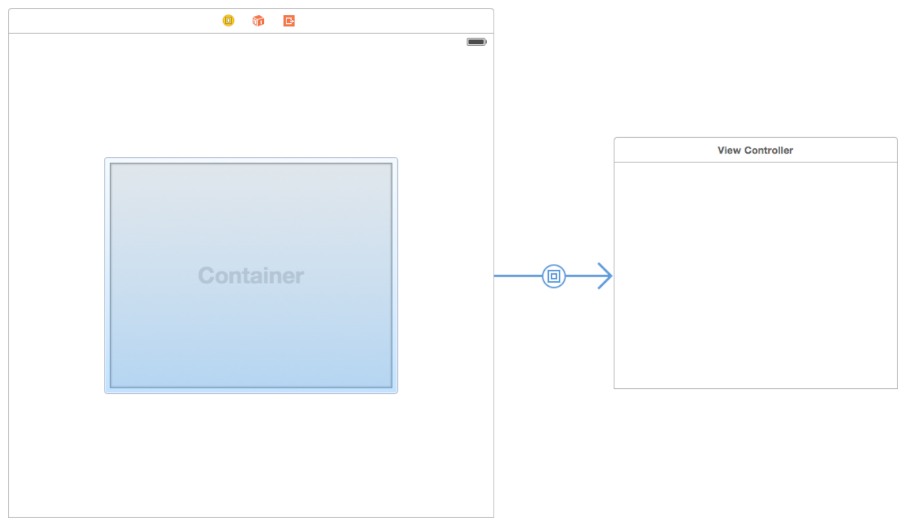

# View Controller Definition 双语

[[toc]]

## 1. 定义你的子类 📎   define your subclass

You use custom subclasses of UIViewController to present your app’s content. Most custom view controllers are content view controllers—that is, they own all of their views and are responsible for the data in those views. By contrast, a container view controller does not own all of its views; some of its views are managed by other view controllers. Most of the steps for defining content and container view controllers are the same and are discussed in the sections that follow.

您可以使用`UIViewController`的自定义子类来呈现app的内容。大多数自定义视图控制器都是内容视图控制器——也就是说，它们拥有自己的所有视图，并对这些视图中的数据负责。相比之下，容器视图控制器并不拥有自己的所有视图；它的一些视图由其他视图控制器管理。定义内容和容器视图控制器的大多数步骤是相同的，将在接下来的部分中讨论。

For content view controllers, the most common parent classes are as follows:

对于内容视图控制器，最常见的父类如下：

* Use UITableViewController specifically when your view controller’s main view is a table.

* 使用`UITableViewController`特别当你的视图控制器的主视图是一个表。

* Use UICollectionViewController specifically when your view controller’s main view is a collection view.

* 当视图控制器的主视图是集合视图时，请特别使用`UICollectionViewController`。

* Use UIViewController for all other view controllers.

* 对所有其他视图控制器使用`UIViewController`。

For container view controllers, the parent class depends on whether you are modifying an existing container class or creating your own. For existing containers, choose whichever view controller class you want to modify. For new container view controllers, you usually subclass UIViewController. For additional information about creating a container view controller, see Implementing a Container View Controller.

对于容器视图控制器，父类的选择，取决于您是修改现有容器类还是创建自己的容器类。对于现有容器，选择要修改的任何视图控制器类。对于新的容器视图控制器，通常是UIViewController的子类。有关创建容器视图控制器的其他信息，请参阅实现容器视图控制器[原文](https://developer.apple.com/library/archive/featuredarticles/ViewControllerPGforiPhoneOS/ImplementingaContainerViewController.html#//apple_ref/doc/uid/TP40007457-CH11-SW1)。


### 定义您的UI 📎 Defining Your UI

Define the UI for your view controller visually using storyboard files in Xcode. Although you can also create your UI programmatically, storyboards are an excellent way to visualize your view controller’s content and customize your view hierarchy (as needed) for different environments. Building your UI visually lets you make changes quickly and lets you see the results without having to build and run your app.

使用Xcode中的故事板文件直观地定义视图控制器的UI。虽然您也可以通过编程方式创建UI，但故事板是可视化视图控制器内容和针对不同环境自定义视图层次结构（根据需要）的绝佳方式。可视化地构建UI可以让您快速进行更改，并让您无需构建和运行应用程序即可查看结果。

Figure 4-1 shows an example of a storyboard. Each of the rectangular areas represents a view controller and its associated views. The arrows between view controllers are the view controller relationships and segues. Relationships connect a container view controller to its child view controllers. Segues let you navigate between view controllers in your interface.

图4-1 显示了一个故事板示例。每个矩形区域代表一个视图控制器及其关联的视图。视图控制器之间的箭头是视图控制器关系和`segue/seɡweɪ/转到,接入`。关系将容器视图控制器连接到其子视图控制器。`Segue`允许您在界面中的视图控制器之间导航。

Figure 4-1A storyboard holds a set of view controllers and views

图4-1A 故事板包含一组视图控制器和视图


Each new project has a main storyboard that typically contains one or more view controllers already. You can add new view controllers to your storyboard by dragging them from the library to your canvas. New view controllers do not have an associated class initially, so you must assign one using the Identity inspector.

每个新project都有一个`main storyboard`，通常已经包含一个或多个视图控制器。您可以通过将新视图控制器从库拖到画布中来将它们添加到故事板。新视图控制器最初没有关联的类，因此您必须使用身份检查器分配一个。

Use the storyboard editor to do the following:

使用故事板编辑器执行以下操作：

* Add, arrange, and configure the views for a view controller.

* 为视图控制器添加、排列和配置视图。

* Connect outlets and actions; see Handling User Interactions.

* 连接插座和操作；请参阅处理用户交互[|原文](https://developer.apple.com/library/archive/featuredarticles/ViewControllerPGforiPhoneOS/DefiningYourSubclass.html#//apple_ref/doc/uid/TP40007457-CH7-SW11)。

* Create relationships and segues between your view controllers; see Using Segues.

* 在视图控制器之间创建关系和segue；请参阅使用segue[|原文](https://developer.apple.com/library/archive/featuredarticles/ViewControllerPGforiPhoneOS/UsingSegues.html#//apple_ref/doc/uid/TP40007457-CH15-SW1)。

* Customize your layout and views for different size classes; see Building an Adaptive Interface.

* 为不同大小的类自定义布局和视图；请参阅构建自适应接口[|原文](https://developer.apple.com/library/archive/featuredarticles/ViewControllerPGforiPhoneOS/BuildinganAdaptiveInterface.html#//apple_ref/doc/uid/TP40007457-CH32-SW1)。

* Add gesture recognizers to handle user interactions with views; see Event Handling Guide for iOS.

* 添加手势识别器来处理用户与视图的交互；有关iOS，请参阅*事件处理指南*。

If you are new to using storyboards to build your interface, you can find step-by-step instructions for creating a storyboard-based interface in Start Developing iOS Apps Today (Retired).

如果您不熟悉使用故事板构建界面，您可以在立即开始开发iOS应用程序（过时）[|原文](https://developer.apple.com/library/archive/referencelibrary/GettingStarted/RoadMapiOS-Legacy/chapters/Introduction.html)中找到创建基于故事板的界面的分步说明。

### 处理用户交互 📎 Handling User Interactions

An app’s responder objects process incoming events and take appropriate actions. Although view controllers are responder objects, they rarely process touch events directly. Instead, view controllers typically handle events in the following ways.

应用程序的`responder`对象处理传入事件并采取适当的操作。虽然视图控制器是响应者对象，但它们很少直接处理触摸事件。相反，视图控制器通常以以下方式处理事件。

* View controllers define action methods for handling higher-level events. Action methods respond to:

* **视图控制器定义用于处理`higher-level events`的`action`方法。操作方法响应一下动作:**

    * Specific actions. Controls and some views call an action method to report specific interactions.

    * 特定的`action`。控件和一些视图调用`action`方法来处理特定的交互。

    * Gesture recognizers. Gesture recognizers call an action method to report the current status of a gesture. Use your view controller to process status changes or respond to the completed gesture.

    * 手势识别器。手势识别器调用`action`方法来报告手势的当前状态。使用视图控制器来处理状态更改或响应完成的手势。

* View controllers observe notifications sent by the system or other objects. Notifications report changes and are a way for the view controller to update its state.

* **视图控制器监听系统或其他对象发送的`notification`**。`notification`触发更改，是视图控制器更新其状态的一种方式。

* View controllers act as a data source or delegate for another object. View controllers are often used to manage the data for tables, and collection views. You can also use them as a delegate for an object such as a CLLocationManager object, which sends updated location values to its delegate.

* **视图控制器充当另一个对象的`data source`或`delegate`**。视图控制器通常用于管理表和集合视图的数据。您还可以将它们用作对象的委托，例如[`CLLocationManager`](https://developer.apple.com/documentation/corelocation/cllocationmanager)对象，它将更新的位置值发送给其委托。

Responding to events often involves updating the content of views, which requires having references to those views. Your view controller is a good place to define outlets for any views that you need to modify later. Declare your outlets as properties using the syntax shown in Listing 4-1. The custom class in the listing defines two outlets (designated by the IBOutlet keyword) and a single action method (designated by the IBAction return type). The outlets store references to a button and a text field in the storyboard, while the action method responds to taps in the button.

响应事件通常涉及到更新视图的内容，这需要对这些视图进行引用。视图控制器是为以后需要修改的任何视图定义`outlets`的好地方。使用清单4-1中所示的语法将`outlets`声明为属性。清单中的自定义类定义了两个`outlets`（由`IBOutlet`关键字指定）和一个操作方法（由`IBAction`返回类型指定）。`outlets`存储对故事板中按钮和文本字段的引用，而操作方法响应按钮中的点击。

Listing 4-1Defining outlets and actions in a view controller class

清单4-1 在视图控制器类中定义`outlets`和`action`

```objc
@interface MyViewController : UIViewController
@property (weak, nonatomic) IBOutlet UIButton *myButton;
@property (weak, nonatomic) IBOutlet UITextField *myTextField;
 
- (IBAction)myButtonAction:(id)sender;
 
@end

class MyViewController: UIViewController {
    @IBOutlet weak var myButton : UIButton!
    @IBOutlet weak var myTextField : UITextField!
    
    @IBAction func myButtonAction(sender: id)
}
```

In your storyboard, remember to connect your view controller’s outlets and actions to the corresponding views. Connecting outlets and actions in your storyboard file ensures that they are configured when the views are loaded. For information about how to create outlet and action connections in Interface Builder, see Interface Builder Connections Help. For information about how to handle events in your app, see Event Handling Guide for iOS.

在故事板中，请记住将视图控制器的`outlets`和`actions`连接到相应的视图。在故事板文件中连接出口和操作可确保在加载视图时配置它们。有关如何在`Interface Builder`中创建`outlets`和`actions`连接的信息，请参阅`Interface Builder`连接帮助。有关如何处理应用中的事件的信息，请参阅*事件处理指南iOS*。


### 在运行时显示您的视图 📎 Displaying Your Views at Runtime

Storyboards make the process of loading and displaying your view controller’s views very simple. UIKit automatically loads views from your storyboard file when they are needed. As part of the loading process, UIKit performs the following sequence of tasks:

故事板使加载和显示视图控制器视图的过程非常简单。UIKit会在需要时自动从故事板文件中加载视图。作为加载过程的一部分，UIKit执行以下任务序列：

* Instantiates views using the information in your storyboard file.

* 使用故事板文件中的信息实例化视图。

* Connects all outlets and actions.

* 连接所有出口和操作。

* Assigns the root view to the view controller’s view property.

* 将根视图分配给视图控制器的`view`属性。

* Calls the view controller’s awakeFromNib method.

* 调用视图控制器的`awakeFromNib`方法。

    When this method is called, the view controller’s trait collection is empty and views may not be in their final positions.

    调用此方法时，视图控制器的`trait`集合为空，视图可能不在其最终位置。

* Calls the view controller’s viewDidLoad method.

* 调用视图控制器的viewDidLoad方法。

    Use this method to add or remove views, modify layout constraints, and load data for your views.

    使用此方法为您的视图添加或删除视图、修改布局约束以及加载数据。

Before displaying a view controller’s views onscreen, UIKit gives you some additional chances to prepare those views before and after they are onscreen. Specifically, UIKit performs the following sequence of tasks:

在屏幕上显示视图控制器的视图之前，UIKit为您提供了一些额外的机会来准备这些视图在屏幕上之前和之后。具体来说，UIKit执行以下任务序列：

* Calls the view controller’s viewWillAppear: method to let it know that its views are about to appear onscreen.

* 调用视图控制器的viewWillAppear:方法，让它知道它的视图即将出现在屏幕上。

* Updates the layout of the views.

* 更新视图的布局。

* Displays the views onscreen.

* 
在屏幕上显示视图。

* Calls the viewDidAppear: method when the views are onscreen.

* 当视图出现在屏幕上时调用[`viewDidAppear:`](https://developer.apple.com/documentation/uikit/uiviewcontroller/1621423-viewdidappear)方法。

When you add, remove, or modify the size or position of views, remember to add and remove any constraints that apply to those views. Making layout-related changes to your view hierarchy causes UIKit to mark the layout as dirty. During the next update cycle, the layout engine computes the size and position of views using the current layout constraints and applies those changes to the view hierarchy.

添加、删除或修改视图的大小或位置时，请记住添加和删除对应的任何布局约束。对视图层次结构进行与布局相关的更改会导致UIKit将布局标记为脏。在下一个更新周期中，布局引擎使用当前布局约束计算视图的大小和位置，并将这些更改应用于视图层次结构。

For information about how to create views without using storyboards, see the view management information in UIViewController Class Reference.

有关如何在不使用故事板的情况下创建视图的信息，请参阅[UIViewController](https://developer.apple.com/documentation/uikit/uiviewcontroller)类参考中的视图管理信息。


### 管理视图布局 📎 Managing View Layout

When the size and position of views changes, UIKit updates the layout information for your view hierarchy. For views configured using Auto Layout, UIKit engages the Auto Layout engine and uses it to update the layout according to the current constraints. UIKit also lets other interested objects, such as the active presentation controller, know abut the layout changes so that they can respond accordingly.

当视图的大小和位置发生变化时，UIKit会更新视图层次结构的布局信息。对于使用自动布局配置的视图，UIKit会启动自动布局引擎，并使用它根据当前约束更新布局。UIKit还允许其他感兴趣的对象（例如活动表示控制器）了解布局更改，以便它们可以做出相应的响应。

During the layout process, UIKit notifies you at several points so that you can perform additional layout-related tasks. Use these notifications to modify your layout constraints or to make final tweaks to the layout after the layout constraints have been applied. During the layout process, UIKit does the following for each affected view controller:

在布局过程中，UIKit会在几个点通知您，以便您可以执行其他与布局相关的任务。使用这些通知来修改布局约束或在应用布局约束后对布局进行最终调整。在布局过程中，UIKit对每个受影响的视图控制器执行以下操作：

1. Updates the trait collections of the view controller and its views, as needed; see When Do Trait and Size Changes Happen?

1. 根据需要更新视图控制器及其视图的`trait`集合；请参阅:何时发生`Trait`和`Size`更改[|原文](https://developer.apple.com/library/archive/featuredarticles/ViewControllerPGforiPhoneOS/TheAdaptiveModel.html#//apple_ref/doc/uid/TP40007457-CH19-SW6)？

2. Calls the view controller’s viewWillLayoutSubviews method.

2. 调用视图控制器的viewWillLayoutSubviews方法。

3. Calls the containerViewWillLayoutSubviews method of the current UIPresentationController object.

3. 调用当前`UIPresentationController`对象的`containerViewWillLayoutSubviews`。

4. Calls the layoutSubviews method of view controller’s root view.

4. 调用视图控制器的根视图的layoutSubviews方法。

    The default implementation of this method computes the new layout information using the available constraints. The method then traverses the view hierarchy and calls layoutSubviews for each subview.

    此方法的默认实现使用可用约束计算新的布局信息。然后，该方法遍历视图层次结构并为每个子视图调用`layoutSubviews`。

5. Applies the computed layout information to the views.

5. 将计算的布局信息应用于视图。

6. Calls the view controller’s viewDidLayoutSubviews method.

6. 调用视图控制器的`viewDidLayoutSubviews`方法。

7. Calls the containerViewDidLayoutSubviews method of the current UIPresentationController object.

7. 调用当前`UIPresentationController`对象的`containerViewDidLayoutSubviews`子视图方法。

View controllers can use the viewWillLayoutSubviews and viewDidLayoutSubviews methods to perform additional updates that might impact the layout process. Before layout, you might add or remove views, update the size or position of views, update constraints, or update other view-related properties. After layout, you might reload table data, update the content of other views, or make final adjustments to the size and position of views.

视图控制器可以使用`viewWillLayoutSubviews`和`viewDidLayoutSubviews`方法来执行可能会影响布局过程的其他更新。在布局之前，您可以添加或删除视图、更新视图的大小或位置、更新约束或更新其他与视图相关的属性。布局之后，您可以重新加载表数据、更新其他视图的内容或对视图的大小和位置进行最终调整。

Here are some tips for managing your layout effectively:

以下是有效管理布局的一些技巧：

1. Use Auto Layout. The constraints you create using Auto Layout are a flexible and easy way to position your content on different screen sizes.

1. **使用自动布局**。您使用自动布局创建的约束是在不同屏幕尺寸上定位内容的一种灵活而简单的方法。

2. Take advantage of the top and bottom layout guides. Laying out content to these guides ensures that your content is always visible. The position of the top layout guide factors in the height of the status bar and navigation bar. Similarly, the position of the bottom layout guide factors in the height of a tab bar or toolbar.

2. **利用顶部和底部`layout guide`**。将内容布局到这些`guides`可确保您的内容始终可见。`top layout guide`的位置影响状态栏和导航栏的高度。同样，`bottom layout guide`的位置影响标签栏或工具栏的高度。

    Remember to update constraints when adding or removing views. If you add or remove views dynamically, remember to update the corresponding constraints.

    添加或删除视图时请记住更新约束。如果您动态添加或删除视图，请记住更新相应的约束。

3. Remove constraints temporarily while animating your view controller’s views. When animating views using UIKit Core Animation, remove your constraints for the duration of the animations and add them back when the animations finish. Remember to update your constraints if the position or size of your views changed during the animation.

3. **在为视图控制器的视图制作动画时暂时删除约束**。使用`UIKit Core Animation`为视图制作动画时，请在动画期间删除约束，并在动画完成时将其添加回来。如果视图的位置或大小在动画期间发生变化，请记住更新约束。

For information about presentation controllers and the role they play in the view controller architecture, see The Presentation and Transition Process.

有关表示控制器及其在视图控制器体系结构中扮演的角色的信息，请参阅呈现和转换处理[|原文](https://developer.apple.com/library/archive/featuredarticles/ViewControllerPGforiPhoneOS/PresentingaViewController.html#//apple_ref/doc/uid/TP40007457-CH14-SW7)。

### 有效管理内存 📎 Managing Memory Efficiently

Although most aspects of memory allocation are for you to decide, Table 4-1 lists the methods of UIViewController where you are most likely to allocate or deallocate memory. Most deallocations involve removing strong references to objects. To remove a strong reference to an object, set properties and variables pointing to that object to nil.

尽管内存分配的大多数方面由您决定，但表4-1列出了`UIViewController`最有可能分配或释放内存的方法。大多数释放涉及删除对对象的强引用。要删除对对象的强引用，请将指向该对象的属性和变量设置为`nil`。

Table 4-1Places to allocate and deallocate memory

表4-1分配和释放内存的位置

| Task 📎 Methods 📎 Discussion |
| --- 📎 --- 📎 --- |
| Allocate critical data structures required by your view controller. 📎 Initialization methods 📎 Your custom initialization method (whether it is named init or something else) is always responsible for putting your view controller object into a known good state. Use these methods to allocate whatever data structures are needed to ensure proper operation. |
| Allocate or load data to be displayed in your view. 📎 viewDidLoad 📎 Use the viewDidLoad method to load any data objects you intend to display. By the time this method is called, your view objects are guaranteed to exist and to be in a known good state. |
| Respond to low-memory notifications. 📎 didReceiveMemoryWarning 📎 Use this method to deallocate all noncritical objects associated with your view controller. Deallocate as much memory as you can. |
| Release critical data structures required by your view controller. 📎 dealloc 📎 Override this method only to perform any last-minute cleanup of your view controller class. The system automatically releases objects stored in instance variables and properties of your class, so you do not need to release those explicitly. |

| task 📎 method 📎 Discussion |
| --- 📎 --- 📎 --- |
| 分配VC需的关键数据结构。 📎 Initialization methods 📎 您的自定义初始化方法（无论是命名为init还是其他名称）总是负责将您的视图控制器对象置于已知的良好状态。使用这些方法来分配确保正确操作所需的任何数据结构。 |
| 分配或加载要在视图中显示的data。 📎 viewDidLoad 📎 使用viewDidLoad方法加载您要显示的任何数据对象。调用此方法时，您的视图对象保证存在并处于已知的良好状态。 |
| 响应低内存通知。 📎 `didReceiveMemoryWarning` 📎 使用此方法释放与视图控制器关联的所有非关键对象。尽可能多地释放内存。 |
| 释放VC所需的关键数据结构。 📎 dealloc 📎 重写此方法只是为了对视图控制器类执行`last-minute`的清理。系统会自动释放存储在类的实例变量和属性中的对象，因此您不需要显式释放这些对象。 |

## 2. 实现容器视图控制器 📎 Implementing a Container View Controller

Container view controllers are a way to combine the content from multiple view controllers into a single user interface. Container view controllers are most often used to facilitate navigation and to create new user interface types based on existing content. Examples of container view controllers in UIKit include UINavigationController, UITabBarController, and UISplitViewController, all of which facilitate navigation between different parts of your user interface.

容器视图控制器是一种将来自多个视图控制器的内容组合成单个用户交互界面的方法。容器视图控制器最常用于促进导航和基于现有内容创建新的用户交互界面类型。UIKit中容器视图控制器的示例包括`UINavigationController`、`UITabBarController`和`UISplitViewController`，所有这些都有助于用户交互界面不同部分之间的导航。

### 设计自定义容器视图控制器 📎 Designing a Custom Container View Controller

In almost every way, a container view controller is like any other content view controller in that it manages a root view and some content. The difference is that a container view controller gets part of its content from other view controllers. The content it gets is limited to the other view controllers’ views, which it embeds inside its own view hierarchy. The container view controller sets the size and position of any embedded views, but the original view controllers still manage the content inside those views.

在几乎所有方面，容器视图控制器都像任何其他内容视图控制器一样，它管理根视图和一些内容。不同之处在于容器视图控制器从其他视图控制器获取部分内容。它获取的内容仅限于其他视图控制器的视图，它将这些视图嵌入到自己的视图层次结构中。容器视图控制器设置任何嵌入视图的大小和位置，但原始视图控制器仍然管理这些视图中的内容。

When designing your own container view controllers, always understand the relationships between the container and contained view controllers. The relationships of the view controllers can help inform how their content should appear onscreen and how your container manages them internally. During the design process, ask yourself the following questions:

在设计您自己的容器视图控制器时，请始终了解容器和包含的视图控制器之间的关系。视图控制器的关系有助于告知它们的内容应该如何出现在屏幕上，以及容器如何在内部管理它们。在设计过程中，问自己以下问题：

* What is the role of the container and what role do its children play?

* 容器的作用是什么，它的子代扮演什么角色？

* How many children are displayed simultaneously?

* 同时显示多少个孩子？

* What is the relationship (if any) between sibling view controllers?

* 兄弟视图控制器之间的关系（如果有）是什么？

* How are child view controllers added to or removed from the container?

* 如何将子控制器添加到容器中或从容器中删除？

* Can the size or position of the children change? Under what conditions do those changes occur?

* 孩子的大小或位置会改变吗？这些变化发生在什么条件下？

* Does the container provide any decorative or navigation-related views of its own?

* 容器控制器是否提供任何自己的装饰或导航相关视图？

* What kind of communication is required between the container and its children? Does the container need to report specific events to its children other than the standard ones defined by the UIViewController class?

* 容器与其子级之间需要什么样的通信？除了`UIViewController`类定义的标准事件之外，容器是否需要向其子级报告特定事件？

* Can the appearance of the container be configured in different ways? If so, how?

* 容器的外观可以用不同的方式配置吗？如果可以，如何？

The implementation of a container view controller is relatively straightforward after you have defined the roles of the various objects. The only requirement from UIKit is that you establish a formal parent-child relationship between the container view controller and any child view controllers. The parent-child relationship ensures that the children receive any relevant system messages. Apart from that, most of the real work happens during the layout and management of the contained views, which is different for each container. You can place views anywhere in your container’s content area and size those views however you want. You can also add custom views to the view hierarchy to provide decoration or to aid in navigation.

在您定义了各种对象的角色之后，容器视图控制器的实现相对简单。UIKit的唯一要求是您在容器视图控制器和任何子视图控制器之间建立正式的父子关系。父子关系确保子视图接收任何相关的系统消息。除此之外，大多数实际工作发生在包含视图的布局和管理期间，这对于每个容器都是不同的。您可以将视图放置在容器内容区域的任何位置，并根据需要调整这些视图的大小。您还可以将自定义视图添加到视图层次结构中，以提供装饰或帮助导航。


### Example: Navigation Controller 📎 Example: Navigation Controller

A UINavigationController object supports navigation through a hierarchical data set. A navigation interface presents one child view controller at a time. A navigation bar at the top of the interface displays the current position in the data hierarchy and displays a back button to move back one level. Navigation down into the data hierarchy is left to the child view controller and can involve the use of tables or buttons.

一个`UINavigationController`对象用于支持对分层的数据集合进行导航。导航界面一次显示一个子视图控制器。界面顶部的导航栏显示数据层次结构中的当前位置，并显示后退按钮以后退一级。向下导航到数据层次结构留给子视图控制器，并且可能涉及使用表格或按钮。

Navigation between view controllers is managed jointly by the navigation controller and its children. When the user interacts with a button or table row of a child view controller, the child asks the navigation controller to push a new view controller into view. The child handles the configuration of the new view controller’s contents, but the navigation controller manages the transition animations. The navigation controller also manages the navigation bar, which displays a back button for dismissing the topmost view controller.

视图控制器之间的导航由导航控制器及其子级共同管理。当用户与子视图控制器的按钮或表行交互时，子级要求导航控制器将新的视图控制器推送到视图中。子级处理新视图控制器内容的配置，但导航控制器管理过渡动画。导航控制器还管理导航栏，该导航栏显示用于关闭最顶部视图控制器的后退按钮。

Figure 5-1 shows the structure of a navigation controller and its views. Most of the content area is filled by the topmost child view controller and only a small portion is occupied by the navigation bar.

图5-1 显示了导航控制器及其视图的结构。大部分内容区域由最顶层的子视图控制器填充，只有一小部分被导航栏占用。

Figure 5-1 Structure of a navigation interface

图5-1 导航界面的结构


In both compact and regular environments, a navigation controller displays only one child view controller at a time. The navigation controller resizes its child to fit the available space.

在`compact(紧凑)`和`regular(常规)`环境中，导航控制器一次只显示一个子视图控制器。导航控制器调整其子视图控制器的大小以适应可用空间。

### Example: Split View Controller 📎 Example: Split View Controller

A UISplitViewController object displays the content of two view controllers in a master-detail arrangement. In this arrangement, the content of one view controller (the master) determines what details are displayed by the other view controller. The visibility of the two view controllers is configurable but is also governed by the current environment. In a regularly horizontal environment, the split view controller can show both child view controllers side-by-side or it can hide the master and display it as needed. In a compact environment, the split view controller displays only one view controller at a time.

一个`UISplitViewController`对象以`master-details`排列显示两个视图控制器的内容。在这种排列中，一个视图控制器（master）的内容决定了另一个视图控制器显示哪些细节。两个视图控制器的可见性是可配置的，但也受当前环境的支配。在`regular`水平环境中，`split view controller`可以并排显示两个子视图控制器，也可以隐藏主视图并根据需要显示。在`compact`环境中，`split view controller`一次只显示一个视图控制器。

Figure 5-2 shows the structure of a split view interface and its views in a regularly horizontal environment. The split view controller itself has only its container view by default. In this example, the two child views are displayed side-by-side. The size of the child views is configurable, as is the visibility of the master view.

图5-2 显示了一个拆分视图界面及其视图在规则水平环境中的结构，`split view controller`本身默认只有它的容器视图，在此示例中，两个子视图并排显示，子视图的大小是可配置的，主视图的可见性也是如此。

Figure 5-2A split view interface

图5-2A 拆分视图界面


### 在Interface Builder中配置容器 📎 Configuring a Container in Interface Builder

To create a parent-child container relationship at design time, add a container view object to your storyboard scene, as shown in Figure 5-3. A container view object is a placeholder object that represents the contents of a child view controller. Use that view to size and position the child’s root view in relation to the other views in the container.

要在设计时创建父子容器关系，请将容器视图对象添加到故事板场景中，如图5-3所示。容器视图对象是表示子视图控制器内容的`placeholder`对象。使用该视图相对于容器中的其他视图调整子视图的大小和位置。

Figure 5-3Adding a container view in Interface Builder

图5-3 在`Interface Builder`中添加容器视图



When you load a view controller with one or more container views, Interface Builder also loads the child view controllers associated with those views. The children must be instantiated at the same time as the parent so that the appropriate parent-child relationships can be created.

当您加载一个容器视图控制(包含一个或者多个容器的视图)，`Interface Builder`还会加载与这些视图关联的子视图控制器。子视图必须与父视图**同时**实例化，以便可以创建适当的父子关系。

If you do not use Interface Builder to set up your parent-child container relationships, you must create those relationships programmatically by adding each child to the container view controller, as described in Adding a Child View Controller to Your Content.

如果不使用`Interface Builder`设置父子容器关系，则必须通过将每个子容器添加到容器视图控制器里面，来以编程方式创建这些关系，如*将子视图控制器添加到您的内容中*[|原文](https://developer.apple.com/library/archive/featuredarticles/ViewControllerPGforiPhoneOS/ImplementingaContainerViewController.html#//apple_ref/doc/uid/TP40007457-CH11-SW13)所述。

### 实现自定义容器视图控制器 📎 Implementing a Custom Container View Controller

To implement a container view controller, you must establish relationships between your view controller and its child view controllers. Establishing these parent-child relationships is required before you try to manage the views of any child view controllers. Doing so lets UIKit know that your view controller is managing the size and position of the children. You can create these relationships in Interface Builder or create them programmatically. When creating parent-child relationships programmatically, you explicitly add and remove child view controllers as part of your view controller setup.

要实现容器视图控制器，您必须在视图控制器与其子视图控制器之间建立关系。在尝试管理任何子视图控制器的视图之前，需要建立这些父子关系。这样做可以让UIKit知道您的视图控制器正在管理子视图的大小和位置。您可以在Interface Builder中创建这些关系或以编程方式创建它们。以编程方式创建父子关系时，您可以显式添加和删除子视图控制器，作为视图控制器设置的一部分。


### 将子视图控制器添加到您的内容上 📎 Adding a Child View Controller to Your Content

To incorporate a child view controller into your content programmatically, create a parent-child relationship between the relevant view controllers by doing the following:

要以编程方式将子视图控制器合并到您的内容中，请通过执行以下操作在相关视图控制器之间创建父子关系：

1. Call the addChildViewController: method of your container view controller.

1. 调用容器视图控制器的`addChildViewController:`方法。

    This method tells UIKit that your container view controller is now managing the view of the child view controller.

    此方法告诉UIKit您的容器视图控制器现在正在管理子视图控制器的视图。

2. Add the child’s root view to your container’s view hierarchy.

2. 将子视图的根视图添加到容器的视图层次结构中。

    Always remember to set the size and position of the child’s frame as part of this process.

    始终记住设置`childVC`的`frame`的大小和位置作为此操作的一部分。

3. Add any constraints for managing the size and position of the child’s root view.

3. 添加用于管理子级根视图的大小和位置的任何约束。

4. Call the didMoveToParentViewController: method of the child view controller.

4. 调用子视图控制器的`didMoveToParentViewController:`方法。

Listing 5-1 shows how a container embeds a child view controller in its container. After establishing the parent-child relationship, the container sets the frame of its child and adds the child’s view to its own view hierarchy. Setting the frame size of the child’s view is important and ensures that the view shows up correctly in your container. After adding the view, the container calls the child’s didMoveToParentViewController: method to give the child view controller a chance to respond to the change in view ownership.

清单5-1显示了容器如何在其容器中嵌入子视图控制器。在建立父子关系后，容器设置其子视图的`frame`，并将子视图添加到自己的视图层次结构中。设置子视图的`frame`大小很重要，并确保视图在您的容器中正确显示。添加视图后，容器调用子视图的`didMoveToParentViewController:`方法，让子视图控制器有机会响应视图所有权的变化。

Listing 5-1Adding a child view controller to a container

示例5-1向容器添加子视图控制器

```objc
- (void)displayContentController:(UIViewController *)content {
   [self addChildViewController:content];
   content.view.frame = [self frameForContentController];
   [self.view addSubview:self.currentClientView];
   [content didMoveToParentViewController:self];
}
```

In the preceding example, notice that you call only the didMoveToParentViewController: method of the child. That is because the addChildViewController: method calls the child’s willMoveToParentViewController: method for you. The reason that you must call the didMoveToParentViewController: method yourself is that the method cannot be called until after you embed the child’s view into your container’s view hierarchy.

在前面的示例中，请注意，您只调用了子控制器的`didMoveToParentViewController:`方法。这是因为`addChildViewController:`方法为您调用了子视图的`willMoveToParentViewController:`方法。您必须自己调用`didMoveToParentViewController:`方法的原因是，在您将子视图嵌入到容器的视图层次结构中之前，不能调用该方法。

When using Auto Layout, set up constraints between the container and child after adding the child to the container’s view hierarchy. Your constraints should affect the size and position of only the child’s root view. Do not alter the contents of the root view or any other views in the child’s view hierarchy.

使用自动布局时，在将子视图添加到容器的视图层次结构后，在容器和子视图之间设置约束。您的约束应该只影响子视图的根视图的大小和位置。不要更改根视图或子视图层次结构中的任何其他视图的内容。

### 删除子视图控制器 📎 Removing a Child View Controller

To remove a child view controller from your content, remove the parent-child relationship between the view controllers by doing the following:

要从内容中删除子视图控制器，请通过执行以下操作删除视图控制器之间的父子关系：

1. Call the child’s willMoveToParentViewController: method with the value nil.

1. 调用孩子的`willMoveToParentViewController:`方法，值为`nil`。

2. Remove any constraints that you configured with the child’s root view.

2. 删除您使用子视图的根视图配置的任何约束。

3. Remove the child’s root view from your container’s view hierarchy.

3. 从容器的视图层次结构中删除子视图的根视图。

4. Call the child’s removeFromParentViewController method to finalize the end of the parent-child relationship.

4. 调用子级的`removeFromParentViewController`方法来完成父子关系的结束。

Removing a child view controller permanently severs the relationship between parent and child. Remove a child view controller only when you no longer need to refer to it. For example, a navigation controller does not remove its current child view controllers when a new one is pushed onto the navigation stack. It removes them only when they are popped off the stack.

删除子视图控制器会永久切断父视图控制器与子视图控制器之间的关系。仅当不再需要引用子视图控制器时才删除子视图控制器。例如，当一个新的子视图控制器被压入导航堆栈时，导航控制器不会删除其当前的子视图控制器。只有当它们从堆栈中弹出时，它才会删除它们。

Listing 5-2 shows you how to remove a child view controller from its container. Calling the willMoveToParentViewController: method with the value nil gives the child view controller an opportunity to prepare for the change. The removeFromParentViewController method also calls the child’s didMoveToParentViewController: method, passing that method a value of nil. Setting the parent view controller to nil finalizes the removal of the child’s view from your container.

清单5-2向您展示了如何从子视图控制器的容器中删除子视图控制器。调用`willMoveToParentViewController:`方法时，值为`nil`，子视图控制器就有机会为更改做准备。`removeFromParentViewController`方法还调用子视图的`didMoveToParentViewController:`方法，并将值nil的值传递给该方法。将父视图控制器设置为nil，就完成了从容器中删除子视图的操作。

Listing 5-2Removing a child view controller from a container

示例5-2从容器中删除子视图控制器
```objc
- (void)hideContentController:(UIViewController *)content {
   [content willMoveToParentViewController:nil];
   [content.view removeFromSuperview];
   [content removeFromParentViewController];
}
```

### 子视图控制器之间的转换 📎 Transitioning Between Child View Controllers

When you want to animate the replacement of one child view controller with another, incorporate the addition and removal of the child view controllers into the transition animation process. Before the animations, make sure both child view controllers are part of your content but let the current child know that it is about to go away. During your animations, move the new child’s view into position and remove the old child’s view. At the completion of the animation, complete the removal of the child view controller.

当您想用另一个子视图控制器替换时，将子视图控制器的添加和删除合并到过渡动画过程中。在动画之前，确保两个子视图控制器都是您内容的一部分，但让当前子视图知道它即将消失。在动画期间，将新子视图移动到适当的位置并删除旧子视图。动画完成时，完成子视图控制器的删除。

Listing 5-3 shows an example of how to swap one child view controller for another using a transition animation. In this example, the new view controller is animated to the rectangle currently occupied by the existing child view controller, which is moved offscreen. After the animations finish, the completion block removes the child view controller from the container. In this example, the transitionFromViewController:toViewController:duration:options:animations:completion: method automatically updates the container’s view hierarchy, so you do not need to add and remove the views yourself.

清单5-3显示了如何使用过渡动画将一个子视图控制器转换为另一个子视图控制器的示例。在这个示例中，新的视图控制器被动画移动到为现有子视图控制器当前占用的矩形区域，该矩形被移出屏幕。动画完成后，在`completion block`中从容器中删除子视图控制器。在这个示例中，`transitionFromViewController:toViewController:duration:options:animations:completion:`方法会自动更新容器的视图层次结构，因此您不需要自己添加和删除视图。

Listing 5-3Transitioning between two child view controllers

清单5-3两个子视图控制器之间的转换
```objc
- (void)cycleFromViewController: (UIViewController*) oldVC
               toViewController: (UIViewController*) newVC {
   // Prepare the two view controllers for the change.
   [oldVC willMoveToParentViewController:nil];
   [self addChildViewController:newVC];
 
   // Get the start frame of the new view controller and the end frame
   // for the old view controller. Both rectangles are offscreen.
   newVC.view.frame = [self newViewStartFrame];
   CGRect endFrame = [self oldViewEndFrame];
 
   // Queue up the transition animation.
   [self transitionFromViewController: oldVC toViewController: newVC
        duration: 0.25 options:0
        animations:^{
            // Animate the views to their final positions.
            newVC.view.frame = oldVC.view.frame;
            oldVC.view.frame = endFrame;
        }
        completion:^(BOOL finished) {
           // Remove the old view controller and send the final
           // notification to the new view controller.
           [oldVC removeFromParentViewController];
           [newVC didMoveToParentViewController:self];
        }];
}
```
### 管理子VC的外观更新 📎 Managing Appearance Updates for Children

After adding a child to a container, the container automatically forwards appearance-related messages to the child. This is normally the behavior you want, because it ensures that all events are properly sent. However, sometimes the default behavior may send those events in an order that doesn’t make sense for your container. For example, if multiple children are simultaneously changing their view state, you may want to consolidate the changes so that the appearance callbacks all happen at the same time in a more logical order.

将子VC添加到容器后，容器会自动将外观相关消息转发给子级。这通常是您想要的行为，因为它确保所有事件都正确发送。但是，有时默认行为可能会以对您的容器没有意义的顺序发送这些事件。例如，如果多个子级同时更改其视图状态，您可能希望合并更改，以便外观回调以更合乎逻辑的顺序同时发生。

To take over responsibility for appearance callbacks, override the shouldAutomaticallyForwardAppearanceMethods method in your container view controller and return NO, as shown in Listing 5-4. Returning NO lets UIKit know that your container view controller notifies its children of changes in its appearance.

要接管外观回调的责任，请重写容器视图控制器中的`shouldAutomaticallyForwardAppearanceMethods`并返回NO，如清单5-4所示。返回NO可以让UIKit知道容器视图控制器通知其子级外观更改。

Listing 5-4Disabling automatic appearance forwarding

示例5-4禁用自动外观转发

```objc
- (BOOL) shouldAutomaticallyForwardAppearanceMethods {
    return NO;
}
```

When an appearance transition occurs, call the child’s beginAppearanceTransition:animated: or endAppearanceTransition method as appropriate. For example, if your container has a single child referenced by a child property, your container would forward these messages to the child as shown in Listing 5-5.

当发生外观转换时，调用子级的`beginAppearanceTransition:animated:`或`endAppearanceTransition`方法。例如，如果您的容器有一个由child属性引用的子级，您的容器会将这些消息转发给该子级，如清单5-5所示。

Listing 5-5Forwarding appearance messages when the container appears or disappears

示例5-5在容器出现或消失时转发外观消息
```objc
-(void) viewWillAppear:(BOOL)animated {
    [self.child beginAppearanceTransition: YES animated: animated];
}
 
-(void) viewDidAppear:(BOOL)animated {
    [self.child endAppearanceTransition];
}
 
-(void) viewWillDisappear:(BOOL)animated {
    [self.child beginAppearanceTransition: NO animated: animated];
}
 
-(void) viewDidDisappear:(BOOL)animated {
    [self.child endAppearanceTransition];
}
```
### 关于构建容器视图控制器的建议 📎 Suggestions for Building a Container View Controller

Designing, developing, and testing a new container view controller takes time. Although the individual behaviors are straightforward, the controller as a whole can be quite complex. Consider the following tips when implementing your own container classes:

设计、开发和测试新的容器视图控制器需要时间。尽管单个行为很简单，但控制器作为一个整体可能相当复杂。在实现自己的容器类时，请考虑以下提示：

* Access only the root view of a child view controller. A container should access only the root view of each child—that is, the view returned by the child’s view property. It should never access any of the child’s other views.

* **只访问子视图控制器的根视图**。容器应该只访问每个子视图的根视图——即子视图属性返回的view。它永远不应该访问子视图的任何其他视图。

* Child view controllers should have minimal knowledge of their container. A child view controller should focus on its own content. If the container allows its behavior to be influenced by a child, it should use the delegation design pattern to manage those interactions.

* **子视图控制器应该对其容器有最少的了解**。子视图控制器应该专注于它自己的内容。如果容器允许它的行为受到子容器的影响，它应该使用委托设计模式来管理这些交互。

* Design your container using regular views first. Using regular views (instead of the views from child view controllers) gives you an opportunity to test layout constraints and animated transitions in a simplified environment. When the regular views work as expected, swap them out for the views of your child view controllers.

* **首先使用常规视图设计容器**。使用常规视图（而不是来自子视图控制器的视图）使您有机会在简化的环境中测试布局约束和动画转换。当常规视图按预期工作时，将它们交换为子视图控制器的视图。

### 将控制委托给子视图控制器｜Delegating Control to a Child View Controller

A container view controller can delegate some aspects of its own appearance to one or more of its children. You can delegate control in the following ways:

容器视图控制器可以将其自身外观的某些方面委托给它的一个或多个子级。您可以通过以下方式委托控制：

* Let a child view controller determine the status bar style. To delegate the status bar appearance to a child, override one or both of the childViewControllerForStatusBarStyle and childViewControllerForStatusBarHidden methods in your container view controller.

* **让子视图控制器确定状态栏样式**。要将状态栏外观委托给子视图控制器，请覆盖容器视图控制器中的`childViewControllerForStatusBarStyle`和`childViewControllerForStatusBarHidden`方法中的一个或两个。

Let the child specify its own preferred size. A container with a flexible layout can use the child’s own preferredContentSize property to help determine the size of the child.

* **让子视图控制器指定自己的首选大小**。具有灵活布局的容器可以使用子VC自己的`preferredContentSize`属性来帮助确定子VC的大小。

## 3. 支持无障碍 📎 Supporting Accessibility

An accessible app is one that can be used by everyone—including those with a disability or physical impairment—while retaining its functionality and usability as a helpful tool. To be accessible, an iOS app must supply information about its user interface elements to VoiceOver, so that vision-impaired users can interact with those elements. UIKit objects are accessible by default, but there are still things you can do from the view controller’s perspective to address accessibility, including the following:

无障碍app是指每个人都可以使用的应用程序——包括残疾人或身体障碍者——同时保留其功能和可用性作为有用工具。为了便于无障碍使用，iOS应用程序必须向`Voiceover`提供有关其用户交互界面元素的信息，以便视力受损的用户可以与这些元素进行交互。默认情况下，UIKit定义的对象是可访问的，但从视图控制器的角度来看，您仍然可以做一些事情来解决可访问性问题，包括以下内容：

* Ensure that every user element in your interface is accessible, including controls and static elements such as labels.

* 确保界面中的每个用户元素都是支持无障碍的，包括控件和标签等静态元素。

* Ensure that accessible elements supply accurate and helpful information.

* 确保无障碍的元素提供准确和有用的信息。

You can enhance the VoiceOver user’s experience in your app by setting the position of the VoiceOver focus ring programmatically, by responding to special VoiceOver gestures, and by observing accessibility notifications.

您可以通过以编程方式设置`Voiceover`焦点环的位置、响应特殊的`Voiceover`手势以及监听无障碍通知来增强`Voiceover`用户在您的应用中的体验。

### 将`VoiceOver`(画外音)光标移动到特定元素 📎 Moving the VoiceOver Cursor to a Specific Element

When your app presents new views onscreen, consider setting the position of the VoiceOver cursor. When the layout of a screen changes, the VoiceOver focus ring, also known as the VoiceOver cursor, resets its position to the first element displayed on the screen from left to right and top to bottom. Placing the cursor over a more appropriate element can speed the user’s navigation of your interface. For example, when pushing a new view controller onto a navigation controller’s stack, the VoiceOver cursor falls on the Back button of the navigation bar. You might want to move that cursor to the heading of the navigation bar or to an element on the newly pushed page.

当您的应用在屏幕上显示新视图时，请考虑设置将`VoiceOver`光标的位置。当屏幕布局发生变化时，`VoiceOver`焦点环（也称为`VoiceOver`光标）会从左到右和从上到下将其位置重置为屏幕上显示的第一个元素。将光标放在更合适的元素上可以加快用户对界面的导航速度。例如，当将新的视图控制器推送到导航控制器的堆栈上时，`VoiceOver`光标会落在导航栏的后退按钮上。您可能希望将光标移动到导航栏的标题或新推送页面上的元素上。

To change the position of the cursor, post a UIAccessibilityScreenChangedNotification notification using the UIAccessibilityPostNotification function. The notification tells VoiceOver that the contents of the screen changed. When posting the notification, specify the element to which you want to assign the focus, as shown in Listing 6-1.

要更改光标的位置，请使用`UIAccessibilityPostNotification`函数发布`UIAccessibilityScreenChangedNotification`通知。该通知告诉`Voiceover`屏幕内容发生了变化。发布通知时，指定要为其分配焦点的元素，如清单6-1所示。

Listing 6-1Posting an accessibility notification can change the first element read aloud

示例6-1 发布无障碍通知可以更改朗读的第一个元素

```objc
@implementation MyViewController
- (void)viewDidAppear:(BOOL)animated {
    [super viewDidAppear:animated];
 
    // The second parameter is the new focus element.
    UIAccessibilityPostNotification(UIAccessibilityScreenChangedNotification,
                                    self.myFirstElement);
}
@end
```

Layout changes, including those caused by rotations, reset the position of the VoiceOver cursor. When the layout of your view controller changes, post the notification UIAccessibilityLayoutChangedNotification. Like the UIAccessibilityScreenChangedNotification notification, you can specify the object that you want to become the new first element for VoiceOver.

布局更改，包括旋转引起的更改，会重置Voiceover光标的位置。当视图控制器的布局发生更改时，发布通知`UIAccessibilityLayoutChangedNotification`。与`UIAccessibilityScreenChangedNotification`通知一样，您可以指定要成为Voiceover的新第一个元素的对象。

### 回应特定的画外音手势 📎 Responding to Special VoiceOver Gestures

VoiceOver defines five special gestures for triggering app-specific actions.

* `Voiceover`定义了五种特殊手势来触发特定于应用程序的操作。

* Escape. A two-finger Z-shaped gesture that dismisses a modal dialog, or goes back one level in a navigation hierarchy.

* `Escape`。关闭模态对话框或返回导航层次结构中的一个级别的两指Z形手势。

* Magic Tap. A two-finger double-tap that performs the most-intended action.

* `Magic Tap`。两指双击，执行最可能的动作。

* Three-Finger Scroll. A three-finger swipe that scrolls content vertically or horizontally.

* `Three-Finger Scroll`。垂直或水平滚动内容的三指滑动。

* Increment. A one-finger swipe up that increments a value in an element.

* `Increment`。单指向上滑动可增加元素中的值。

* Decrement. A one-finger swipe down that decrements a value in an element.

* `Decrement`。单指向下滑动会减少元素中的值。

Use these gestures to perform tasks that are specific to your views and view controllers. UIKit looks for a method that implements the method corresponding to the gesture. It searches for the method using the responder chain, starting with the element that has the VoiceOver focus. If no object implements the appropriate method, UIKit performs the default system action for that gesture. For example, the Magic Tap gesture plays and pauses music playback from the Music app if no Magic Tap implementation is found from the current view to the app delegate.

使用这些手势执行特定于视图和视图控制器的任务。UIKit查找实现了手势对应方法的对象。它使用响应器链搜索该方法，从具有`Voiceover`焦点的元素开始。如果没有对象实现适当的方法，UIKit执行该手势的默认系统操作。例如，如果从当前视图到应用委托没有找到`Magic Tap`实现，则`Magic Tap`手势从`Music`应用程序播放并暂停音乐播放。

Although you can take any actions you want in your handlers, VoiceOver users expect your app’s actions to follow certain guidelines. Like any gesture, your implementation of a VoiceOver gesture should follow a pattern so that interaction with an accessible app remains intuitive.

尽管您可以在处理程序中执行任何您想要的操作，但`Voiceover`用户希望您的应用程序的操作遵循某些准则。与任何手势一样，`Voiceover`手势的实现应遵循一种模式，以便与可访问的应用程序的交互保持直观。

::: tip NOTE
All special VoiceOver gesture methods return a Boolean value that determine whether to propagate through the responder chain. To halt propagation, return YES; otherwise, return NO.
:::

::: tip 注
所有特殊的Voiceover手势方法都返回一个布尔值，该值决定是否通过响应链传播。要停止传播，返回YES；否则，返回NO。
:::

### 退出 📎 Escape

Use the accessibilityPerformEscape method to handle the Escape gesture. For a view that overlays content—such as a modal dialog or an alert—use the method to dismiss the overlay. The function of the Escape gesture is like the function of the Esc key on a computer keyboard; it cancels a temporary dialog or sheet to reveal the main content. You might also use the Escape gesture to navigate back one level in a custom navigation hierarchy. You do not need to implement this gesture if you are already using a UINavigationController object, which already handles this gesture.

使用`accessibilityPerformEscape`方法处理`Escape`手势。对于覆盖内容的视图（例如模态对话框或警报），使用该方法关闭覆盖。`Escape`手势的功能类似于计算机键盘上的Esc键的功能；它取消临时对话框或工作表以显示主要内容。您还可以使用`Escape`手势在自定义导航层次结构中向后导航一层。如果您已经在使用已经处理此手势的`UINavigationController`对象，则不需要实现此手势。

### 两指双击 📎 Magic Tap

Use the accessibilityPerformMagicTap method to handle the Magic Tap gesture. The Magic Tap gesture performs an often-used or most-intended action quickly. For example, in the Phone app, a Magic Tap picks up or hangs up a phone call, and in the Clock app, a Magic Tap starts and stops the stopwatch. You might use this gesture to trigger actions that are not necessarily relevant to the element that the VoiceOver cursor is highlighting. To handle Magic Tap gestures from anywhere in your app, implement the accessibilityPerformMagicTap method in your app delegate.

使用`accessibilityPerformMagicTap`方法处理`Magic Tap`手势。`Magic Tap`手势可快速执行常用或最有意义的操作。例如，在电话应用中，`Magic Tap`接听或挂断电话，在时钟应用中，`Magic Tap`启动和停止秒表。您可以使用此手势触发不一定与`Voiceover`光标突出显示的元素相关的操作。要从应用中的任何位置处理`Magic Tap`手势，请在应用委托中实现`accessibilityPerformMagicTap`方法。

### 三指滚动 📎 Three-Finger Scroll

Use the accessibilityScroll: method to scroll the content of a custom view when a VoiceOver user performs a three-finger scroll gesture. A custom view that displays the pages of a book might use this gesture to turn the page. The parameter passed to the method indicates the direction in which to scroll.

当`Voiceover`用户执行三指滚动手势时，使用`accessibilityScroll:`方法滚动自定义视图的内容。显示书籍页面的自定义视图可能使用此手势翻页。传递给该方法的参数指示滚动方向。

### 增大和减小 📎 Increment and Decrement

Use the accessibilityIncrement and accessibilityDecrement methods to increment or decrement a value in the element. Elements with the UIAccessibilityTraitAdjustable trait must implement this method.

使用`accessibilityIncrement`和`accessibilityDecrement`方法来增加或减少元素中的值。具有`UIAccessibilityTraitAdjustable`的元素必须实现此方法。

### 监听无障碍通知 📎 Observing Accessibility Notifications

UIKit sends accessibility notifications to inform your app about relevant events. The objects of your app can observe any relevant notifications and use them to perform appropriate tasks. For example, the iBooks app uses the UIAccessibilityAnnouncementDidFinishNotification notification to turn the page and continue reading when VoiceOver finishes speaking the last line on a page. This behavior provides a seamless, uninterrupted reading experience.

UIKit发送无障碍功能通知，通知您的应用有关相关事件。您的应用的对象可以观察任何相关通知，并使用它们来执行适当的任务。例如，iBooks应用使用 `UIAccessibilityAnnouncementDidFinishNotification`通知翻页，并在`Voiceover`说完页面上的最后一行时继续阅读。这种行为提供了无缝、不间断的阅读体验。

Use the default notification center to register as an observer for accessibility notifications. Listing 6-2 shows an example of a view that records whether the reading of an announcement was successful or was interrupted by the user.

使用默认通知中心注册为无障碍通知的观察者。清单6-2显示了一个视图示例，该视图记录了对公告的阅读是成功的还是被用户中断的。

Listing 6-2Registering as an observer for accessibility notifications

示例6-2注册为可访问性通知的观察者

```objc
@implementation MyViewController
- (void)viewDidLoad
{
    [super viewDidLoad];
 
    [[NSNotificationCenter defaultCenter]
        addObserver:self
           selector:@selector(didFinishAnnouncement:)
               name:UIAccessibilityAnnouncementDidFinishNotification
             object:nil];
}
 
 
- (void)didFinishAnnouncement:(NSNotification *)dict
{
    NSString *valueSpoken = [[dict userInfo] objectForKey:UIAccessibilityAnnouncementKeyStringValue];
    NSString *wasSuccessful = [[dict userInfo] objectForKey:UIAccessibilityAnnouncementKeyWasSuccessful];
    // ...
}
@end
```

Another helpful notification to subscribe to is the UIAccessibilityVoiceOverStatusChanged notification. You can use that notification to detect when VoiceOver is toggled on or off. If this notification occurs while your app is suspended, you receive the notification when your app returns to the foreground.


另一个需要订阅的有用通知是`UIAccessibilityVoiceOverStatusChanged`通知。您可以使用该通知来检测`Voiceover`何时打开或关闭。如果在应用暂停时出现此通知，则在应用返回前台时收到通知。

For a list of accessibility notifications you can observe, see UIAccessibility Protocol Reference.

有关您可以观察到的无障碍功能通知列表，请参阅`UIAccess`协议参考[|原文](https://developer.apple.com/documentation/objectivec/nsobject/uiaccessibility)。

>>

## 4. 保存和恢复状态 📎 Preserving and Restoring State

View controllers play an important role in the state preservation and restoration process. State preservation records the configuration of your app before it is suspended so that the configuration can be restored on a subsequent app launch. Returning an app to its previous configuration saves time for the user and offers a better user experience.

视图控制器在状态保存和恢复过程中发挥着重要作用。状态保存会在应用暂停之前记录其配置，以便在后续应用启动时恢复配置。将应用恢复到以前的配置可以为用户节省时间并提供更好的用户体验。

The preservation and restoration process is mostly automatic, but you need to tell iOS which parts of your app to preserve. The steps for preserving your app’s view controllers are as follows:

保存和恢复的处理大多是自动的，但您需要告诉iOS要保留应用的哪些部分。保留应用视图控制器的步骤如下：

* (Required) Assign restoration identifiers to the view controllers whose configuration you want to preserve; see Tagging View Controllers for Preservation.

* （必需）将恢复标识符分配给要保留其配置的视图控制器；请参阅*标记视图控制器*[｜原文](https://developer.apple.com/library/archive/featuredarticles/ViewControllerPGforiPhoneOS/PreservingandRestoringState.html#//apple_ref/doc/uid/TP40007457-CH28-SW2)以进行保留。

* (Required) Tell iOS how to create or locate new view controller objects at launch time; see Restoring View Controllers at Launch Time.

* （必需）告诉iOS如何在启动时创建或定位新的视图控制器对象；请参阅在*启动时恢复视图控制器*[|原文](https://developer.apple.com/library/archive/featuredarticles/ViewControllerPGforiPhoneOS/PreservingandRestoringState.html#//apple_ref/doc/uid/TP40007457-CH28-SW5)。

* (Optional) For each view controller, store any specific configuration data needed to return that view controller to its original configuration; see Encoding and Decoding Your View Controller’s State.

* （可选）对于每个视图控制器，存储恢复到其原始配置所需的任何特定配置数据；请参阅*编码和解码您的视图控制器的状态*[|原文](https://developer.apple.com/library/archive/featuredarticles/ViewControllerPGforiPhoneOS/PreservingandRestoringState.html#//apple_ref/doc/uid/TP40007457-CH28-SW6)。

For an overview of the preservation and restoration process, see App Programming Guide for iOS.

有关保存和恢复过程的概述，请参阅iOS的应用程序编程指南[|原文](https://developer.apple.com/documentation/uikit#//apple_ref/doc/uid/TP40007072)。

### 标记保存视图控制器 📎 Tagging View Controllers for Preservation

UIKit preserves only the view controllers you tell it to preserve. Each view controller has a restorationIdentifier property, whose value is nil by default. Setting that property to a valid string tells UIKit that the view controller and its views should be preserved. You can assign restoration identifiers programmatically or in your storyboard file.

UIKit只保留您告诉它要保留的视图控制器。每个视图控制器都有一个`restorationIdentifier`属性，默认值为`nil`。将该属性设置为有效字符串告诉UIKit应该保留视图控制器及其视图。您可以以编程方式或在故事板文件中分配`restorationIdentifier`。

When assigning restoration identifiers, remember that all parent view controllers in the view controller hierarchy must have restoration identifiers too. During the preservation process, UIKit starts at the window’s root view controller and walks the view controller hierarchy. If a view controller in that hierarchy does not have a restoration identifier, the view controller and all of its child view controllers and presented view controllers are ignored.

分配`restorationIdentifier`时，请记住视图控制器层次结构中的所有父视图控制器也必须具有`restorationIdentifier`。在保存过程中，UIKit从窗口的根视图控制器开始并遍历视图控制器层次结构。如果该层次结构中的视图控制器没有`restorationIdentifier`，则视图控制器及其所有子视图控制器和被呈现的视图控制器将被忽略。

### 选择有效的`restorationIdentifier` 📎 Choosing Effective Restoration Identifiers

UIKit uses your restoration identifier strings to recreate view controllers later, so choose strings that are easily identifiable to your code. If UIKit cannot automatically create one of your view controllers, it asks you to create it, providing you with the restoration identifiers of the view controller and all of its parent view controllers. This chain of identifiers represents the restoration path for the view controller and is how you determine which view controller is being requested. The restoration path starts at the root view controller and includes every view controller up to and including the one that was requested.

UIKit使用您的`restorationIdentifier`字符串稍后重新创建视图控制器，因此选择易于识别您的代码的字符串。如果UIKit无法自动创建您的视图控制器之一，它会要求您创建它，为您提供视图控制器及其所有父视图控制器的`restorationIdentifier`。这个标识符链代表视图控制器的恢复路径，也是您确定指定哪个视图控制器的方式。恢复路径从根视图控制器开始，包括每个视图控制器，一直到包括被指定的视图控制器。

Restoration identifiers are often just the class name of the view controller. If you use the same class in many places, you might want to assign more meaningful values. For example, you might assign a string based on the data being managed by the view controller.

`restorationIdentifier`通常只是视图控制器的类名。如果您在许多地方使用相同的类，您可能希望分配更有意义的值。例如，您可以根据视图控制器管理的数据分配一个字符串。

The restoration path for every view controller must be unique. If a container view controller has two children, the container must assign each child a unique restoration identifier. Some container view controllers in UIKit automatically disambiguate their child view controllers, allowing you to use the same restoration identifiers for each child. For example, the UINavigationController class adds information to each child based on its position in the navigation stack. For more information about the behavior of a given view controller, see the corresponding class reference.

每个视图控制器的恢复路径必须是唯一的。如果容器视图控制器有两个子VC，则容器必须为每个子视图控制器分配唯一的恢复标识符。UIKit中的一些容器视图控制器会自动消除其子视图控制器的歧义，允许您为每个子视图控制器使用相同的恢复标识符。例如，UINavigationController类根据每个子视图在导航堆栈中的位置向其添加信息。有关给定视图控制器行为的更多信息，请参阅相应的类引用。

For more information on how you use restoration identifiers and restoration paths to create view controllers, see Restoring View Controllers at Launch Time.

有关如何使用还原标识符和还原路径创建视图控制器的详细信息，请参阅在启动时还原视图控制器。

Excluding Groups of View Controllers
排除视图控制器组
To exclude an entire group of view controllers from the restoration process, set the restoration identifier of the parent view controller to nil. Figure 7-1 shows the impact that setting the restoration identifier to nil has on the view controller hierarchy. The lack of preservation data prevents that view controller from being restored later.

要从恢复过程中排除整个视图控制器组，请将父视图控制器的恢复标识符设置为nil。图7-1显示了将恢复标识符设置为nil对视图控制器层次结构的影响。缺少保存数据会阻止以后恢复该视图控制器。

Figure 7-1Excluding view controllers from the automatic preservation process
Figure 7-1Excluding view controllers from the automatic preservation process
image: ../Art/state_vc_caveats.jpg
Excluding one or more view controllers does not remove them altogether during a subsequent restore. At launch time, any view controllers that are part of your app’s default setup are still created, as shown in Figure 7-2. Such view controllers are recreated in their default configuration, but they are still created.

排除一个或多个视图控制器不会在后续还原期间完全删除它们。在启动时，仍会创建属于应用默认设置的任何视图控制器，如图7-2所示。此类视图控制器会在其默认配置中重新创建，但仍会创建。

Figure 7-2Loading the default set of view controllers
图7-2加载默认的视图控制器集
image: ../Art/state_vc_caveats_2.jpg
Excluding a view controller from the automatic preservation process does not prevent you from preserving it manually. Saving a reference to the view controller in the restoration archive preserves the view controller and its state information. For example, if the app delegate in Figure 7-1 saved the three children of the navigation controller, their state would be preserved. During a restore, the app delegate could then recreate those view controllers and push them onto the navigation controller’s stack.

Excluding a view controller from the automatic preservation process does not prevent you from preserving it manually. Saving a reference to the view controller in the restoration archive preserves the view controller and its state information. For example, if the app delegate in Figure 7-1 saved the three children of the navigation controller, their state would be preserved. During a restore, the app delegate could then recreate those view controllers and push them onto the navigation controller’s stack.

Preserving a View Controller’s Views
Preserving a View Controller’s Views
Some views have additional state information that is relevant to the view but not to the parent view controller. For example, a scroll view has a scroll position that you might want to preserve. While the view controller is responsible for providing the content of the scroll view, the scroll view itself is responsible for preserving its visual state.

一些视图具有与视图相关但与父视图控制器无关的附加状态信息。例如，滚动视图具有您可能想要保留的滚动位置。虽然视图控制器负责提供滚动视图的内容，但滚动视图本身负责保留其视觉状态。

To save a view’s state, do the following:

要保存视图的状态，请执行以下操作：

Assign a valid string to the view’s restorationIdentifier property.

将有效字符串分配给视图的restorationIdentifier属性。

Use the view from a view controller that also has a valid restoration identifier.

使用具有有效恢复标识符的视图控制器中的视图。

For table views and collection views, assign a data source that adopts the UIDataSourceModelAssociation protocol.

对于表视图和集合视图，分配采用UIDataSourceModelAssociation协议的数据源。

Assigning a restoration identifier to a view tells UIKit that it should write that view’s state to the preservation archive. When the view controller is restored later, UIKit also restores the state of any views that had restoration identifiers.

将恢复标识符分配给视图告诉UIKit它应该将该视图的状态写入保存存档。当视图控制器稍后恢复时，UIKit还会恢复任何具有恢复标识符的视图的状态。

Restoring View Controllers at Launch Time
在启动时恢复视图控制器
At launch time, UIKit tries to restore your app to its previous state. At that time, UIKit asks your app to create (or locate) the view controller objects that comprise your preserved user interface. UIKit searches in the following order when trying to locate view controllers:

在启动时，UIKit会尝试将您的应用恢复到以前的状态。此时，UIKit会要求您的应用创建（或定位）构成您保留的用户交互界面的视图控制器对象。UIKit在尝试定位视图控制器时按以下顺序进行搜索：

If the view controller had a restoration class, UIKit asks that class to provide the view controller. UIKit calls the viewControllerWithRestorationIdentifierPath:coder: method of the associated restoration class to retrieve the view controller. If that method returns nil, it is assumed that the app does not want to recreate the view controller and UIKit stops looking for it.

如果视图控制器有恢复类，UIKit会要求该类提供视图控制器。UIKit调用viewControllerWithRestorationIdentifierPath:coder:方法来检索视图控制器。如果该方法返回nil，则假定应用程序不想重新创建视图控制器，UIKit停止寻找它。

If the view controller did not have a restoration class, UIKit asks the app delegate to provide the view controller. UIKit calls the application:viewControllerWithRestorationIdentifierPath:coder: method of your app delegate to look for view controllers without a restoration class. If that method returns nil, UIKit tries to find the view controller implicitly.

如果视图控制器没有恢复类，UIKit会要求应用委托提供视图控制器。UIKit会调用应用委托的application:viewControllerWithRestorationIdentifierPath:coder:方法来查找没有恢复类的视图控制器。如果该方法返回nil，UIKit会尝试隐式查找视图控制器。

If a view controller with the correct restoration path already exists, UIKit uses that object. If your app creates view controllers at launch time (either programmatically or by loading them from a storyboard) and those view controllers have restoration identifiers, UIKit finds them implicitly based on their restoration paths.

如果具有正确恢复路径的视图控制器已经存在，UIKit将使用该对象。如果您的应用在启动时创建视图控制器（以编程方式或通过从故事板加载它们）并且这些视图控制器具有恢复标识符，UIKit会根据它们的恢复路径隐式查找它们。

If the view controller was originally loaded from a storyboard file, UIKit uses the saved storyboard information to locate and create it. UIKit saves information about a view controller’s storyboard inside the restoration archive. At restore time, UIKit uses that information to locate the same storyboard file and instantiate the corresponding view controller if the view controller was not found by any other means.

If the view controller was originally loaded from a storyboard file, UIKit uses the saved storyboard information to locate and create it. UIKit saves information about a view controller’s storyboard inside the restoration archive. At restore time, UIKit uses that information to locate the same storyboard file and instantiate the corresponding view controller if the view controller was not found by any other means.

Assigning a restoration class to a view controller prevents UIKit from searching for that view controller implicitly. Using a restoration class gives you more control over whether you really want to create a view controller. For example, your viewControllerWithRestorationIdentifierPath:coder: method can return nil if your class determines that the view controller should not be recreated. When no restoration class is present, UIKit does everything it can to find or create the view controller and restore it.

将恢复类分配给视图控制器可以防止UIKit隐式搜索该视图控制器。使用恢复类可以让您更好地控制是否真的要创建视图控制器。例如，如果您的类确定不应重新创建视图控制器，您的viewControllerWithRestorationIdentifierPath:coder:方法可以返回nil。当不存在恢复类时，UIKit会尽其所能查找或创建视图控制器并将其恢复。

When using a restoration class, your viewControllerWithRestorationIdentifierPath:coder: method should create a new instance of the class, perform minimal initialization, and return the resulting object. Listing 7-1 shows an example of how you might use this method to load a view controller from a storyboard. Because the view controller was originally loaded from a storyboard, this method uses the UIStateRestorationViewControllerStoryboardKey key to get the storyboard from the archive. Note that this method does not try to configure the view controller’s data fields. That step occurs later when the view controller’s state is decoded.

使用恢复类时，您的viewControllerWithRestorationIdentifierPath:coder:方法应该创建该类的新实例，执行最小初始化，并返回结果对象。清单7-1显示了一个示例，说明如何使用此方法从故事板加载视图控制器。因为视图控制器最初是从故事板加载的，因此此方法使用UIStateRestorationViewControllerStoryboardKey键从存档中获取故事板。请注意，此方法不会尝试配置视图控制器的数据字段。该步骤稍后在解码视图控制器的状态时发生。

Listing 7-1Creating a new view controller during restoration
示例7-1在恢复期间创建一个新的视图控制器
+ (UIViewController*) viewControllerWithRestorationIdentifierPath:(NSArray *)identifierComponents
+ (UIViewController*) viewControllerWithRestorationIdentifierPath:(NSArray *)identifierComponents
                      coder:(NSCoder *)coder {
                      coder:(NSCoder *)coder {
   MyViewController* vc;
   MyViewController* vc;
   UIStoryboard* sb = [coder decodeObjectForKey:UIStateRestorationViewControllerStoryboardKey];
   UIStoryboard* sb = [coder decodeObjectForKey:UIStateRestorationViewControllerStoryboardKey];
   if (sb) {
   if (sb) {
      vc = (PushViewController*)[sb instantiateViewControllerWithIdentifier:@"MyViewController"];
      vc = (PushViewController*)[sb instantiateViewControllerWithIdentifier:@"MyViewController"];
      vc.restorationIdentifier = [identifierComponents lastObject];
      vc.restorationIdentifier = [identifierComponents lastObject];
      vc.restorationClass = [MyViewController class];
      vc.restorationClass = [MyViewController class];
   }
   }
    return vc;
    return vc;
}
}
Reassigning the restoration identifier and restoration class is a good habit to adopt when recreating view controllers manually. The simplest way to restore the restoration identifier is to grab the last item in the identifierComponents array and assign it to your view controller.

重新分配恢复标识符和恢复类是手动重新创建视图控制器时采用的一个好习惯。恢复恢复标识符的最简单方法是抓取identifierComponents数组中的最后一项并将其分配给您的视图控制器。

For objects that were created from your app’s main storyboard file at launch time, do not create new instances of each object. Let UIKit find those objects implicitly or use the application:viewControllerWithRestorationIdentifierPath:coder: method of your app delegate to find the existing objects.

对于在启动时从应用的主故事板文件创建的对象，不要为每个对象创建新实例。让UIKit隐式查找这些对象或使用应用委托的application:viewControllerWithRestorationIdentifierPath:coder:方法来查找现有对象。

Encoding and Decoding Your View Controller’s State
对视图控制器的状态进行编码和解码
For each object slated for preservation, UIKit calls the object’s encodeRestorableStateWithCoder: method to give it a chance to save its state. During the restoration process, UIKit calls the matching decodeRestorableStateWithCoder: method to decode that state and apply it to the object. The implementation of these methods is optional, but recommended, for your view controllers. You might use them to save and restore the following types of information:

对于每个预定保存的对象，UIKit调用对象的encodeRestorableStateWithCoder:方法，让它有机会保存其状态。在恢复过程中，UIKit调用匹配的decodeRestorableStateWithCoder:方法来解码该状态并将其应用于对象。这些方法的实现是可选的，但建议用于您的视图控制器。您可以使用它们来保存和恢复以下类型的信息：

References to any data being displayed (not the data itself)

对正在显示的任何数据的引用（不是数据本身）

For a container view controller, references to its child view controllers

对于容器视图控制器，对其子视图控制器的引用

Information about the current selection

有关当前选择的信息

For view controllers with a user-configurable view, information about the current configuration of that view.

对于具有用户可配置视图的视图控制器，有关该视图当前配置的信息。

In your encode and decode methods, you can encode objects and any data types supported by the coder. For all objects except views and view controllers, the object must adopt the NSCoding protocol and use the methods of that protocol to write its state. For views and view controllers, the coder does not use the NSCoding protocol to save the object’s state. Instead, the coder saves the restoration identifier of the object and adds it to the list of preservable objects, which causes that object’s encodeRestorableStateWithCoder: method to be called.

In your encode and decode methods, you can encode objects and any data types supported by the coder. For all objects except views and view controllers, the object must adopt the NSCoding protocol and use the methods of that protocol to write its state. For views and view controllers, the coder does not use the NSCoding protocol to save the object’s state. Instead, the coder saves the restoration identifier of the object and adds it to the list of preservable objects, which causes that object’s encodeRestorableStateWithCoder: method to be called.

The encodeRestorableStateWithCoder: and decodeRestorableStateWithCoder: methods of your view controllers must call super at some point in their implementation. Calling super gives the parent class a chance to save and restore any additional information. Listing 7-2 shows a sample implementation of these methods that save a numerical value used to identify the specified view controller.

视图控制器的encodeRestorableStateWithCoder:和decodeRestorableStateWithCoder:方法必须在其实现中的某个点调用super。调用super使父类有机会保存和恢复任何其他信息。清单7-2显示了这些方法的示例实现，这些方法保存了用于标识指定视图控制器的数值。

Listing 7-2Encoding and decoding a view controller’s state.
清单7-2对视图控制器的状态进行编码和解码。
- (void)encodeRestorableStateWithCoder:(NSCoder *)coder {
- (void)encodeRestorableStateWithCoder:(NSCoder *)coder {
   [super encodeRestorableStateWithCoder:coder];
   [super encodeRestorableStateWithCoder:coder];
 
 
   [coder encodeInt:self.number forKey:MyViewControllerNumber];
   [coder encodeInt:self.number forKey:MyViewControllerNumber];
}
}
 
 
- (void)decodeRestorableStateWithCoder:(NSCoder *)coder {
- (void)decodeRestorableStateWithCoder:(NSCoder *)coder {
   [super decodeRestorableStateWithCoder:coder];
   [super decodeRestorableStateWithCoder:coder];
 
 
   self.number = [coder decodeIntForKey:MyViewControllerNumber];
   self.number = [coder decodeIntForKey:MyViewControllerNumber];
}
}
Coder objects are not shared during the encode and decode process. Each object with preservable state receives its own coder object. The use of unique coders means that you do not have to worry about namespace collisions among your keys. However, do not use the UIApplicationStateRestorationBundleVersionKey, UIApplicationStateRestorationUserInterfaceIdiomKey, and UIStateRestorationViewControllerStoryboardKey key names yourself. Those keys are used by UIKit to store additional information about the state of your view controller.

编码器对象在编码和解码过程中不共享。每个具有可保存状态的对象都接收自己的编码器对象。使用唯一的编码器意味着您不必担心键之间的命名空间冲突。但是，不要使用UIApplicationStateRestorationBundleVersionKey、UIApplicationStateRestorationUserInterfaceIdiomKey和UIStateRestorationViewControllerStoryboardKey键自己命名。UIKit使用这些键来存储有关视图控制器状态的其他信息。

For more information about implementing the encode and decode methods for your view controllers, see UIViewController Class Reference.

有关为视图控制器实现编码和解码方法的详细信息，请参阅UIViewController类参考。

Tips for Saving and Restoring Your View Controllers
保存和恢复视图控制器的提示
As you add support for state preservation and restoration in your view controllers, consider the following guidelines:

在视图控制器中添加对状态保存和恢复的支持时，请考虑以下准则：

Remember that you might not want to preserve all view controllers. In some cases, it might not make sense to preserve a view controller. For example, if the app was displaying a change, you might want to cancel the operation and restore the app to the previous screen. In such a case, you would not preserve the view controller that asks for the new password information.

请记住，您可能不想保留所有视图控制器。在某些情况下，保留视图控制器可能没有意义。例如，如果应用程序显示更改，您可能希望取消操作并将应用程序恢复到上一个屏幕。在这种情况下，您不会保留请求新密码信息的视图控制器。

Avoid swapping view controller classes during the restoration process. The state preservation system encodes the class of the view controllers it preserves. During restoration, if your app returns an object whose class does not match (or is not a subclass of) the original object, the system does not ask the view controller to decode any state information. Thus, swapping out the old view controller for a completely different one does not restore the full state of the object.

避免在恢复过程中交换视图控制器类。状态保存系统对其保留的视图控制器类进行编码。在恢复过程中，如果您的应用程序返回的对象的类与原始对象不匹配（或不是原始对象的子类），系统不会要求视图控制器解码任何状态信息。因此，将旧视图控制器换成完全不同的视图控制器不会恢复对象的完整状态。

The state preservation system expects you to use view controllers as they were intended. The restoration process relies on the containment relationships of your view controllers to rebuild your interface. If you do not use container view controllers properly, the preservation system cannot find your view controllers. For example, never embed a view controller’s view inside a different view unless there is a containment relationship between the corresponding view controllers.

状态保存系统希望您按预期使用视图控制器。恢复过程依赖于视图控制器的包含关系来重建您的界面。如果您没有正确使用容器视图控制器，保存系统将无法找到您的视图控制器。例如，除非相应的视图控制器之间存在包含关系，否则永远不要将视图控制器的视图嵌入到不同的视图中。

Supporting Accessibility支持可访问性

Presenting a View Controller呈现视图控制器


<<
