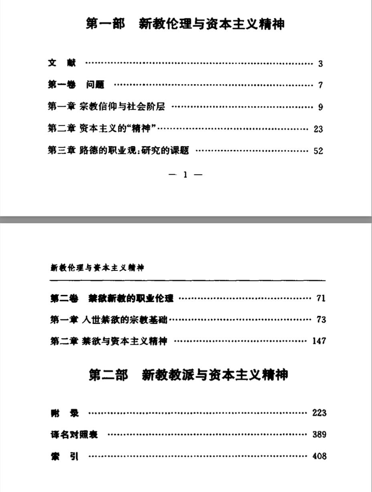

# 新教伦理与资本主义精神

> 作者：马克思韦伯 \
> 这是大学时候非常喜欢的《现代社会的诞生》课程的读书报告.

[[toc]]

# 1. 总体脉络

以《新教伦理与资本主义精神》为讨论对象，跟随马克思·韦伯的思路去追寻新教伦理与资本主义精神之间的关系，因为是读书报告，所以主体阐述韦伯的在此书中的论证逻辑。

如《韦伯作品集·新教伦理与资本主义精神》（广东师范大学出版社）的说明部分所述此书出版的 **20世纪初** ，是资本主义开始展现威力的时代， **韦伯是解释资本主义原动力的大军中杰出的一位** ，《新》是韦伯最为知名的作品，韦伯在《新》中论述的观点也正是“ **新教徒的生活伦理思想影响了资本主义的发展** ”，这一个看似逻辑上无法自洽的悖论。

全书第一部分为两卷:

* 在**第一卷**问题部分韦伯阐述自己对于资本主义、宗教等对象的观察，进一步指出怪异的地方，亦即<u>“唯独在西方产生了西方独具的理性化的资本主义”，而西方资本主义愈是繁荣的地区，基督新教的色彩越浓，然后提出自己的问题，宗教信仰中的种种特性中哪一些要素导致了这种相关性，新教与资本主义二者之间的关系是怎么样的</u>。提出问题后韦伯首先从资本主义入手，约束自己的研究范围，考量整个资本主义中最为核心的"**资本主义精神**" ，强调现代资本主义精神的理性、非贪婪的职业美德，也就是韦伯所述的"**天职观**"。
    * 在第一卷第三章路德的职业观中，韦伯开始着手于在宗教中寻找相对于“天职”的，或者说对于资本主义精神有这可能关联的要素，而在`天主教`中没有收获，这很显然， **因为西方现代资本主义在宗教改革之后再逐渐形成**。
    * 那么接下来必然在`基督新教`中进行寻找，宗教改革中首当其冲的就是`路德宗`，`路德宗`的教义中是有着对于职业的伦理约束的，但却是一种类似宿命论的“**天职观**”，这或许在资本主义的发展中发挥了作用，但一定无法形成如现代西方资本主义精神那种对于职业的积极担当、对于金钱的追求而不贪婪的特质。

* 而在**第二卷**第一章"入世禁欲的宗教基础"中，承接路德的`卡尔文教`（或作`加尔文`）的教义，则很好地契合了其发展需要，从`卡尔文教`的核心教义“**上帝预选说**”中得到的，不同于`路德宗预定论`的是<u>给予了职业以荣耀上帝、印证救赎状态的功能</u>。韦伯进一步阐释这种教义下的信徒的世俗禁欲生活，并在第二章禁欲主义与资本主义精神中，一步步解释， **这种宗教精神是如何孕育出资本主义那种国民性的**

而在第二部: "**新教教派与资本主义精神**"，韦伯搬出美国这个在20世纪初正在从自由资本主义向现代资本主义转变的国家，强力地论证了自己的观点。

# 2. 具体展开

接下来以**具体的章节**来具体阐述韦伯的论证思路，并且对比中国，我们这个所谓直接跨越了资本主义来到中国特色社会主义的国家。

## 第一部：新教伦理与资本主义精神

### 第一卷: 问题

**第一卷**名为问题，包含三个章节:

1. 宗教信仰与社会阶层
2. 资本主义精神
3. 路德的职业观：研究的课题

#### **第一章**: 宗教信仰与社会阶层

首先从各种宗派信仰混杂之处的职业统计发现一个<u>现象：近代企业中，资本家与企业经营者、连通熟练的上层劳动阶层，特别是在技术上或者商业上受过较高教育的训练者，全都带有着 **非常浓重的极度新教色彩**</u> 。凭此现象可以发现一个问题：**经济上最为发展的地区为何对宗教革命具有强烈的倾向**。

韦伯给这个问题初步的解释是这部分归咎于**历史的传习**，另一方面基督新教徒与天主教徒相反展现出一种走向经济理性主义的的特殊倾向，所以我们研究宗教的种种特性中导致这种倾向的特性，这也使得问题解决的方向已经清晰起来。

#### **第二章**: 资本主义“精神”

这部分的作用是：在韦伯解决上述问题之前对一些事实加以说明，以使得我们可以免于纠结含糊不清的一般概念，而着眼于深入探索基督各门各派的思想。

在这章阐释的资本主义精神，理清了在第一章只简单带过的描述现象式的资本主义，不再简单使用练达强盛的事业精神来指代资本主义。韦伯分析资本主义是一个**历史的实体**，用历史上的蕴含资本主义精神的文献来加以描述，“时间就是金钱”、“信用就是金钱”、“金钱天生具有孽生繁衍性”、“勤奋与节俭”，这些描述中透露出<u>资本主义独特的伦理——赚钱、赚取更多的钱，并严格回避一切天生自然的享乐，</u> 即使这在我们看来不具备合理性。

这种精诚干练的职业义务，完全有别于处于贪欲的对于金钱的追求，这是韦伯所看到和指出的现代资本主义精神，而且韦伯罗列了大量的事实，比如富兰克林、安东尼·弗洛伦萨等，正正反反地论证强调：

**资本主义的精神是一种理性的、非营利的、以赚钱为天职的带有禁欲色彩的精神**。

#### **第三章**: 路德的职业观：研究的课题

首先韦伯直截了当地说明在<u>`天主教`占优势的民族里，我们找不到我们所谓的“职业”</u>一事，也就是“天职”的概念，而这样的字词存在于所有`基督新教`占优势的民族里（这里可能存在翻译的不同，“职业”或许可以直接翻译成“天职”）。**“天职”及其思想都是新的，来自于宗教改革的**。天职概念中的对于世俗职业里的义务履行、评价为个人道德实践所能达到的最高内容这一点表达出了基督新教的中心教义，那就是摈弃天主教将道德诫命区分为“命令”与“劝告”的做法，转而认为: **经营为神所喜的生活的唯一手段不是接着修道僧的禁欲来超越俗世的道德，反而是端赖切实履行个人生活岗位所带来的俗世义务——即“天职”**。

这中心教义是路德在其改革活动的最初十年当中发展而来的。以路德为首的宗教改革赋予职业生活以道德意义，与资本主义有着很深的关联，<u>但路德虽然具有这种天职的观念，却是拒斥现世的，有着“不义之财”的用语，并且批判高利贷和放利取息的商业活动</u>。以及路德后期的愈发的传统主义，坚守信仰，都显示出，路德无法做到将职业劳动和宗教原理结合起来。具体来说路德的职业观认为职业就是人应当将将之视为神的旨意而甘愿接受且顺从的事，这是一种消极接受宿命的观念，和现代西方资本主义有着本质的不同。而 **路德引领者宗教改革，意味着宗教改革也同样止步于使得现世内的职业劳动在道德的重视和宗教的奖赏上大为提升。** 另外提一句，韦伯举得例子是真的很多，多到有些时候会让人对他的论证的逻辑感到混乱，更不用提他巨量篇幅的注释。

~ ~ 至此第一卷结束 ~ ~

### **第二卷**: 禁欲新教的职业伦理。

韦伯在这一卷：**谈论与寻找新教中的职业伦理以及其如何作用于资本主义的发展的**。

#### **第一章**: 入世禁欲的宗教基础。

既然路德不是与资本主义精神契合的那种宗教精神，那么禁欲的`基督新教`的历史担纲者（`卡尔文教派`、`虔敬派`、`卫理公会`、从再洗礼派运动中生长出来的诸教派）中，是否有这样的宗教精神呢。

韦伯首先讨论`卡尔文教派`，`卡尔文教派`的最具特征的教义是"上帝预选说"：<u>为了彰显神的荣耀，有些人和天使被与选定得永生，并其余者被预定受永死</u>。也就是说人是否被救赎，是神早就预定好的，做任何事情都无法使其得到改变，而人本身无法知道自己是否被救赎，只有神自己知道。这必然导致个人内在空前的孤独感，因为一个人人生的终极理想或者全部意义就是确认自己是否被救赎，而一方面他无从得到肯定，只有神知道他的救赎状态，另一方面他不能够怀疑自己，一旦怀疑自己，他无法告诉别人自己觉得自己可能不是被选中的，一旦如此，别人会直接孤立他，一个被判永死的人一定是罪恶的人，而神父也只能给予他暂时的安慰，劝告他应当相信自己，继续追寻社会事功，但这种劝慰于事无补，神父不是神，没法给他以救赎，**对于恩宠状态的怀疑会一直持续不断地存在**。

卡尔文教信徒在现世所能做的就是不断履行自己的天职，努力凭借更多的“社会事功”来荣耀上帝。因为所有被选中的人都会如此做，那么想要认为自己是被选中的，就一定需要积极地进行社会活动，这成为了卡尔文教派实际上达成的强力的效果，**人的精神生活和现世职业生活都被宗教所规划**，天职观指导下信众的职业生活具有强烈的理性化，不为了金钱而为了荣耀上帝而进行的经济商业活动，**这显然与资本主义精神有着极为匹配的一致性**。

韦伯认为，<u>禁欲的基督新教的最重要的结果是整个伦理生活之有系统的理性安排，卡尔文派的可怕教义具有驱动人不断地自我检视，因而有计划地规制自己的生活。</u> 之后韦伯分别讨论了虔敬派、卫理公会、再洗礼派等教派的教义，并且指出相对于卡尔文教派教义和教义实现上的强固的首尾一贯性，别的教派都欠缺这种首尾一贯性，有着自己或是神秘主义的、或是感情性质的发展。

#### **第二章**: 禁欲与资本主义精神

韦伯具体论述**基督新教的宗教基本观念与经济生活有何关联** ，这是韦伯真正解决资本主义原动力问题的地方，虽然进过之前的解释铺垫，答案已经呼之欲出了。

韦伯在这里引用一些神学著作，帮助我们理解经过新教的司牧的时间所运作出来的宗教力量，实为形塑“国民性”的决定性因素。比如巴克斯特的《圣徒的永恒安息》指出财富本身十分危险，财富的诱惑永无止境，财富的追求比起神之国度的无上重要，不仅毫无意义而且道德可疑。巴克斯特在其主要著作中一再反复热切地劝勉人，要刻苦地持续肉体劳动或者精神劳动。可以看到， **神学著作教导信众对待金钱的态度与现代西方资本主义别无二致** ，`清教`(受加尔文主义影响的英国教派)的职业理念里所着重的也总是职业禁欲生活里的讲求方法的性格。<u>到这里我们至少可以证明清教徒在经济生活中的状态与现代西方资本主义精神有着很深得渊源，其职业观对于资本主义生活形态之发展具有直接影响</u>

这些清教的基督徒在其职业生活总实际上变得富有了，韦伯进一步说道，近代的资本主义精神以及近代的文化，本质上的一个构成要素——**立基于职业理念上的理性的生活样式，乃是由基督教的禁欲精神所孕育出来的。**

## 第二部：新教教派与资本主义精神

在下一篇论文，也就是《新》的第二部分新教教派与资本主义精神中，韦伯针对美国的资本主义进行分析，验证自己的观点。

写《新》的时间是二十世纪初，当时的美国正在由自有资本主义转向现代资本主义，虽然美国是一个政教分离的国家，但是 **美国当时不属于某一教会的人仅止于6%** ，可以说美国在这一阶段由资本主义强国上升到资本主义霸主地位与这些教会有着直接且强烈的关系。

**教会在美国成为了一种道德品质认可**，通过教会的品质审核成为教会的一员会给一个人带来巨大的信誉保证，这强力地保证了这个人的商业活动的进行，只要在行商，永远会有客人，而这一几乎由各种信众组成的国家，其国民的性质一定承接自宗教精神，这些教会基本上都是新教教会，那么显然可以认为新教的职业精神一定参与形成了美国的资本主义精神，而就观察来看，还起这决定性的作用。

至此，**禁欲的宗教伦理孕育了近代资本主义的风格，这一点已经得证**。

<Vssue :title="$title" />