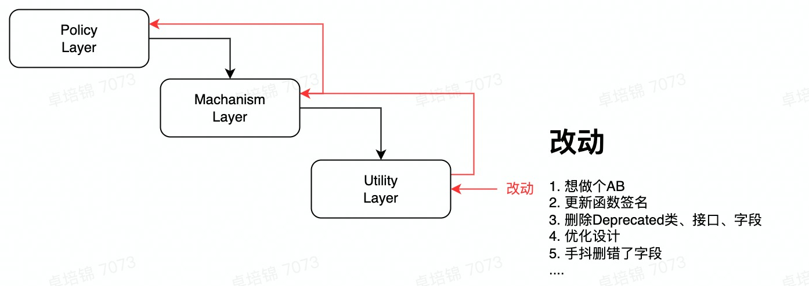
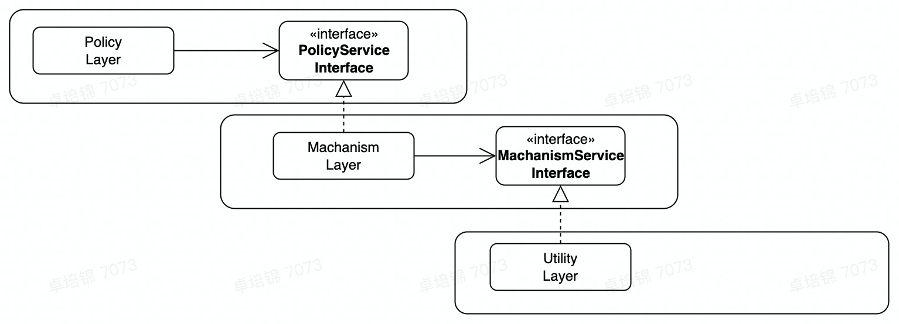
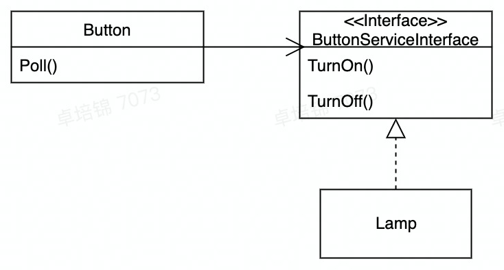

# DIP: Dependency Inversion Principle

> dependency inversion principle, 一种模块间松耦合的设计原则
>
> 1. High-level modules should not import anything from low-level modules. Both should depend on abstractions (e.g., interfaces).高层次的模块不应当依赖低层次的模块。二者都应当依赖于抽象。
> 2. Abstractions should not depend on details. Details (concrete implementations) should depend on abstractions.抽象不应当依赖于细节，细节应当依赖于抽象。

## 什么是依赖

**依赖关系：**

有两个元素A、B，如果元素A的变化会引起元素B的变化，则称元素B依赖（Dependency）于元素A。

如：一个类向另一个类发消息；一个类是另一个类的成员；一个类是另一个类的某个操作参数，等等。


**直观感受：**

文件依赖，ClassA 需要

1. #import ClassB
2. 持有和使用
3. 实例化B
4. ...

当ClassB变动时：

1. 字段类型改变： string *name  =>  mutableString *name;
2. 函数返回值改变: (int)funcB  =>  (void)funcB
3. ...

那么ClassA其实就需要去不断地适配ClassB的变动。一个上层类ClassA,往往持有和使用多个和ClassB类似的下层的类，导致不稳定++，耦合程度++，当层级变得更多时，工程可能也就难以维护了；

**目的：**

依赖隔离，依赖倒置 ---> 代码的稳定

## 层次化、模块化

工程规模大了之后，为了追求复用，往往模块化地去组织代码，比如Aweme --> Studio--> CameraClient --> CreationKit，形成层次化的结构。



这就导致底层类的更改会导致上层类的变动。Utility Layer的接入方越多，影响越大。

依赖关系：Policy #import Machanism#import Utility

调用关系： Policy --> Machanism --> Utility

## 倒置依赖

一种解决的方案，就是把依赖倒置。上层模块Policy去依赖`<PolicyServiceInterface>`，他知道自己需要一个什么样的对象。


```
依赖关系：Policy #import  <PolicyServiceInterface> #implemenet Machanism   #import <MachanismServiceInterface> #implement Utility
```
```
调用关系： Policy --> <PolicyServiceInterface>  --> Machanism --> <MachanismServiceInterface> -->Utility
```
这样底层的实现即便改动，只要没有改动到接口层，上层模块就可以继续使用原本的接口抽象。

“倒置”：
```
原本： Policy #import Machanism

现在： Policy #import <PolicyServiceInterface>

 Machanism #import <PolicyServiceInterface>
```
Policy 不需要再引入 Machanism的内容，反而是Machanism要去引入Policy定义的接口，因此说倒置。不过实际的函数调用关系没有改变，上下层关系也没有改变，这么处理完的效果是代码层面的隔离，行为仍然和原来是一致的。

## 一个简单的例子

一个Button作为开关，控制一个灯泡Lamp

可以简单Button持有一个Lamp，当Button被点击Poll()的时候，调用Lamp的TurnOn()和TurnOff()方法


代码中：直接持有一个Lamp实例

```objectivec
public class Button
    private Lamp *lamp;
    public void Poll() {
        if (<some condition>) {
            lamp.TurnOn();
        }
    }
```
当TurnOn是一个空实现的时候，就不亮了。



## 接口放哪儿

> 接口的所有权？

> 工具库 or 调用方 or 第三方

接口的代码，如果放在上层模块，下层模块要去#import上层模块吗？

比如 Machanism要去`#import <PolicyServiceInterface>`，倒置是倒置了，就是有点奇怪。

如果Machanism有多个接入方，那么`<PolicyServiceInterface>`就应该被多个接入方#import, 那么命名也就变得不那么合适了。

* 接口单独放，C++中单独放在一个namespace中，Java中单独放在一个package中。


> 《敏捷软件开发》：注意，这里的倒置不仅仅是依赖关系的倒置，它也是接口所有权的倒置。我们通常会认为工具库应该拥有它们自己的接口。但是当应用了DIP时，我们发现往往是客户拥有抽象接口，而它们的服务者则从这些抽象接口派生。

## 实例谁来创建和组装

> 依赖提供方?
>
> 工具库 or 调用方 or 第三方

**几种方式:**

* Policy的调用方来组装
* 上层的类Policy自己创建Machanism。
* 第三方创建Machanism，提供给Policy
  * --> 依赖注入
  * 抽象工厂模式，看着和容器很像。

**几种解决办法：**

1. 下沉到底层的模块，再依赖底层的模块。
2. 单例实现，三个调用方引入
3. 注入，需要一个在所有层级都能够访问的第三方注入工具。

## 适用范围

> 实际应用上，可能没有办法那么严格

为了依赖于抽象，考虑是否：

1. 任何变量不应该持有一个指向具体类的指针或者引用
2. 任何一个类都不应该由具体类派生
3. 任何方法不应该覆写它的任何基类中已经实现了的方法

---

1. 很难做到，对于非常稳定的类没有必要，比如NSString等基础类
2. 尽可能做到，派生自抽象类，或者实现接口来实现继承更为稳定，防止父类过多变动，导致不稳定。
3. 尽可能做到，覆写之后，导致基类的方法不再稳定，会逐渐被子类的行为入侵。

继承是代价比较大，容易产生过大复杂度的行为，子类必定依赖父类 🐶

日常开发应该尽可能使用接口抽象和包含引用，而尽可能少使用直接继承。

> Golang 没有继承 🐶，更加提倡使用包含与组合

## 第二个例子

熔炉(FURNACE)

```objectivec
void  Regulate(double minTemp, double maxTemp)
{
    for(;;) {
        while (in(THERMONETER) > minTemp) // 温度计温度 > minTemp
            wait(1);
        out(FURNACE, ENGAGE);  // 咬合
        while (in(THERMONETER) < minTemp)
            wait(1);
        out(FURNACE, DISENGAGE); // 松开
    }
}
```
```objectivec
void  Regulate(Thermometer &t, Heater &h, double minTemp, double maxTemp)
{
    for(;;) {
        while (t.read() > minTemp) // 温度计温度 > minTemp
            wait(1);
        h.engage();  // 咬合
        while (t.read() < minTemp)
            wait(1);
        h.disengate(); // 松开
    }
}
```
这样高层的温度调节，就不依赖具体的温度计、加热器的型号的细节了。

## 动态多态与静态多态

> 另一种抽象方法：泛型

同样实现了依赖关系的倒置，只要t和h实例确实实现了read()等方法就可以。不具备动态多态的开销，不过也无法在运行时替换实例，改动需要重新编译。

```objectivec

template <typename THERMOMETER, typename HEATER>
void  Regulate(THERMOMETER &t, HEATER &h, double minTemp, double maxTemp)
{
    for(;;) {
        while (t.read() > minTemp) // 温度计温度 > minTemp
            wait(1);
        h.engage();  // 咬合
        while (t.read() < minTemp)
            wait(1);
        h.disengate(); // 松开
    }
}
```
依赖倒置，并不一定要使用接口实现，静态的模板方式，或者像Python一样的动态类型，或者使用指针类型，都可以去实现依赖倒置，符合两个原则：

* -->  高层次的模块不应当依赖低层次的模块。二者都应当依赖于抽象。
* -->  抽象不应当依赖于细节，细节应当依赖于抽象。

不过有接口更加便于管理，感觉更加方便一点。

> 依赖倒置的方法有很多, 发散地找一些语法特性，其实都是可以去实现的
>
> 1. 接口
> 2. 指针
> 3. 泛型
> 4. 动态类型
> 5. 反射
> 6. 甚至可以依托于外在文件，Java Bean使用xml进行注入-->Spring框架
> 7. 口头约定，注释约定，文本约定？持久稳定的约定是可以的。比如HTTP协议🐶？200， 比如SQL
>
> 依赖注入的方式也有很多：
>
> 1. 初始化方法注入
> 2. public方法注入
> 3. 类方法注入
> 4. 宏注入
> 5. 第三方框架注入

毕竟DIP是一种思想，没有强制的实现方案。


## 理想状态

> 形成稳定的抽象

《架构整洁之道》:

1. Don't refer to volatile concrete classes

不去依赖：易变的具体的类

2. Don't derive from volatile concrete classes

不派生自：易变的具体的类

3. Don't override concrete functions

不覆盖：具体的函数

4. Never mention the name of anything concrete and volatile.

依赖于抽象

## 问题

组织类，组织代码的方式，及其优劣

## 更多样例

### Java

```Java
public interface Greeter{
        void greet();
}

class AngryGreeter implements Greeter { 
    public void greet() {
        System.out.println("YOWL!");
    }
}

class Cat {
    private final Greeter greeter;
          
    public Cat(Greeter greeter) {
        this.greeter = greeter;
    }

    public void greet() {
        this.greeter.greet();
    }
}
```
### Python

https://www.linisnil.com/articles/python-dependency-inversion-principle/

```Python
class AngryGreeter:
    def greet(self):
        print("YOWL!")
class Cat:
    def greet(self, greeter) // 动态类型直接调用方法，没有greet()方法就报错
        greeter.greet()
```
```Python
import abc
// 也可以引入抽象类，帮助进行接口的约束
class Greeter(abc.ABC):
    @abc.abstractmethod
    def greet(self):
        pass

class AngryGreeter(Greeter):
    def greet(self):
        print("YOWL!")

class HappyGreeter(Greeter):
    pass

class Cat:
    def greet(self, greeter):
        greeter.greet()

if __name__ == "__main__":
    c = Cat()
    c.greet(AngryGreeter())
    c.greet(HappyGreeter()) // HappyGreeter实例化时检查，报错
```
### GO

[Dive to Clean Architecture with Golang](https://dev.to/bmf_san/dive-to-clean-architecture-with-golang-cd4)

```Go
package examples

// Logger is an interface which will be used for an argument of a function.
type Logger interface {
    Printf(string, ...interface{})
}

// FooController is a struct which will be returned by function.
type FooController struct {
    Logger Logger
}

// NewFooController is a function for an example, "Accept interfaces, return structs".
// Also, this style of a function take on a role of constructor for struct.
func NewFooController(logger Logger) *FooController {
    return &FooController{  // 接受Logger接口， 构建并返回FooController的实例
        Logger: logger,
    }
}
```

## Ref

1. [Clean Coder Blog](https://blog.cleancoder.com/uncle-bob/2012/08/13/the-clean-architecture.html) Bob Uncle

2. [Python Dependency Inversion Principle – Linisnil](https://www.linisnil.com/articles/python-dependency-inversion-principle/)

3. https://github.com/bxcodec/go-clean-arch

4. [GitHub - sergdort/CleanArchitectureRxSwift: Example of Clean Architecture of iOS app using RxSwift](https://github.com/sergdort/CleanArchitectureRxSwift)

<Vssue :title="$title" />
