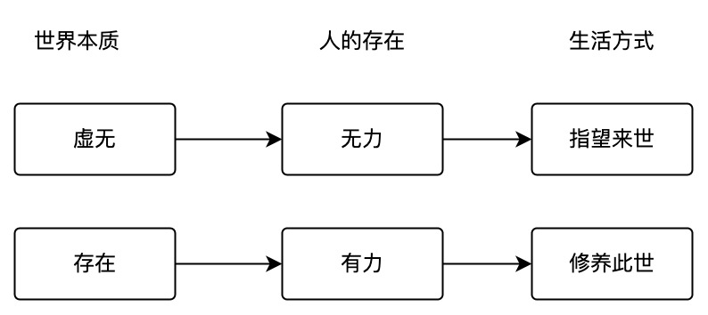
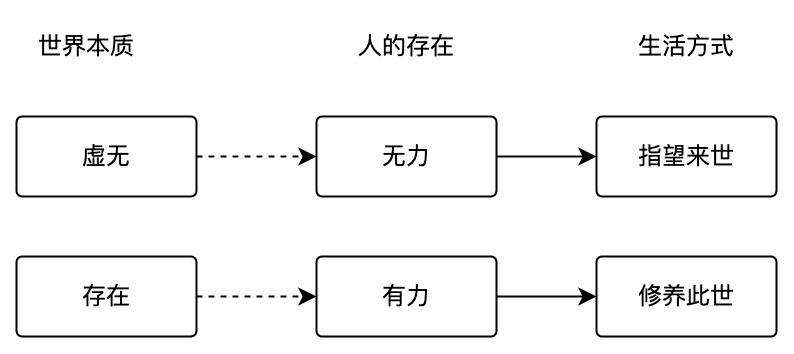
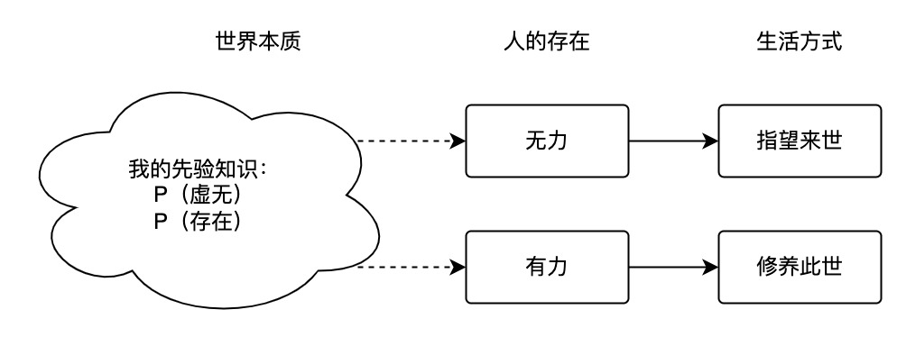
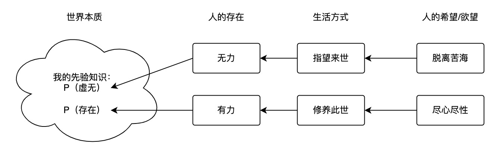
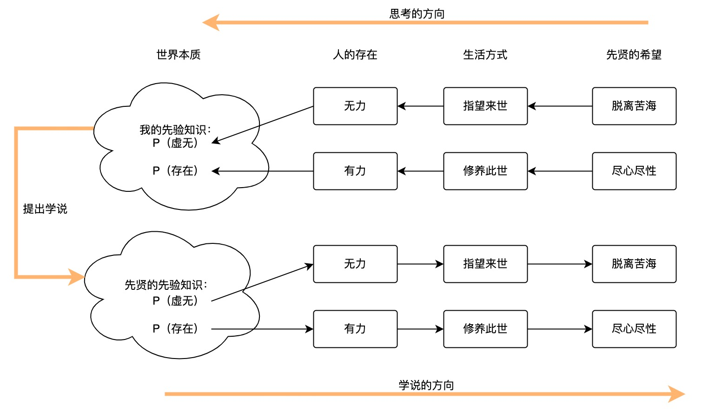
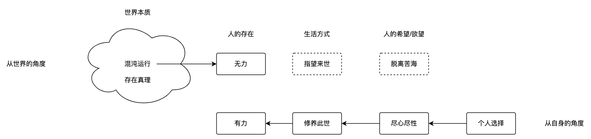

# 我的想法

> 2022年6月5日

大家会对世界本源提出自己的认识，本质是气、理、水火、阴阳、善、恶等等，以此来：
1. 阐释世界运作的规则
2. 解释事物的性质
3. 考量人的存在构成，指导人的生活方式

由此大概会是有几方面发展

- 禅宗、佛学、基督教，世界的认识上都偏向虚无，一个没有意义的世界本质，会解构人本身存在的意义。当前的存在既然是没有意义的，那么能指望的也就是虚无的来世、天堂、永恒了。
- 儒家更为脚踏实地一些，焉知生，安知死，先把这辈子活清楚了。世界有理， 理就是所当然，所以然，也就是世界运作的规则。这些规则至少当前是存在的，那么按照这些规则指导自己的生活，还是做的到的。

不过我有一个问题：
- 不论如何世界的本质都是未穷尽的状态。理想的生活方式背后的哲学依据，不论怎么说，都是不稳定的，拿来指导人生，可能仍是不充分的。(画成虚线好了)

- 我们从前选取生活方式，同时也选择一种对世界的解释，否则无法放心的生活，因为不够合理。
  - 我们所面临的真正的问题就是，我们一定是在不充分的对世界的认识之下，选择生活方式的。
- 我们能做的，是通过对世界的观察，得到足够的先验知识，尽可能拟合世界的本质。不要求绝对正确，在我死前够用就行。（我们的图片变成了）

- 那么问题更糟糕了一点，因为我的先验知识，是变化的，而且我明确知道，我随时可以改变对世界的认识。（我的无限心在作祟）。更为大胆一点，箭头的方向，可以按照我们的意愿改变。

- 以人的主观意愿+先验知识去解释世界，也未尝不可，虽然不一定具备普世的价值，但是具有个人的指导生活的价值。
- 那么提出儒学、道学、佛学、基督的人，是否也是这样一个路径去思考，最后解释了世界本质，而要求大家以他个人所希望的方式生活？如果是这样，我按照同样的思考方式，思考出自己的学说，也是可以的。

如果是现在的我， 尝试去解释，大概会是这么个图示
1. 世界是一个混沌，一个客观存在，存在着维持运转的背后的真理。人是混沌中的尘埃。
2. 真理只是参与人的生灭、构成，没有倾向。
3. 人，在生活的范围上是有力的，在世界的范围上是无力的。
  1. 所以人能控制自己的生活，而无法左右世界的潮流。
  2. 往往潮流推出来一些人，而不是一些人推上来潮流。
4. 用自我的意愿去指导生活，用真理去解释世界。不需要一个有善良倾向的世界，不要一个有德行倾向的世界。人的意义，由自己与认可自己的他人去一同肯定。
5. 是的，这里尝试解构原本的解释路径。认为个人选择，占据主要地位。
  1. 理由是：我们知道的不够多，用先验知识去做拟合，当然可以。而把知道的和不知道的划分来看，不能确定的部分，就不确定，则是我当前的方法。
  2. 也许未来科学发现，人类能够影响到客观规律的运转，或者人只要奋斗就能长高，或者人就是规律的化身，那就是这个理论该出错的时候了。
6. 我想这样去解释，还是比较贴近真实情况的。

- 可是如此，一个礼崩乐坏的社会是很容易出现的。这里没有规定人的倾向及其来源，人完全可是恶的。为天地立心，实在是困难的事情。
- 我们解释了个人如何指导自己的生活，却又担心混乱的发生，因为我们并不解释人类如何合理地共存。
- 我们当然也想构成足够多的共识，基于共识而共存。而这些共识的合理性，只能来自于对世界的理解。所以我们又回到了先贤的老路，需要世界赋予人类合理共存的合法性？
- 为什么人类如此的混乱，和宇宙的混沌状态多么相似。
TODO: 需要世界赋予人类合理共存的合法性？
- 如果我们说不呢？人类合不合理共存，不重要。这里就去运用世界混沌运作的客观性质。人类作为群体而言就是混乱的，合理的人类社会共存只在局部具有共识的人群中存在，只在某些事务的共同认识上存在。就整体而言，就是宇宙混乱的一部分。
- 大学时候请教《现代社会的诞生》课程的老师，说一个暴力或者混乱的社会是无法长时间存在的。那么我们究竟是处在稳态之中，还是短时间的覆灭之前呢。如何解决这种混乱，亦或是这种混乱不可解决，这是未知的事情。
- 对待未知的事情，还是很多个方向，一是尽可能去拟合，一是尽可能去划分清楚，一是完全认可未知与无力，一是完全否定未知与无力。
- 我们此时，是否应该选择一种对世界的解释，以使得人们以一种我们所希望的方式合理共存。就像先贤们做的一样，用可能错误的学说，去做我们认为正确的事情。这算不算是欺天，欺骗自己。
- 如果我这么做了， 虽然学说可能错，但是目的达成了，世界和谐了，是否是可以的呢。学问可以错，想做的事情却也做了，学问大不了之后再修正，但是人们不合理地共存，真的忍不了。很好， 我们发现我们会去做先贤们也做的事情。
- 如果别人不信我的学说怎么办？大部分人信就行。可是，他们真信了，也很糟糕。我们这个理论，只是一个暂时的拟合，一定有人能做出更好的解释，如果是被现在这套说法误导了，也不好。这，只能期待他自己冒出来了。
- 再或者，每个人都有共同的对这些问题的认识，每个人都有自己的学说，大家进行讨论，选一个可以接受的先用着？不信邪的同学们，去凿那些最坚硬的强。
- 最终，也许大家都转向对宇宙客观真理的探寻上了，毕竟对于暂时难解的问题，可以先取近似。

TODO: 好了，如何用于现实世界呢
- 价值既然由自己衡量，我们自己考虑的因素，其实只包含自己能够把握的范围--生活。人的力作用于生活，生活中其他的力也作用于人。
- 人的品格品质，在于如何看待自我。认为自己是个真诚的人，和认为自己不是什么好人的人，区别很大。
- 事务的成功与否，在于事务本身与人的意愿。事务本身包含不可控的部分，我们尽可能把握可控的部分，去提高成功的概率。
- 尽可能减少外界混乱的干扰(optional)，毕竟世界是混沌的，人类社会中混乱的部分也真的太多了。

TODO:反驳一下自己吧
- 说是切分开，其实切分不开，对世界的认识和拟合，仍然是我们做选择的最大依据。
  - 生活的背景就是世界。因此我们其实是，选择人生的态度，选择生活的方式。落实到真正去生活，我们仍是参考着先验，运用着客观事物规律去生活的。
- 完全依托于自己的意愿，太过容易走偏。意愿的合理性在于，这是出于我们自身的选择。可是我们的选择，没有指导的方针。
- 如果秉承这个理念。我选择积极努力生活，对任何事情都尽心尽性，自我认可，但是不被外界认可，或者完全被外界否定，人也无法维持。人本来就生成与这个世界，没有必要把人与混沌的状态隔离开，混沌也是我们要去讨论的。
- 一套合理的学说，完备性还是非常需要具备的。

