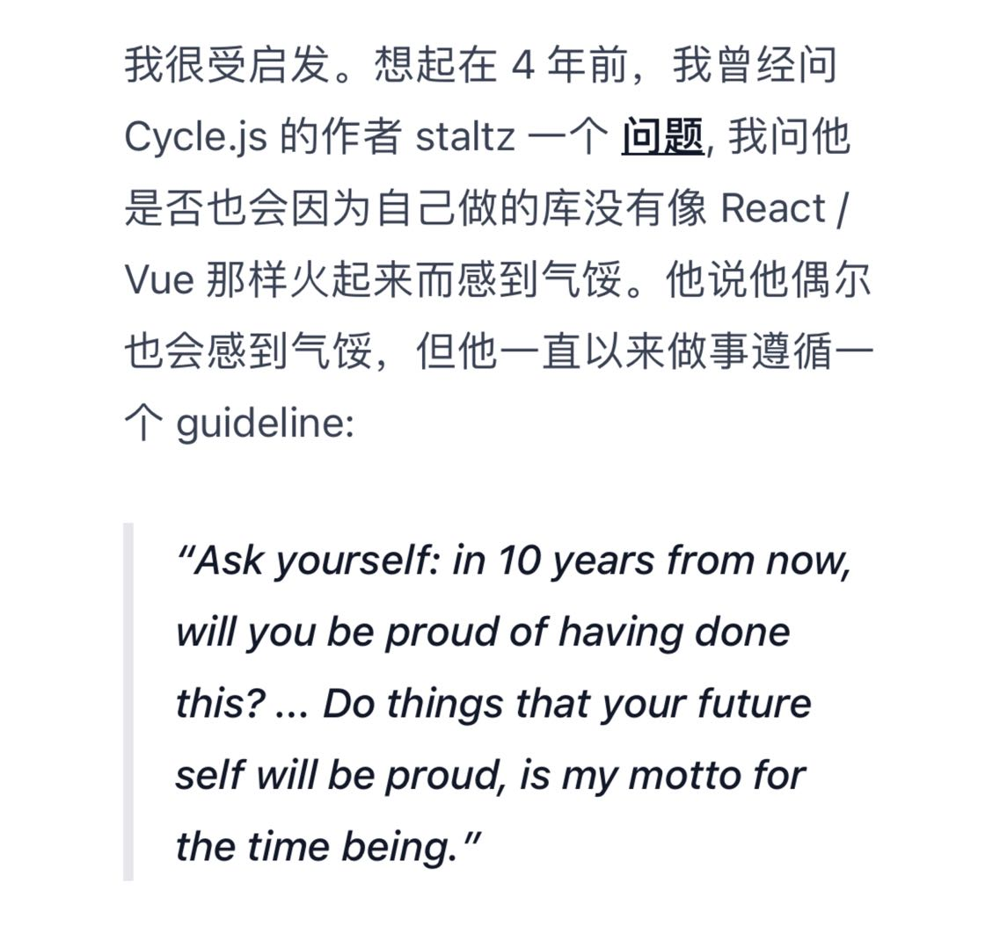

# 鸡汤
> 我爱喝的鸡汤, 

我记得我，很早，就想弄一个鸡汤api， 非常方便， 我认为内容就是可以通过api服务贩卖出去的，而且现在有很多通用api，比如墨迹天气。只不过是缺乏个人的内容接口，我猜web3初创企业有很多已经开始尝试了。

## 0x00000002 | 整体看起来，是不是还不错
> link: [https://www.bilibili.com/video/BV1Zr4y1J7PH/](https://www.bilibili.com/video/BV1Zr4y1J7PH/)

## 0x00000001 | in 10 years from now, will you be proud of having done this?
```plainText
Ask yourself: in 10 years from now, will you be proud of having done this? ... Do things that your future self will be proud, is my motto for the time being.
```
</img>

## 0x00000000 | how-to-be-successful

> link: [https://blog.samaltman.com/how-to-be-successful](https://blog.samaltman.com/how-to-be-successful)
```text
1. Compound yourself // 让自己处于复利之中
2. Have almost too much self-belief // 无条件自信
3. Learn to think independently // 学会独立思考
4. Get good at “sales” // 善于“推销”
5. Make it easy to take risks // 让冒险变得容易
6. Focus // 保持专注
7. Work hard // 努力工作
8. Be bold // 大胆去做
9. Be willful // 拥有顽强的信念
10. Be hard to compete with // 让自己难以被取代
11. Build a network // 构建人际网络
12. You get rich by owning things // 通过拥有东西致富
13. Be internally driven // 成为内驱型的人
```


