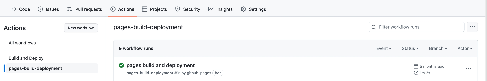

# 更新部署
> 久不更新，忘了本地编译模板的指令，更忘了怎么推送的，记录一下，方便之后写博客


## Step 1. 在本地启动服务器
```shell
yarn docs:dev # npm run docs:dev
```
然后访问：http://localhost:8080

## Step 2. github hook
```shell
.github/workflows/vuepress-deploy.yml
```
配置了两个任务
1. 自动 `checkout` 出 master
2. 自动 `deploy` vuepress

```sh
jobs:
  build-and-deploy:
    runs-on: ubuntu-latest
    steps:
    - name: Checkout
      uses: actions/checkout@master

    - name: vuepress-deploy
      uses: jenkey2011/vuepress-deploy@master
      env:
            TARGET_BRANCH: gh_pages
            BUILD_SCRIPT: yarn && yarn docs:build
```

## Step 3. git push origin master & check action status

确认一下任务运行的状态，是否部署成功
* push 到 main 分支就行了
* 生成的 assets、html、js、css 都在 gh_pages 分支上，静态内容，挂在pages服务上




## Step 4. comments
> 评论系统
> https://vssue.js.org/zh/guide/

<Utterances />
