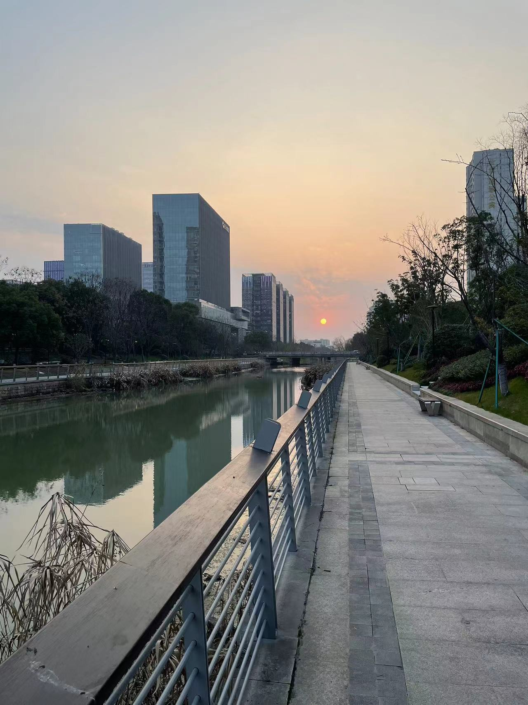
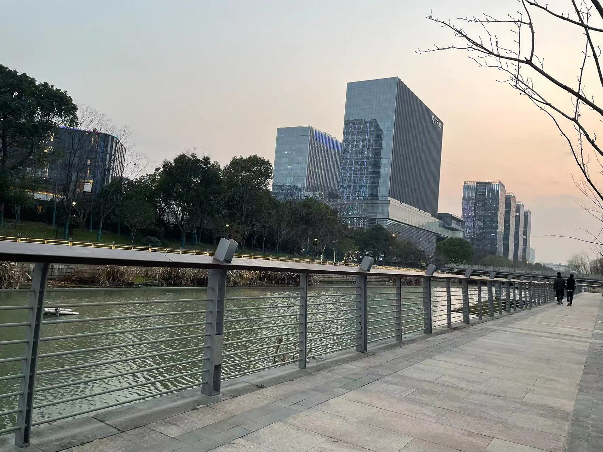
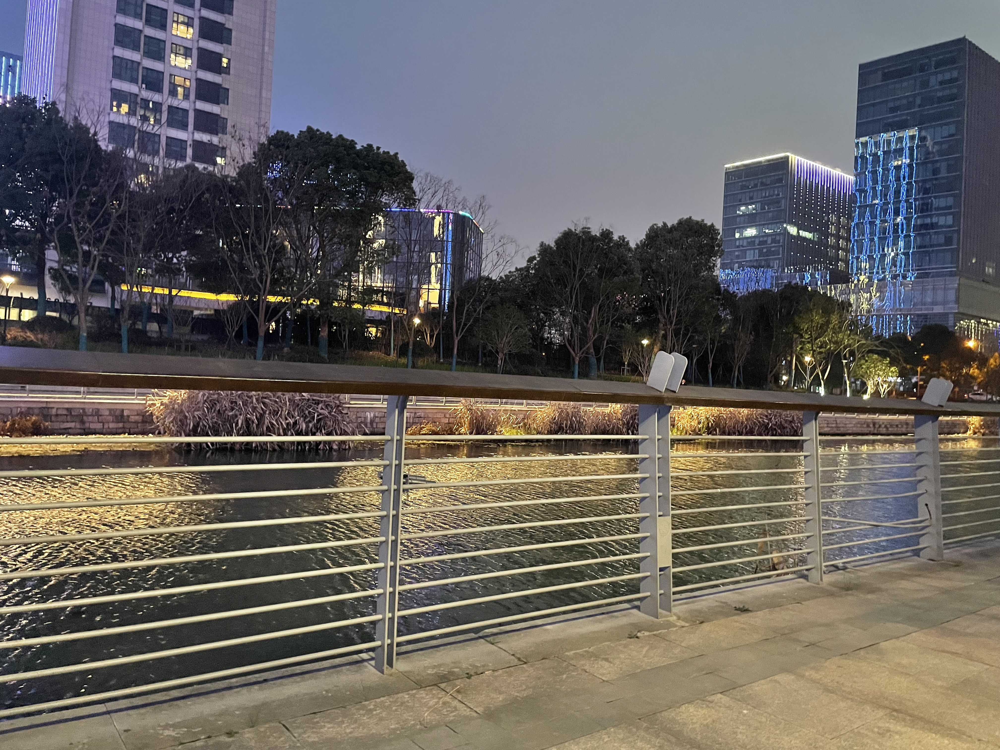
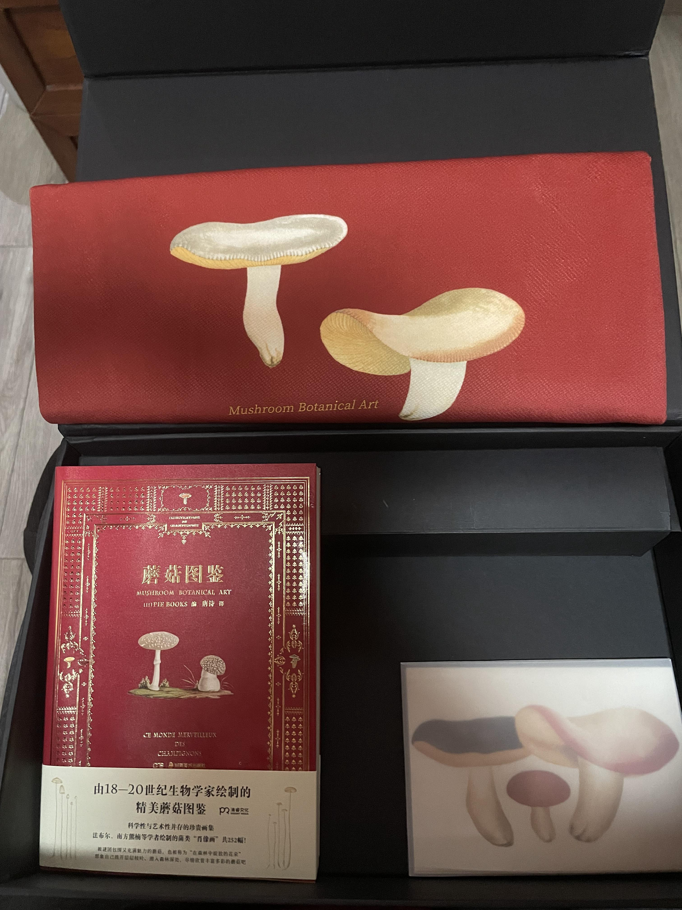

# 记忆碎片
> * 随手记录下来的想法，特别在疲惫的，深夜，独自一人的时候。
> * 不过，还是保持对不确定的事情的乐观，永远相信自己。
> * 可能混乱，不过一直在记录，这些想法不由自主地流淌。

## 2023.3.18

* 坏了， 发现自己，喜欢在河边洗(写)代码了，你好， 我是河马🦛， 在河边写代码。

## 2023.3.17

我所坚持的，才成为我自己。

内心之中，有点沉闷。内心之中，有点动摇吗？

继续坚持，因为相信，所以要做，有这样的确信。

这一个月，博客，已经初具规模。

## 2023.3.14

原来早上醒来头昏脑胀，不是没有休息好，是鼻炎过敏反应...

## 2023.3.12

重新信任这个世界。

- 回来打了一晚上的文明6， 终于放出3个核弹。
- 似乎原本对于生活的恐惧，也随着这两周的松懈，而没有那么畏惧
- 这个礼拜，确实有缓解我内心的焦虑。
- 我的焦虑从何而来呢。
- 现在似乎已经没有了呢。

---
今天见到了lucy牧师，很是惊喜，因为许久没有见到了。结果刚见到一次，她又要回韩国，还邀请我有空去韩国玩，说是之后很长一段时间就在韩国了。

我好像，确实比较喜欢东亚混血女性，特别是和他们交流，听着熟悉又带着一点夹生的口音，很是有趣。

---
似乎，已经和世界和解了，不在有巨大的压力和愤怒，而更关注事情怎么去做。 :)

## 2023.3.9

中午重新午睡之后，发现精神变好很多..看来勉强身体是没有用的。还是得适当休息。

## 2023.3.9

对世界的信任的重新构建。

## 2023.3.7

工作实际上是限定时间、空间、能力下，应对易变的外部条件的Action， 涉及少数的编排，情绪的控制，上下文切换，合作的问题。

## 2023.3.5

本来昨天就打算弄点`Swift`代码，但是关闭在房间里，却发现没有什么写代码的意愿。

\> 于是偷偷跑了出来🐶， 🤔， 在想是不是就是在轻松的场景中，我才更加愿意去写代码，内心中没有了压力，好像一切的一切，都会被河水带走 ~ ~

1. 点个咖啡
2. 带上电脑
3. 带薄外套

</img>

</img>

</img>

\> 未来会怎么样呢， 我也不知道，拭目以待吧 :)

---
* 去年圣诞没能送出去的礼物，《蘑菇图鉴》，里边居然送了一个超级好看的袋子，布料很舒服，还带有明信片和海报。惊喜 :)

* 晚上回来，还整理了房间，感觉日后还是要时常整理房间，很放松人的内心，而且一切都有条理地放置，很舒服。

</img>

---
23:01
* 回到工作中，感觉到一点焦虑，还是因为自己有不会的东西，而怕被`challenge`, 这大概是十几二十年来的教育中，带给我最为糟糕的东西，我总以无知为耻，然而无知是人生的常态，虽然我已经能够比较坦然地说出"我不知道", 但是在收到别人的质疑的时候，或者是像现在这样，在学东西时候发现有东西不会的时候，内心中似乎有个影子在那边点起我的名字， 叫我起来回答问题，然后大家哈哈大笑，即便他们并没有比我知道的更多，而受到群体嘲笑的原因，居然只是某个知识点不知道而已..

这种耻辱式教育，什么时候可以改成互助式教育，分享式教育。为什么要把不好的感觉带给别人呢..

## 2023.3.4

打算加上评论系统，结果`gittalk`的服务不可用了,有点尴尬。 [`vssue`](https://vssue.js.org/zh/demo/github.html)也让我有点摸不着头脑.再研究下看看。

[Gitalk显示一直加载中，并提示Error: Network Error #514](https://github.com/gitalk/gitalk/issues/514) 

无法跨域..

---
e, 都遇到持续loading的情况，这可能得使用别的第三方评论托管平台了。

## 2023.3.3

今天Reviewd代码看到个停止线程的问题，系统`block`暴露出一个stop指针，在传入的回调中，设置这个stop的值，就可以通过系统把这个线程停止掉。 // 这种方式和调用系统api去在这个线程的结构体上去停止线程是不一样的。

对于系统库底层， 还有很多需要挖掘的地方。
感叹是，在技术上， 我还有很多需要学习的东西。

## 2023.2.28

这两天思考🤔：
1. 如何让工作变得开心
2. 如何减少工作对我自己生活和兴趣的侵入

昨天工作到22点的时候，一种反感的心情凸显出来。因为我没有时间做自己的事情了。大厂工作对人的侵入，过于粗暴了。

## 2023.2.26

**多个有能力的人互相投资，互相帮助，成功的可能性能够大大增加**

**从选择中获益，周期性地check，精确性很重要.✅**

想起这几点的问题是，我把充电头落在酒店了，离开房间的时候，头脑昏沉，只是简单环顾了一下，落下了。我大概落过下很多东西。脑子里对于落下东西有熟悉的感觉，流程一般就是脑子混乱，在漫无边目的地娱乐或者浏览，然后临时整理一下散落各处的东西，匆忙下楼，赶往下一站。然后略感懊悔。

与从前不同的一点是，这次没有再沉溺于懊悔的情绪，这大概是工作2年半后收获的最为宝贵的能力，我不再沮丧，开始习惯于寻找各种各样的解决方式。因此在工区待了20分钟后，就回酒店取充电头，径直来机场。

所以目前就坐在机场的星巴克写点什么，听着播客
[饭饭之交](https://open.spotify.com/episode/1tJ2PzXlzIzmhQsWw3UF9e?si=yq9LDDVUTHyP9NJp75_TQA)，感觉到有些惬意。(听两个小姐姐聊天还挺有趣的 😊 )

博客、日记这一类记录到底会带我什么呢。或许什么都不会带来，不过毕竟满足了我的表达欲，还能刷`github commit`记录 😊, 并且带给我很大的乐趣，是一种很即时的反馈。

距离了解到“儒家是一种理想的生活方式”这一点已经过去了大半年。我好像还是按着原来的方式去活，虽然在各个尺度上都稍有寸进，总觉得距离还是很远。最首先一点就是，规律的作息并没有能够达成，或者说我没有能刻意坚持下来。

还有，做自己的事情真的很快乐，要尽可能使得公司的工作，成为自己想做的事情。

---
=v= 看到21年7月份写的代码，发现其实对于`iOS`大多数的`objc`的内容，那个时候我已经基本都学会了，如今竟然已经是2年多之后了，技术上几乎没有太多长进，这真的太恐怖了，我有明显的感觉是工作对于我的消耗过多，几乎拖累了我的成长，这太可惜了，这两年的时间。// 不过也感慨那个时候的学习热情之高。

实际上，基于已有的对计算机科学的理解，工作上的绝大多数问题对我已经没有太多的帮助了，需要做的就是快速完成，并且寻找有挑战的事情去做。//看来工作上要做更多的规划才行。🐶。

---
还是需要和更多优秀的人聚集在一起，这种优质的聚集，优点太多了。

---
需要训练自己，习惯有结果地，有目标地做事情。OKR这种事物管理方式显然是有意义的，在生活中去习惯这种方式，比如现在我需要确定需要优化的三个目标并且包裹到AB之中，这样晚上会回我就不会特别地被动了。\
// 发现想要编译的时候，没有签名，在飞机上又不能解除飞行模式。\
// 在各种的行为模式上，思维习惯上，感觉还有很多可以优化的空间，优化的目标是更加本质地高效地生后和工作。\
// 像这一次的需求，其实推进的还是优点慢，中间加入的需求又不合理，搞的我也挺费劲的，做成什么样子这个事情在`iOS`这边是没有确切标准的， 实际上我的品味，已经是比较高的标准了。 \
// 我其实希望我目前正在做的事情，不断出现在我的面前，提醒着我去做这些事情。可能我需要一个外挂文字的app.

## 2023.2.19

今天更新了一下博客。实际上看到 `oneV's Den` 的博客之后，觉得写博客这个事情还是很有意义的。我从前也常写日记，偶尔写博客，这段时间的注意力完全被工作占据，很少专心做自己的事情。好在本周的状态不错, 推进了一直不太想去推的项目，中午减少了回家的半小时路程后，发现时间明显变多，在`Twitter`上找到很多很不错的 `iOS` 开发者 ， 他们都非常优秀，让人觉得客户端还是很有活力的。

好耶，好起来了，冲冲冲 ～ 

## 2023.2.5
* 我很喜欢当初写`python`写`rails`写`hexo`， 那种即时的，快速得到反馈的感觉
* 玩文明6，其实也是的，有很快，很直接的反馈，是就是，不是就不是，学习得巨快
* 那么真正的学习与娱乐， 人真实的所有感觉，是否其实都是这个样子的，快速地反馈，直观的想法，持久的尝试，最终形成的能力、积累，强悍。

## 2023.1.7
过上美好的生活，不再担惊受怕，不在惶惶不安。

## 2023.1.1
跨年了，新的一年，希望过上正常的生活，以自己的方式去生活。能够有自己的app，对工作尽心尽力。
更多地去爱人吧
嗯，好像太贪心了，努力试试。

## 2022.12.17
想家了,我实在想念那太阳刚落，温暖昏蓝的土地，那有些浑浊的口音。似乎只有那里的风才抚慰我的内心。

 ## 2022.12.3
 昨天，疲惫叠着疲惫，昏沉叠着昏沉，酸涩叠着酸涩。是为了什么呢。

## 2022.9.23
 夜里， 不愿睡去，将疲惫拉长，挽成铁丝，盘卷成团，洗刮我的皮肉，搓洗下来，不知名的负累，留下的，别的缠连。
 有路，不愿走，习惯四处盘桓，这种晕眩感，使人安心，却一定要醒起。

 问题在于，时刻保持自我，在疲惫的时候，也是如此，一如既往，不必觉得艰难。
 
 好好睡一觉吧，没有敌人。
